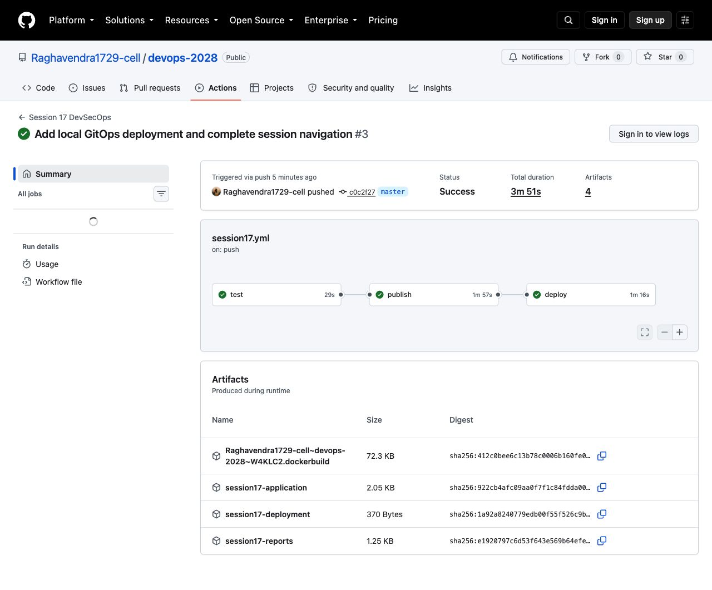
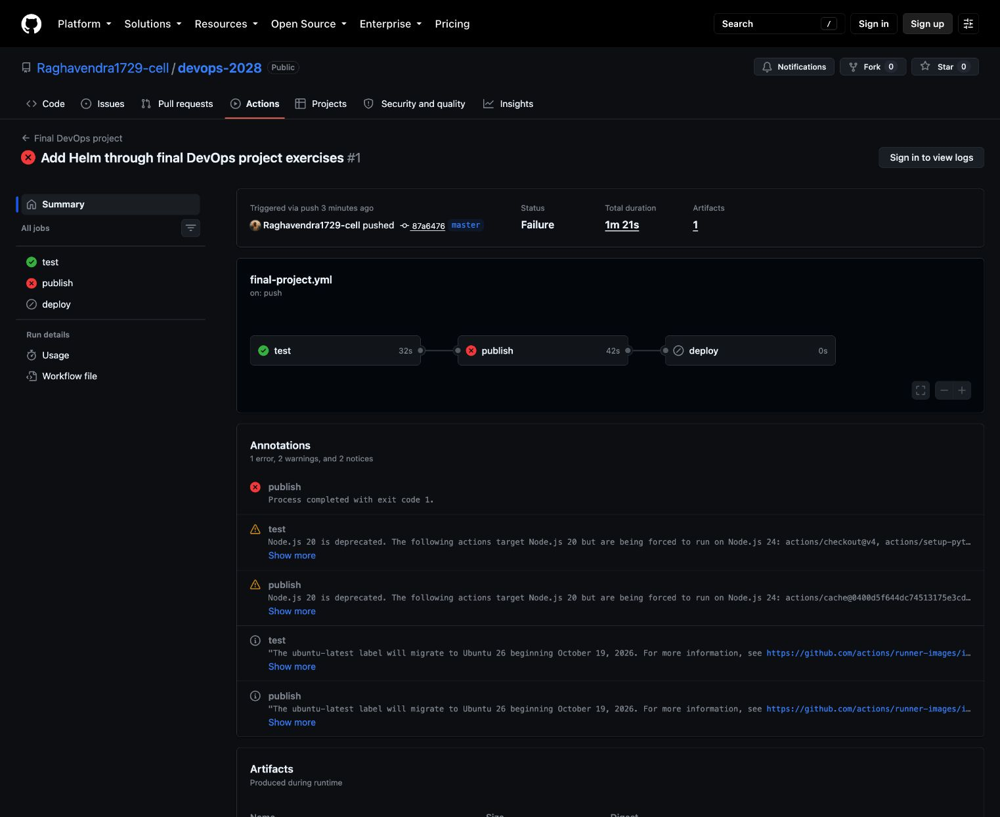

# CI/CD and DevSecOps

**Name:** Raghavendra  
**Enrollment number:** 24BCS10250

**Session:** 17

This application displays its version, environment and hostname. It also provides a calculator API. I followed the class pipeline structure and added Docker publishing and a Kubernetes deployment check.

## Run locally

```bash
python3 -m venv .venv
source .venv/bin/activate
pip install -r requirements-dev.txt
pytest -v
export API_TOKEN=$(openssl rand -hex 24)
gunicorn --bind 127.0.0.1:8500 --workers 1 --threads 4 app:app
```

Open `http://127.0.0.1:8500`. In another terminal:

```bash
curl -fsS http://127.0.0.1:8500/health
curl -fsS -X POST http://127.0.0.1:8500/api/calculate -H 'Content-Type: application/json' -d '{"a":6,"b":3,"operation":"multiply"}'
```

The calculator returns `18`. It rejects missing fields, non-numeric values, unknown operations, division by zero and numbers too large to calculate safely.

## Docker

```bash
docker build -t devsecops:1.0 .
docker run --rm -p 127.0.0.1:8500:5000 -e API_TOKEN devsecops:1.0
```

## Security checks

The pipeline runs Bandit for SAST, pip-audit for dependency vulnerabilities, Gitleaks for secrets and Trivy for the Docker image. The test and source scan jobs must pass before the image job runs. The image gate blocks fixable HIGH and CRITICAL vulnerabilities before publishing. Findings without an available fix remain visible in a full scan report and are reviewed separately.

Run source checks locally:

```bash
bandit -c security/bandit.yaml -q app.py
pip-audit -r requirements.txt
gitleaks dir . --redact
```

There is no `continue-on-error` on security checks. The workflow's `gate_demo` input produces a controlled failure so that skipped image and deployment jobs can be observed without committing broken application code.

## GitHub Actions

The executable workflow is [`.github/workflows/session17.yml`](../.github/workflows/session17.yml) at the repository root. It runs on changes to this section and can also be started from the Actions page.

```bash
gh workflow run session17.yml --ref master
gh run list --workflow session17.yml
gh run view --log
```

The image is tagged with the full commit SHA, so the deployment uses the version built by that run. PR checks run tests without publishing an image.

The Kubernetes deployment uses the [final project chart](../final-devops-project/helm/notes/). For a manual run, create the application Secret, load the image into Minikube and use Helm with autoscaling disabled. The commands are in the [final project README](../final-devops-project/README.md).

Class reference: [Session 17](https://github.com/Mehul01-Max/devops-heros/tree/main/session-17-devsecops/demo).

## Kubernetes manifests

After building the Docker image above:

```bash
minikube image load devsecops:1.0
../final-devops-project/kubernetes/create-secret.sh devsecops-lab
kubectl apply -n devsecops-lab -f kubernetes/application.yaml
kubectl -n devsecops-lab rollout status deployment/notes
kubectl -n devsecops-lab port-forward service/notes 8500:5000
```

Open `http://127.0.0.1:8500`. Delete `devsecops-lab` after the exercise.

## Pipeline result

The [successful run](https://github.com/Raghavendra1729-cell/devops-2028/actions/runs/37001239734) completed tests, image publishing and Kubernetes deployment. Its deployment job verified readiness, health and the calculator response before deleting Kind.



## Security gate result

The first image scan found fixable vulnerabilities and stopped the publishing job. Deployment remained skipped. I updated the Debian packages and removed pip and its bundled installer from the runtime image after installing the application dependencies.



The [updated image scan](outputs/image-scan.txt) passed the configured gate. The later successful run completed publishing and deployment. A passing gate means no fixable HIGH or CRITICAL findings were detected at scan time; it is not a claim that the image has no vulnerabilities of any severity.
