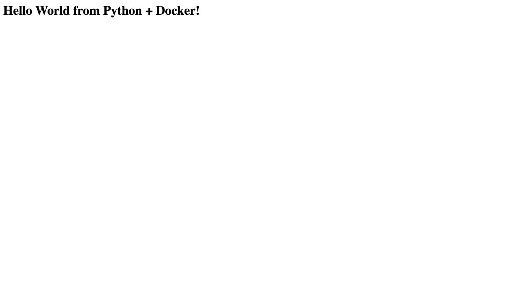
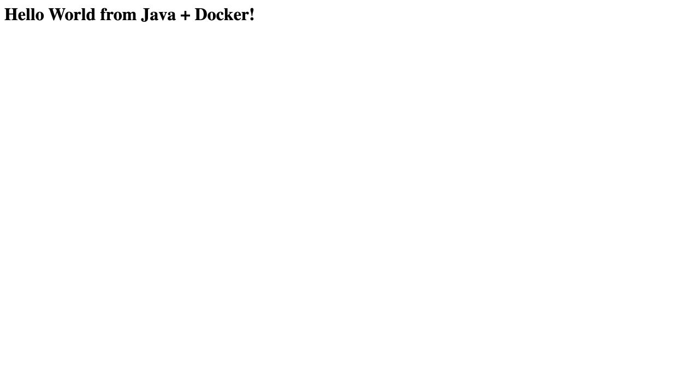
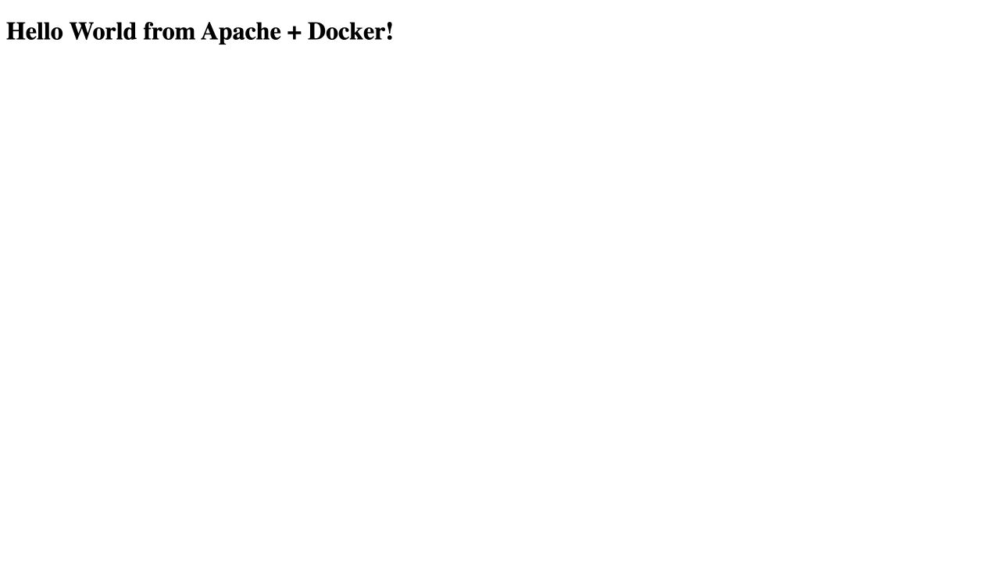
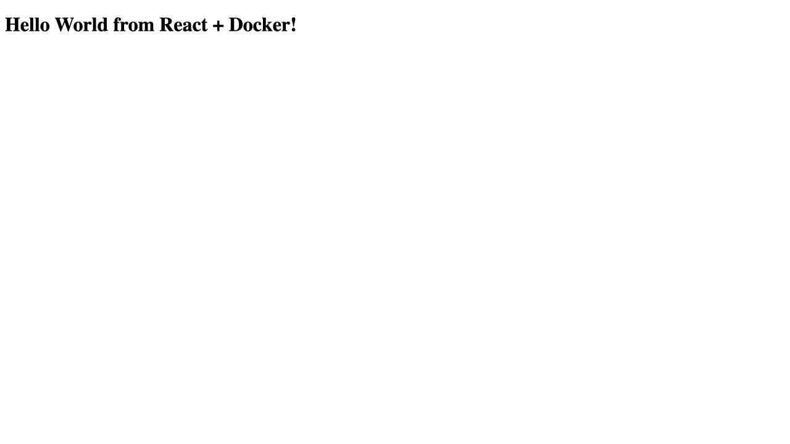

# Docker Fundamentals

**Name:** Raghavendra

**Enrollment number:** 24BCS10250

I built six small applications with Docker. I used a separate folder and Dockerfile for each one.

| Application | Folder | Container port | Local URL |
| --- | --- | ---: | --- |
| Node.js | `nodejs-app` | 3000 | `http://localhost:3000` |
| Python | `python-app` | 8000 | `http://localhost:8000` |
| Java | `java-app` | 8080 | `http://localhost:8080` |
| Apache HTTP Server | `Apache-app` | 80 | `http://localhost:8081` |
| React | `React-app` | 80 | `http://localhost:8082` |
| Nginx | `nginx-app` | 80 | `http://localhost:8083` |

I ran the commands below from the `Docker Fundamentals` folder after starting Docker Desktop.

```bash
docker info
```

## 1. Node.js

```bash
docker build -t hello-node ./nodejs-app
docker run -d --name hello-node -p 3000:3000 hello-node
curl http://localhost:3000
```

The page returned `Hello World from Node.js + Docker!`.


## 2. Python

```bash
docker build -t hello-python ./python-app
docker run -d --name hello-python -p 8000:8000 hello-python
curl http://localhost:8000
```

The page returned `Hello World from Python + Docker!`.



## 3. Java

```bash
docker build -t hello-java ./java-app
docker run -d --name hello-java -p 8080:8080 hello-java
curl http://localhost:8080
```

The Java application was available on port 8080.



## 4. Apache HTTP Server

```bash
docker build -t hello-apache ./Apache-app
docker run -d --name hello-apache -p 8081:80 hello-apache
curl http://localhost:8081
```

I mapped port 8081 on my computer to port 80 in the container.



## 5. React

```bash
docker build -t hello-react ./React-app
docker run -d --name hello-react -p 8082:80 hello-react
curl http://localhost:8082
```

The React page was served from the container on `http://localhost:8082`.



## 6. Nginx

```bash
docker build -t hello-nginx ./nginx-app
docker run -d --name hello-nginx -p 8083:80 hello-nginx
curl http://localhost:8083
```

The Nginx page was available on `http://localhost:8083`.


I used this command to see all six containers together:

```bash
docker ps --filter "name=hello-"
```

The React build stage installs React and ReactDOM. Its final Nginx image serves the page and both JavaScript files locally, so the page does not depend on a CDN at runtime. The Java Dockerfile also uses a build stage with the JDK and a smaller JRE stage for execution.

## Rechecked containers

I rebuilt all six applications and checked their HTTP responses. The new run used ports 8300–8305 so each page could be checked together. The [outputs](outputs/) contain build logs, running-container checks and page responses.
