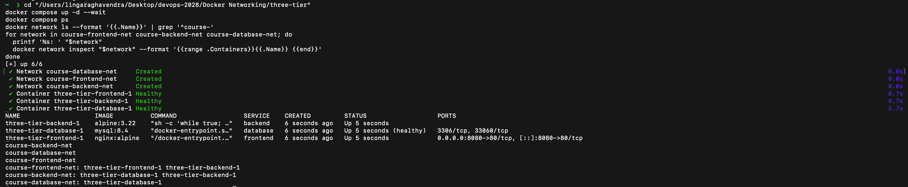
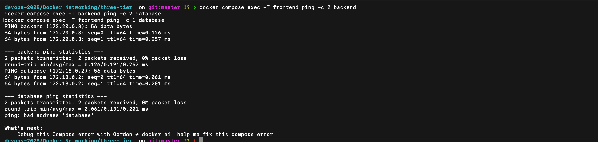
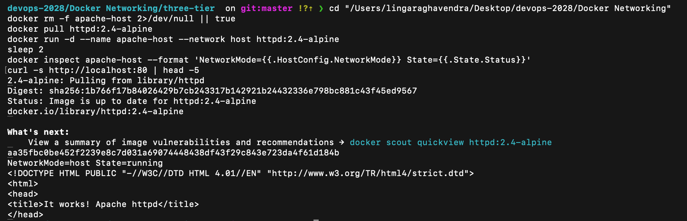
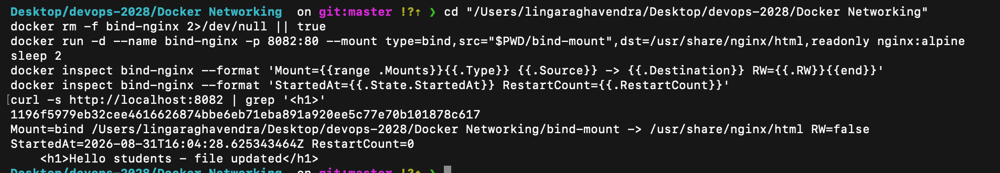

# Docker Networking and Volume Homework

**Student:** Raghavendra

**Enrollment number:** 24BCS10250

This README documents the completed Docker networking and bind-mount exercises. All commands were run with Docker Desktop running. The screenshots are genuine results from the completed exercises; they are included as evidence, not sample output.

## Completion checklist

| Homework requirement | Completed evidence |
| --- | --- |
| Three containers: frontend, backend, and database | `frontend` uses Nginx, `backend` uses Alpine, and `database` uses MySQL in the three-tier setup below. |
| Three different Docker networks | `course-frontend-net`, `course-backend-net`, and `course-database-net`. |
| Backend connected to two networks | It is attached to `course-frontend-net` and `course-backend-net`. |
| Connectivity checked | Two allowed connections succeed; the isolated frontend-to-database connection fails as expected. |
| Apache on host networking, accessible on port 80 | Apache runs with `--network host`; the browser evidence shows `http://localhost`. |
| Bind mount updates without restart | The original and changed pages are both shown below. |
| Overlay-network research | Use cases and the multi-host mechanism are explained in Task 4. |

## Task 1 - Docker container networking

### Design

I created three containers and three named bridge networks. The backend is connected to two application networks, allowing it to communicate with both tiers while the frontend and database remain isolated from each other.

| Container | Image | Attached network(s) |
| --- | --- | --- |
| `frontend` | `nginx:alpine` | `course-frontend-net` |
| `backend` | `alpine:3.22` | `course-frontend-net`, `course-backend-net` |
| `database` | `mysql:8.4` | `course-backend-net`, `course-database-net` |

The Compose file is in [`three-tier/docker-compose.yml`](three-tier/docker-compose.yml). It explicitly declares all three networks and attaches the backend to two of them.

```text
frontend <--> backend <--> database
   |             |             |
course-       course-       course-
frontend-net  backend-net   database-net
```

### Run the three-tier setup

Run these commands from this directory:

```bash
cd three-tier
cp .env.example .env
docker compose up -d --wait
docker compose ps
```

Verify the three networks and the container membership:

```bash
docker network ls --format '{{.Name}}' | grep '^course-'
for network in course-frontend-net course-backend-net course-database-net; do
  printf '%s: ' "$network"
  docker network inspect "$network" --format '{{range .Containers}}{{.Name}} {{end}}'
done
```

Expected relationship:

```text
course-frontend-net: three-tier-frontend-1 three-tier-backend-1
course-backend-net:  three-tier-backend-1 three-tier-database-1
course-database-net: three-tier-database-1
```

The following terminal result shows the three running services, all three named networks, and the backend's membership of the frontend and backend networks.



### Connectivity verification

```bash
# Allowed: frontend and backend share course-frontend-net.
docker compose exec -T frontend ping -c 2 backend

# Allowed: backend and database share course-backend-net.
docker compose exec -T backend ping -c 2 database

# Expected to fail: frontend and database share no network.
docker compose exec -T frontend ping -c 1 database
```

The first two checks returned replies with `0% packet loss`. The final command returned `ping: bad address 'database'`, which is the expected result: the frontend cannot resolve or reach the isolated database service.



## Task 2 - Apache on the host network

I pulled the official Apache HTTP Server image and started it with the host network. Host networking makes the container use the host network stack directly, so no `-p` mapping is used. On Docker Desktop for macOS, host networking must be enabled before running this command.

```bash
docker pull httpd:2.4-alpine
docker run -d --name apache-host --network host httpd:2.4-alpine
docker inspect apache-host --format 'NetworkMode={{.HostConfig.NetworkMode}} State={{.State.Status}}'
curl http://localhost:80
```

Verification returned `NetworkMode=host`, the container was running, and `http://localhost` displayed the Apache `It works!` page directly on port 80.




## Task 3 - Bind mount with live updates

I created a local folder named `bind-mount` and placed an `index.html` file inside it. Its original page heading was `Hello students`. I mounted that folder read-only into Nginx's document root.

```bash
docker run -d \
  --name bind-nginx \
  -p 8082:80 \
  --mount type=bind,src="$PWD/bind-mount",dst=/usr/share/nginx/html,readonly \
  nginx:alpine
```

The first browser check showed the original local file.


I then changed the local file heading to `Hello students - file updated`, refreshed the browser, and did **not** restart `bind-nginx`.

```bash
curl http://localhost:8082
docker inspect bind-nginx --format '{{range .Mounts}}{{.Type}} {{.Source}} -> {{.Destination}} RW={{.RW}}{{end}}'
```

The refreshed page immediately showed the changed content. This demonstrates that the Nginx container is serving the local bind-mounted file rather than a copied image file.




## Task 4 - Overlay networks

An overlay network connects Docker Swarm services across multiple Docker hosts. Docker uses a VXLAN-based data plane to encapsulate service traffic between participating hosts, while Swarm manages membership, service discovery, and encrypted control communication. This lets a service on one host reach a service on another host by service name without exposing every internal connection to the physical network.

Typical use cases include replicated web/API services, distributed worker queues, and multi-host microservices where each service should communicate on a private application network.

An overlay network is created from a Swarm manager. A real multi-host exercise therefore needs at least a manager and another Swarm node; it is not equivalent to a single-machine bridge network.

```bash
# Run once on the manager, then join worker nodes using the command Docker prints.
docker swarm init

# Create an attachable multi-host application network.
docker network create --driver overlay --attachable multi-host-network
```

## Cleanup

```bash
docker rm -f apache-host bind-nginx
cd three-tier
docker compose down -v
```

These commands remove only the containers, networks, and MySQL volume created for this homework.

## What I learned

- Docker DNS resolves container or service names only when the containers share a Docker network.
- Connecting the backend to two networks is a simple way to separate frontend and database traffic.
- Host networking removes normal port mapping because the container uses the host network stack.
- A bind mount exposes local files to a container, so a browser refresh can show file changes without rebuilding or restarting it.
- Overlay networks solve the same service-to-service communication problem across multiple Docker hosts in a Swarm.
