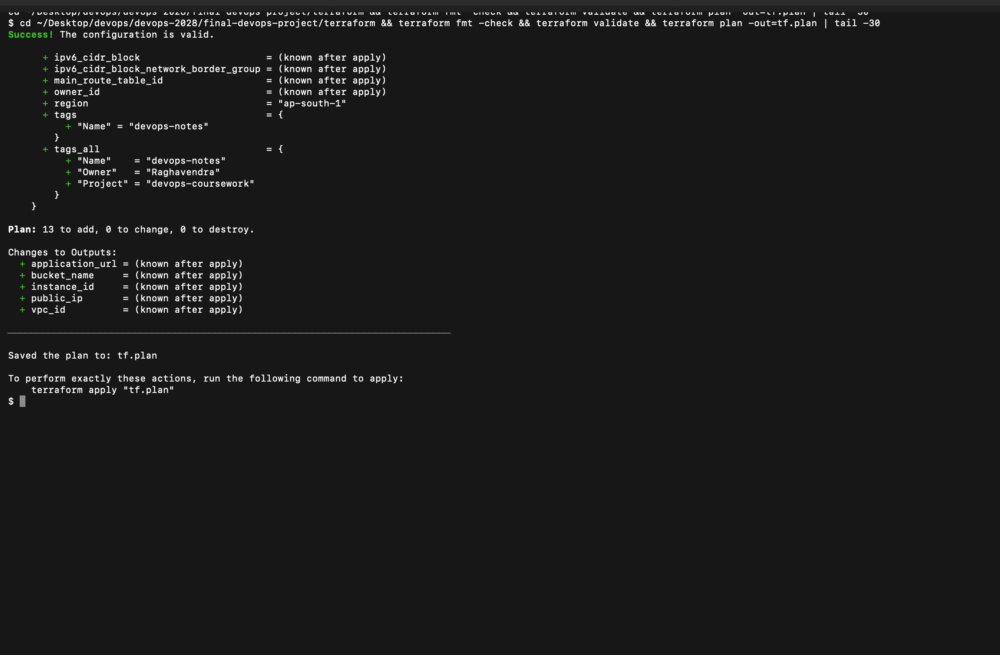
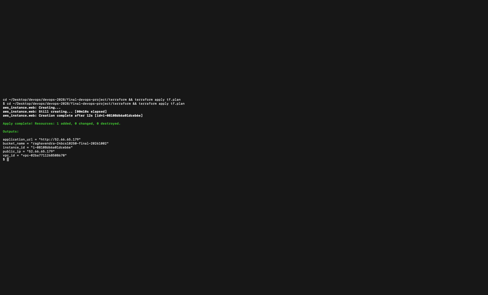
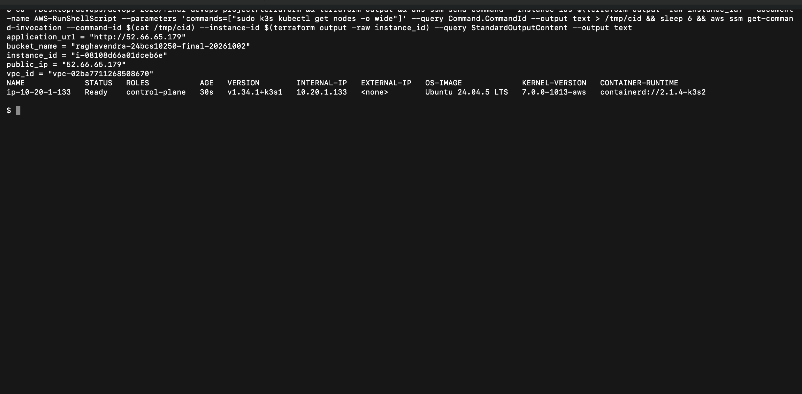
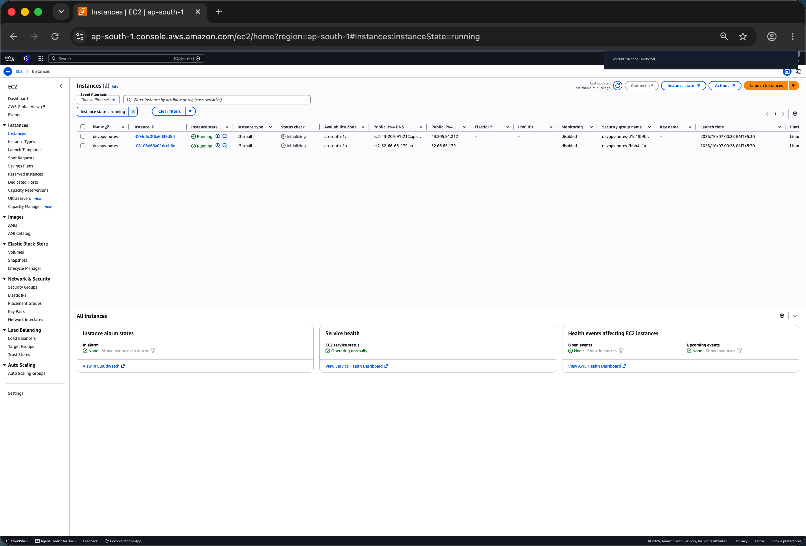
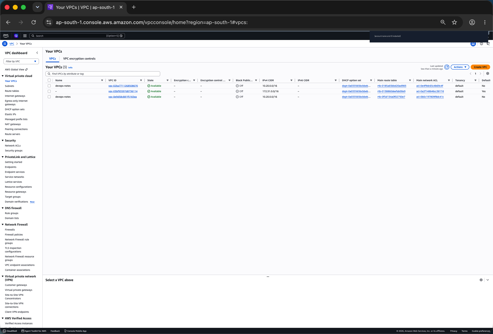
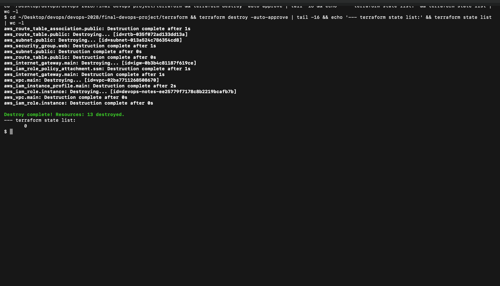

# Terraform cloud deployment

This configuration creates the networking, Ubuntu EC2 instance, SSM role and private S3 bucket for the Notes project. `user-data.sh` installs K3s. HTTP is open on port 80; the Kubernetes API stays private.

## Create infrastructure

```bash
export AWS_PROFILE=devops
aws sts get-caller-identity
terraform init
terraform fmt -check
terraform validate
terraform plan -out=final.tfplan
terraform apply final.tfplan
terraform output
aws ssm start-session --target "$(terraform output -raw instance_id)"
```

Install the AWS Session Manager plugin on the client for the final command. In the instance session, inspect cloud-init and Kubernetes:

```bash
sudo tail -n 30 /var/log/cloud-init-output.log
sudo k3s kubectl get nodes
sudo k3s kubectl get pods -A
```

## Deploy the application

In the instance session:

```bash
git clone https://github.com/Raghavendra1729-cell/devops-2028.git
cd devops-2028/Final-DevOps-Project
sudo ./kubernetes/create-secret.sh final-project
sudo k3s kubectl create namespace argocd
sudo k3s kubectl apply -n argocd --server-side -f https://raw.githubusercontent.com/argoproj/argo-cd/v3.5.3/manifests/install.yaml
sudo k3s kubectl apply -f gitops/application-cloud.yaml
sudo ./monitoring/install.sh
sudo k3s kubectl -n argocd get application devops-notes
sudo k3s kubectl -n final-project get pods,services,ingress,hpa
```

The cloud Application reads the published image from `gitops/values.yaml` and adds `values-cloud.yaml` for K3s's Traefik Ingress controller. Publish the image through the final workflow before syncing. Use public GHCR visibility, or provide an image-pull Secret for a private package.

From the client, test the EC2 address with the Ingress host header:

```bash
curl -fsS -H 'Host: notes.local' "$(terraform output -raw application_url)/api/status"
```

Cloud monitoring uses the same PVC-backed stack. K3s provides the local-path StorageClass; data remains tied to this single server. This class project has one node and does not provide high availability.

## Remove infrastructure

Remove workloads and retain any required evidence before deleting the instance. From this Terraform folder:

```bash
terraform plan -destroy
terraform destroy
terraform show
```

Keep the S3 bucket empty, preserve state until destroy succeeds, and check for remaining EC2, EBS, networking and S3 resources. State and saved plans are excluded from Git.

[Local validation output](outputs/validate.txt) records Terraform initialization and configuration validation.

## Evidence from a real AWS run

I ran this configuration against my own AWS account in `ap-south-1`, using a limited IAM user (`terraform-homework`) and not the root user. In the console screenshots the account name and account ID are redacted.

My account is on AWS's free plan, which only allows free-tier instance types. The first `terraform apply` with `t3.medium` did not create the EC2 instance (the other 12 resources were created), so I changed `instance_type` in `terraform.tfvars` to `t3.small` (2 GB, free-tier eligible), planned again (1 resource to add) and applied. The `t3.small` instance has enough memory for the K3s install.

`plan` (13 resources to add):



The second `apply` created the EC2 instance:



`terraform output`, then the K3s node through Systems Manager (no SSH port is open). The node is `Ready` and runs Kubernetes `v1.34.1+k3s1`:



The EC2 console (the first row is the Session 19 stack) and the VPC console:





`terraform destroy` removed all 13 resources and the state list is empty afterwards:


