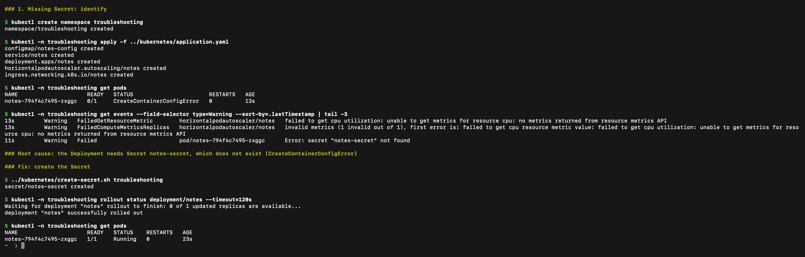
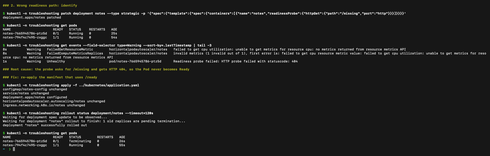
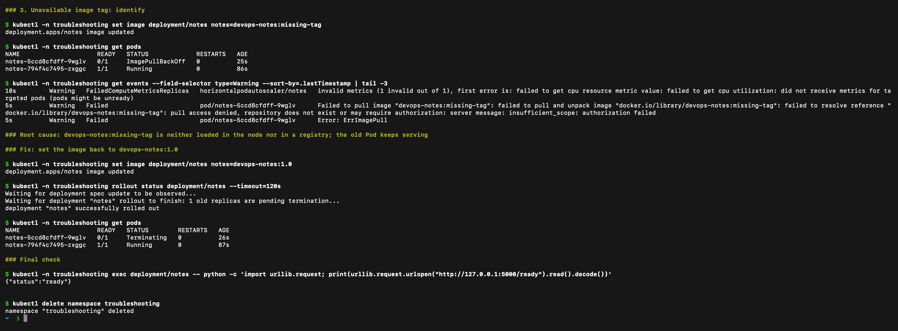
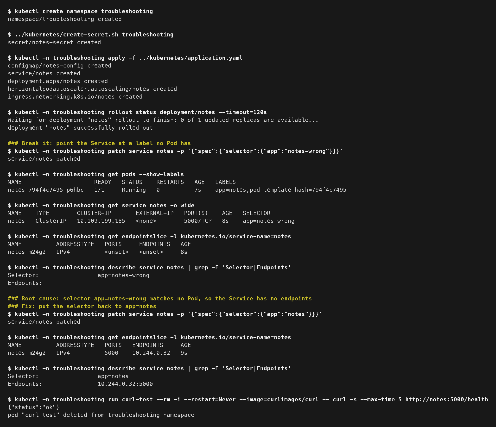

# Final Troubleshooting Challenge

For the challenge I broke the project on purpose in four different ways. I did the first three in a separate `troubleshooting` namespace and the fourth one in the same namespace after it was recreated, so nothing touched the working `final-project` deployment. Each issue below follows the same steps: identify, investigate, root cause, fix, verify. The raw command output for every step is in the [outputs](outputs/) folder.

| # | Issue | What I saw | Root cause |
|---|---|---|---|
| 1 | Missing Secret | Pod stuck in `CreateContainerConfigError` | `notes-secret` did not exist |
| 2 | Wrong readiness path | Pod `Running` but `0/1` ready | Probe pointed at `/missing` (404) |
| 3 | Bad image tag | New Pod in `ImagePullBackOff` | Tag `missing-tag` does not exist |
| 4 | Service selector mismatch | Service had no endpoints | Selector `app=notes-wrong` matches no Pod |

## 1. Missing Secret

**Identify:** after applying the manifest the Pod never became ready.

```bash
kubectl create namespace troubleshooting
kubectl -n troubleshooting apply -f ../kubernetes/application.yaml
kubectl -n troubleshooting get pods
```

The status was `CreateContainerConfigError` with `0/1` ready.

**Investigate:** the warning events say what Kubernetes could not do.

```bash
kubectl -n troubleshooting get events --field-selector type=Warning --sort-by=.lastTimestamp
```

**Root cause:** the event says `secret "notes-secret" not found`. The image was fine. The Deployment reads `API_TOKEN` from a Secret, and I had not created it yet (the Secret is generated by a script and is never committed to Git).

**Fix:**

```bash
../kubernetes/create-secret.sh troubleshooting
kubectl -n troubleshooting rollout status deployment/notes
```

**Verify:** the rollout finished and `get pods` shows `1/1 Running`. Evidence: [problem](outputs/02-configuration-error.txt), [fix](outputs/03-secret-fixed.txt).



## 2. Wrong readiness path

**Identify:** after I changed the probe the new Pod stayed `0/1` although the container was running.

```bash
kubectl -n troubleshooting patch deployment notes --type strategic -p '{"spec":{"template":{"spec":{"containers":[{"name":"notes","readinessProbe":{"httpGet":{"path":"/missing","port":"http"}}}]}}}}'
kubectl -n troubleshooting get pods
```

**Investigate:**

```bash
kubectl -n troubleshooting get events --field-selector type=Warning --sort-by=.lastTimestamp
```

**Root cause:** `Readiness probe failed: HTTP probe failed with statuscode: 404`. The app was healthy, the probe was asking for a path that does not exist, so the Pod was never added to the Service.

**Fix:** re-apply the manifest, which has the correct `/ready` path.

```bash
kubectl -n troubleshooting apply -f ../kubernetes/application.yaml
kubectl -n troubleshooting rollout status deployment/notes
```

**Verify:** the new Pod is `1/1` and the rollout completes. Evidence: [failed probe](outputs/05-probe-error.txt), [healthy rollout](outputs/06-probe-fixed.txt).



## 3. Unavailable image tag

**Identify:** I updated the Deployment to an image tag that does not exist.

```bash
kubectl -n troubleshooting set image deployment/notes notes=devops-notes:missing-tag
kubectl -n troubleshooting get pods
```

The new Pod showed `ErrImagePull` and then `ImagePullBackOff`. The old Pod was still `Running`.

**Investigate:**

```bash
kubectl -n troubleshooting get events --field-selector type=Warning --sort-by=.lastTimestamp
```

**Root cause:** the tag is not in the local image store and not in a registry, so the pull fails. Because it is a rolling update, the old healthy Pod kept serving and the app never went down.

**Fix:** go back to the good tag.

```bash
kubectl -n troubleshooting set image deployment/notes notes=devops-notes:1.0
kubectl -n troubleshooting rollout status deployment/notes
```

**Verify:** the rollout completed and only the good Pod is left. Evidence: [image pull failure](outputs/08-image-error.txt), [restored image](outputs/09-image-fixed.txt).



## 4. Service selector mismatch

**Identify:** the Pod was `Running` and `1/1`, but nothing could reach the Service. In the monitoring exercise this is also the case that makes the `NotesApplicationDown` alert fire, because Prometheus scrapes the application through the Service.

```bash
kubectl -n troubleshooting patch service notes -p '{"spec":{"selector":{"app":"notes-wrong"}}}'
kubectl -n troubleshooting get pods --show-labels
kubectl -n troubleshooting get service notes -o wide
```

**Investigate:** compare the labels on the Pod with the selector on the Service, then look at the endpoints.

```bash
kubectl -n troubleshooting get endpointslice -l kubernetes.io/service-name=notes
kubectl -n troubleshooting describe service notes | grep -E 'Selector|Endpoints'
```

The Pod has `app=notes` but the Service selector is `app=notes-wrong`. The EndpointSlice shows `<unset>` and `describe` shows an empty `Endpoints:` line.

**Root cause:** a Service only sends traffic to Pods whose labels match its selector exactly. No Pod matched, so there were no endpoints, even though every Pod looked healthy.

**Fix:**

```bash
kubectl -n troubleshooting patch service notes -p '{"spec":{"selector":{"app":"notes"}}}'
```

**Verify:** the EndpointSlice now lists the Pod IP (`10.244.0.32:5000`) and a test Pod can call the Service and get `{"status":"ok"}`. Evidence: [full output](outputs/11-selector-mismatch.txt).



This is the same thing that happened to the alert in the Session 20 monitoring demo: [alert firing](../../Session-20-Monitoring-Observability-GitOps/images/alert-firing.jpg) and [alert recovered](../../Session-20-Monitoring-Observability-GitOps/images/alert-recovered.jpg) after the selector was corrected.

## Final check and cleanup

The [verification output](outputs/10-verify.txt) shows a healthy Pod and a successful `/ready` response after the first three fixes. Then I removed the namespace:

```bash
kubectl -n troubleshooting exec deployment/notes -- python -c 'import urllib.request; print(urllib.request.urlopen("http://127.0.0.1:5000/ready").read().decode())'
kubectl delete namespace troubleshooting
```

## What I learned

- Always read the warning events first. In all four cases the answer was in the events or in `describe`.
- `Running` does not mean the app is reachable. Readiness and Service selectors decide that.
- A rolling update protects you from a bad image because the old Pod keeps running until the new one is ready.
