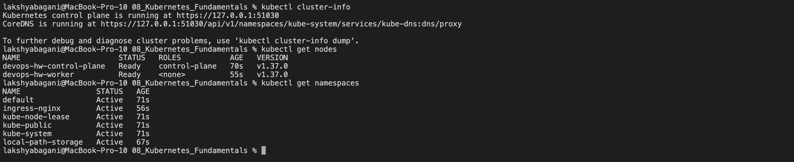
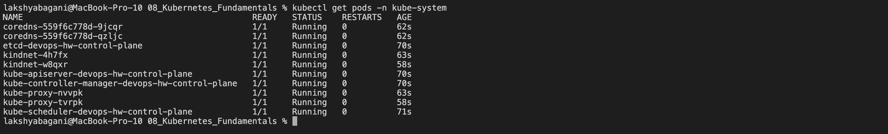
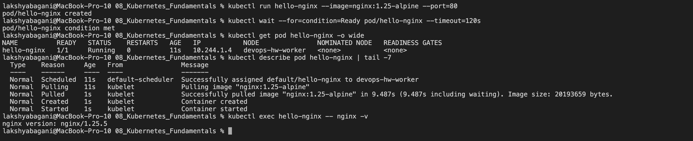
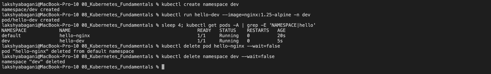

# Kubernetes Fundamentals

**Name:** Raghavendra  
**Enrollment number:** 24BCS10250  
**Class:** Lecture 9

These notes cover the local cluster setup, Kubernetes architecture, Pods, namespaces, and the commands used to check cluster health.

## 1. Install and verify the tools

`kubectl` is the client used to talk to Kubernetes. Minikube creates a small local cluster that is useful for practice.

On macOS with Homebrew:

```bash
brew install kubectl minikube
```

Verify both tools before starting:

```bash
minikube version
kubectl version --client
```

Expected result: both commands print their installed client versions without an error.

```text
minikube version: vX.Y.Z
Client Version: vX.Y.Z
```

## 2. Start and check the cluster

```bash
minikube start
minikube status
kubectl cluster-info
kubectl get nodes -o wide
```

What I check:

- Minikube reports the host, kubelet and API server as running.
- The node is `Ready`.
- `kubectl cluster-info` can reach the control plane and CoreDNS.



The important result is a reachable control plane and a node whose status is `Ready`.

```text
host: Running
kubelet: Running
apiserver: Running

NAME       STATUS   ROLES           VERSION
minikube   Ready    control-plane   vX.Y.Z
```

## 3. Kubernetes architecture

Kubernetes is declarative. I describe the state I want, and its controllers keep comparing the current state with that desired state.

```text
kubectl
   |
   v
+--------------------------- CONTROL PLANE ---------------------------+
| kube-apiserver <----> etcd                                         |
|       |                                                            |
|       +----> kube-scheduler                                        |
|       +----> kube-controller-manager                               |
+----------------------------+----------------------------------------+
                             |
                             v
+--------------------------- WORKER NODE -----------------------------+
| kubelet  |  container runtime  |  kube-proxy  |  application Pods  |
+---------------------------------------------------------------------+
```

| Component | Where it runs | What I remember |
|---|---|---|
| `kube-apiserver` | Control plane | Front door of the cluster. `kubectl` and other components use its API. |
| `etcd` | Control plane | Stores Kubernetes API data and the cluster state. |
| `kube-scheduler` | Control plane | Chooses a suitable node for a new unscheduled Pod. |
| `kube-controller-manager` | Control plane | Runs reconciliation loops that move current state toward desired state. |
| `kubelet` | Each node | Makes sure the containers described by Pod specs are running on that node. |
| Container runtime | Each node | Actually runs containers, normally through a CRI-compatible runtime such as `containerd`. |
| `kube-proxy` | Each node when used | Maintains network rules for Services. Some networking implementations replace it. |
| CoreDNS | Cluster add-on | Gives Services and Pods useful DNS names. |

The API server is the central communication point. Other components should not update `etcd` directly.

To see system components in a local cluster:

```bash
kubectl get pods -n kube-system -o wide
kubectl get --raw='/readyz?verbose'
```



## 4. First Pod and basic inspection

A Pod is the smallest deployable Kubernetes object. It normally contains one main application container, although helper, sidecar and init containers are also possible.

For a quick test without keeping a YAML file, this command starts NGINX and leaves it running long enough to inspect:

```bash
kubectl run hello-nginx --image=nginx:1.25-alpine --port=80
kubectl wait --for=condition=Ready pod/hello-nginx --timeout=120s
kubectl get pod hello-nginx -o wide
kubectl describe pod hello-nginx
kubectl exec hello-nginx -- nginx -v
kubectl delete pod hello-nginx
```

Its normal state is `Running` because the NGINX process stays active. A short command such as `echo` with `restartPolicy: Never` would finish as `Completed` instead.



## 5. Namespaces

Namespaces separate groups of resources inside one cluster. A name only needs to be unique inside its namespace.

```bash
kubectl get namespaces
kubectl create namespace dev
kubectl run hello-dev --image=nginx:1.25-alpine -n dev
kubectl get pods -A | grep -E 'NAMESPACE|hello'
kubectl delete namespace dev
```

Common namespaces:

| Namespace | Purpose |
|---|---|
| `default` | Used when I do not specify another namespace. |
| `kube-system` | Kubernetes and add-on components. |
| `kube-public` | Publicly readable cluster information when configured. |
| `kube-node-lease` | Node heartbeat lease objects. |



## 6. Generate YAML and read the schema

These commands are useful when I forget a field:

```bash
kubectl create deployment web --image=nginx:alpine \
  --dry-run=client -o yaml

kubectl explain pod
kubectl explain pod.spec.containers
kubectl api-resources
```

`--dry-run=client -o yaml` lets me generate a starting manifest without creating the resource.

## 7. Stop or reset Minikube

```bash
minikube stop
minikube status
```

`stop` keeps the cluster so it can be started again. `minikube delete` removes the local cluster completely, so I only use it when I really want a fresh setup.

Expected result after `stop`: the host, kubelet, and API server are reported as stopped while the kubeconfig remains available.

```text
host: Stopped
kubelet: Stopped
apiserver: Stopped
kubeconfig: Configured
```

## Quick check

```bash
minikube status
kubectl get nodes
kubectl get pods -A
kubectl cluster-info
```

If these four checks work, the local cluster, node, system Pods and API connection are all available.
