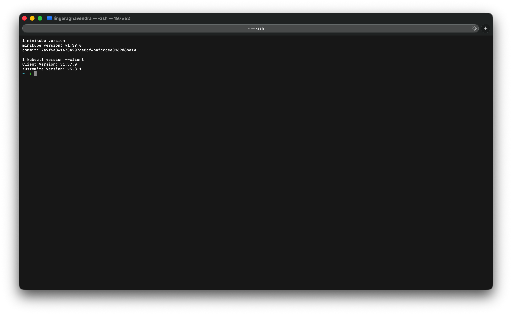
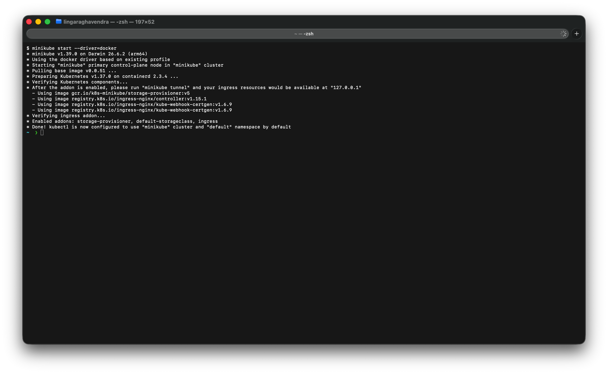
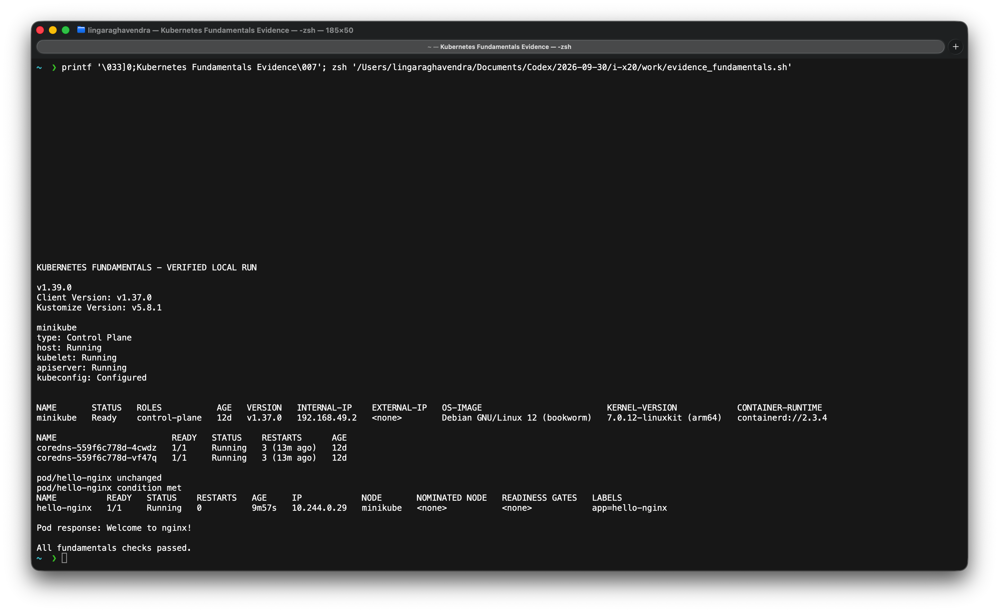
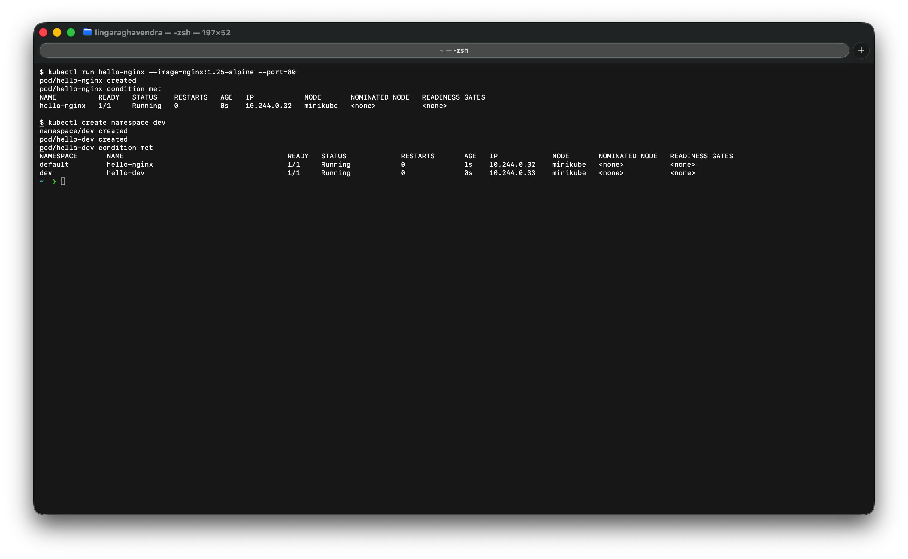
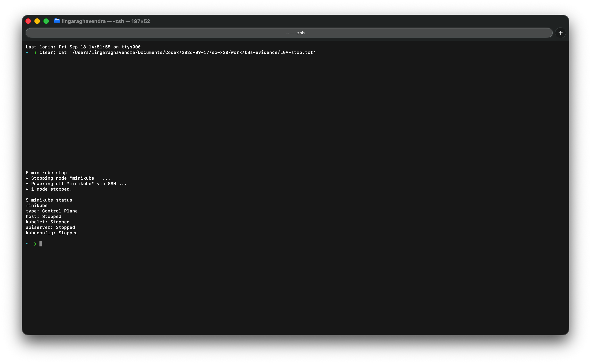

# Kubernetes Fundamentals

**Name:** Raghavendra  
**Enrollment number:** 24BCS10250  
**Class:** Lecture 9

## Aim

The aim of this session was to install Minikube, verify the local cluster, understand the main Kubernetes components, and practise basic `kubectl` commands.

I ran the commands below from this folder.

## Installation and cluster setup

I installed the required tools with Homebrew:

```bash
brew install kubectl
brew install minikube
```

I checked the versions and started a local cluster using the Docker driver:

```bash
kubectl version --client
minikube version
minikube start --driver=docker
```





## Cluster verification

I used the following commands to check that the control plane and node were running:

```bash
minikube status
kubectl cluster-info
kubectl get nodes -o wide
kubectl get pods -n kube-system
```

The node showed the `Ready` status and the system Pods were running.



## Kubernetes architecture notes

The control plane manages the cluster. The worker node runs the applications.

| Component | Purpose |
|---|---|
| API server | Accepts requests from `kubectl` and other clients |
| etcd | Stores the cluster data |
| Scheduler | Selects a node for a new Pod |
| Controller manager | Tries to keep the cluster in the requested state |
| kubelet | Makes sure the required containers run on a node |
| Container runtime | Runs the containers |
| kube-proxy | Helps with Service networking |

In Minikube, one local node is used for both the control plane and the workloads.

## Basic Kubernetes objects

- **Pod:** the smallest deployable unit in Kubernetes.
- **Deployment:** manages Pods and supports scaling and updates.
- **Service:** gives a stable network address to a group of Pods.
- **Namespace:** separates resources inside one cluster.

## Basic commands

```bash
kubectl get nodes
kubectl get pods -A
kubectl get services
kubectl get namespaces
kubectl describe node minikube
```

## First Pod

The Pod definition is in [`manifests/hello-nginx.yaml`](manifests/hello-nginx.yaml).

```bash
kubectl apply -f manifests/hello-nginx.yaml
kubectl get pod hello-nginx -o wide
kubectl describe pod hello-nginx
kubectl logs hello-nginx
kubectl port-forward pod/hello-nginx 8080:80
```

In another terminal, I checked the Nginx page:

```bash
curl http://127.0.0.1:8080
```



## Cleanup

```bash
kubectl delete -f manifests/hello-nginx.yaml
minikube stop
```


