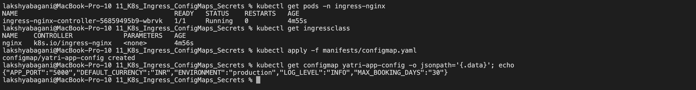
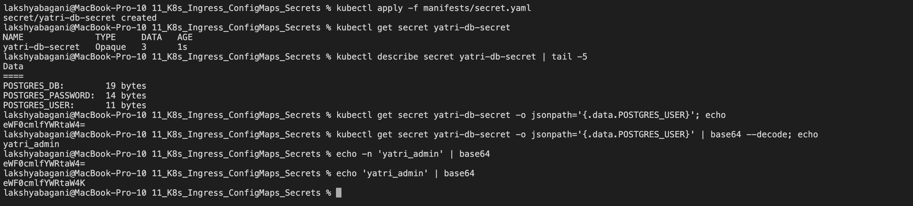
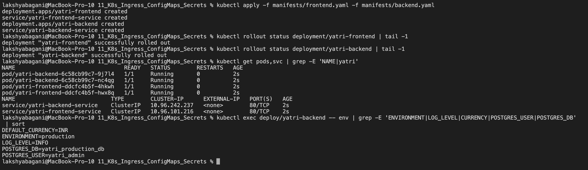
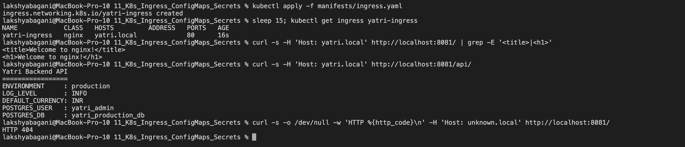
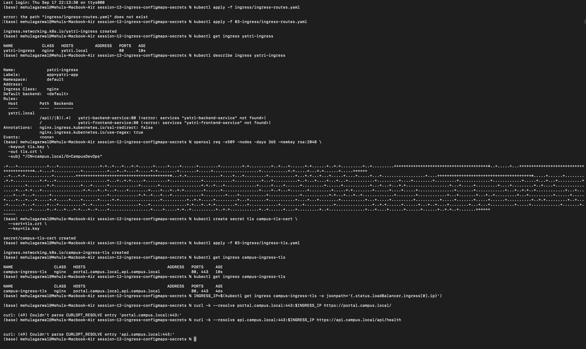

# Kubernetes Ingress, ConfigMaps & Secrets

This session connects three ideas: keep configuration outside the image, keep sensitive values separate from normal configuration, and route HTTP traffic to several Services through one entry point.

> The screenshots are reference runs from our class repositories. They contain demo values only. Real passwords, keys and certificates should never be copied into a public repository.

## 1. ConfigMap for normal configuration

A ConfigMap stores non-sensitive key-value data separately from the container image.

```yaml
apiVersion: v1
kind: ConfigMap
metadata:
  name: app-config
data:
  ENVIRONMENT: production
  LOG_LEVEL: INFO
  PORT: "8080"
  DEFAULT_CURRENCY: INR
  MAX_BOOKING_DAYS: "30"
```

```bash
kubectl apply -f app-config.yaml
kubectl get configmap app-config
kubectl describe configmap app-config
kubectl get configmap app-config \
  -o jsonpath='{.data.ENVIRONMENT}' && echo
```

ConfigMaps are not encrypted and should not contain passwords or tokens.



## 2. Updating a ConfigMap

Environment variables are copied into a container when it starts. Changing the ConfigMap does not rewrite those variables inside an existing process.

```bash
kubectl patch configmap app-config \
  --type merge \
  -p '{"data":{"ENVIRONMENT":"staging"}}'

kubectl exec deploy/backend -- env | grep ENVIRONMENT
kubectl rollout restart deployment/backend
kubectl rollout status deployment/backend
kubectl exec deploy/backend -- env | grep ENVIRONMENT
```

The old Pod can still show `production` after the patch. The replacement Pod should show `staging`.

ConfigMap files mounted as volumes behave differently: kubelet can update them after a delay. An application still has to reread the file, and a `subPath` mount does not receive those automatic updates.

> Screenshot to add manually: capture the before value, rollout restart, and after value in one terminal. Save it as `images/configmap-live-update.png`.

## 3. Secret and Base64

A Secret is meant for sensitive data, but Base64 is only an encoding format. It is easy to decode and is not encryption.

```bash
kubectl create secret generic db-secret \
  --from-literal=POSTGRES_USER=demo_user \
  --from-literal=POSTGRES_PASSWORD='replace-this-demo-value' \
  --dry-run=client -o yaml > db-secret.yaml
```

```bash
kubectl apply -f db-secret.yaml
kubectl get secret db-secret
kubectl describe secret db-secret
kubectl get secret db-secret \
  -o jsonpath='{.data.POSTGRES_USER}' | base64 --decode
echo
```

`kubectl describe secret` shows key names and byte counts, not the decoded values. Anyone allowed to read the Secret object may still retrieve its data, so RBAC and encryption at rest matter.



## 4. The trailing-newline mistake

Normal `echo` adds a newline. That extra byte becomes part of the encoded password and can cause authentication failures.

```bash
echo "secretpassword" | xxd
echo -n "secretpassword" | xxd

echo "secretpassword" | base64
echo -n "secretpassword" | base64
```

The first byte stream ends in `0a`, which is the newline. `printf %s 'secretpassword'` is another portable way to avoid it:

```bash
printf %s 'secretpassword' | base64
```

## 5. How secrets should be handled in a real project

Committing a Base64 Secret manifest still exposes the credential in Git history. A safer flow is:

```text
AWS Secrets Manager / Azure Key Vault / HashiCorp Vault
                         |
                         v
        External Secrets operator or CSI provider
                         |
                         v
              Kubernetes Secret / mounted value
                         |
                         v
                     application
```

Useful rules:

- Keep real secret values outside Git.
- Give workloads only the Secret keys they need.
- Use namespace-scoped, least-privilege RBAC.
- Enable encryption at rest for the Kubernetes API data store.
- Rotate secrets instead of treating them as permanent.
- Do not print decoded secrets in normal CI logs.
- CI/CD should authenticate to a secret store and inject short-lived values at deployment time.

```bash
kubectl get crds | grep -i secret \
  || echo 'No external secret operator CRD found'
```

## 6. Inject ConfigMap and Secret data into one application

```yaml
envFrom:
  - configMapRef:
      name: app-config
env:
  - name: POSTGRES_USER
    valueFrom:
      secretKeyRef:
        name: db-secret
        key: POSTGRES_USER
  - name: POSTGRES_PASSWORD
    valueFrom:
      secretKeyRef:
        name: db-secret
        key: POSTGRES_PASSWORD
```

```bash
kubectl apply -f configmap.yaml
kubectl apply -f secret.yaml
kubectl apply -f backend.yaml
kubectl rollout status deployment/backend
kubectl exec deploy/backend -- \
  env | grep -E 'ENVIRONMENT|LOG_LEVEL|POSTGRES_USER'
```

I avoid printing the password during a normal check. Confirming the variable exists is enough.



## 7. Ingress resource vs Ingress controller

These are not the same thing:

| Part | What it is | What it does |
|---|---|---|
| Ingress resource | Kubernetes API object | Stores host, path, TLS and backend-Service rules. |
| Ingress controller | Running software | Watches those rules and configures a real reverse proxy or load balancer. |

```text
browser -> load balancer / node entry point -> controller -> ClusterIP Service -> Pods
```

An Ingress object by itself does not carry traffic. It needs a compatible controller and an `ingressClassName`.

Current note: the Ingress API is stable but frozen, and the Kubernetes project recommends Gateway API for new features. The community `ingress-nginx` project used in many classroom labs was retired in March 2026 and no longer receives security fixes. It can still explain the class concept, but I would choose a maintained controller or Gateway implementation for a new production system.

## 8. Enable and verify a controller in Minikube

The class command is:

```bash
minikube addons enable ingress
kubectl get pods -n ingress-nginx
kubectl wait --namespace ingress-nginx \
  --for=condition=Ready pod \
  --selector=app.kubernetes.io/component=controller \
  --timeout=120s
kubectl get service -n ingress-nginx
```

This lab depends on the Minikube driver and the add-on version available on the machine. If the add-on is unsupported or unavailable, I would not download an old controller blindly; I would use a currently maintained controller supported by the environment.

## 9. Local hostname mapping

For the classroom hostname:

```bash
minikube ip
```

Add one controlled entry to `/etc/hosts`:

```text
<minikube-ip> yatri.local portal.campus.local api.campus.local
```

Then verify it:

```bash
grep -E 'yatri.local|campus.local' /etc/hosts
dscacheutil -q host -a name yatri.local
```

Editing `/etc/hosts` requires administrator access. I would remove the entries after the lab if they are no longer needed.

An alternative for a one-off `curl` check is to send the Host header directly:

```bash
curl -H 'Host: yatri.local' http://127.0.0.1:<forwarded-port>/
```

## 10. Path-based routing

One hostname can send different paths to different Services:

```text
yatri.local/       -> frontend-service
yatri.local/api/   -> backend-service
```

```yaml
apiVersion: networking.k8s.io/v1
kind: Ingress
metadata:
  name: yatri-ingress
spec:
  ingressClassName: nginx
  rules:
    - host: yatri.local
      http:
        paths:
          - path: /
            pathType: Prefix
            backend:
              service:
                name: frontend-service
                port:
                  number: 80
          - path: /api
            pathType: Prefix
            backend:
              service:
                name: backend-service
                port:
                  number: 80
```

```bash
kubectl apply -f ingress.yaml
kubectl get ingress
kubectl describe ingress yatri-ingress
curl http://yatri.local/
curl http://yatri.local/api/
```

Controller-specific regex and rewrite annotations are useful when needed, but a plain `Prefix` rule is easier to move between controllers.




## 11. Host-based routing

The same entry IP can route by hostname:

```text
portal.campus.local -> frontend-service
api.campus.local    -> backend-service
```

```yaml
rules:
  - host: portal.campus.local
    http:
      paths:
        - path: /
          pathType: Prefix
          backend:
            service:
              name: frontend-service
              port:
                number: 80
  - host: api.campus.local
    http:
      paths:
        - path: /
          pathType: Prefix
          backend:
            service:
              name: backend-service
              port:
                number: 80
```

```bash
curl -H 'Host: portal.campus.local' http://<ingress-ip>/
curl -H 'Host: api.campus.local' http://<ingress-ip>/
```

## 12. Hybrid host and path routing

Hybrid routing simply combines both checks. For example:

```text
portal.campus.local/        -> frontend
portal.campus.local/api/    -> portal API
api.campus.local/v1/        -> version 1 API
api.campus.local/v2/        -> version 2 API
```

```bash
kubectl apply -f ingress-hybrid.yaml
kubectl describe ingress campus-ingress
```

I check the `Rules` section carefully because a wrong hostname, path type or Service port can create a valid object that still returns `404` or `503`.

> Screenshot to add manually: capture the `kubectl describe ingress` rules plus two successful host/path requests. Save it as `images/hybrid-ingress.png`.

## 13. TLS termination

For a local demonstration, create a self-signed certificate:

```bash
openssl req -x509 -nodes -days 30 -newkey rsa:2048 \
  -keyout tls.key \
  -out tls.crt \
  -subj '/CN=portal.campus.local/O=CampusDevOps' \
  -addext 'subjectAltName=DNS:portal.campus.local,DNS:api.campus.local'

kubectl create secret tls campus-tls \
  --cert=tls.crt \
  --key=tls.key
```

The Ingress refers to the Secret:

```yaml
tls:
  - hosts:
      - portal.campus.local
      - api.campus.local
    secretName: campus-tls
```

Test without permanently changing DNS:

```bash
curl -k --resolve portal.campus.local:443:<ingress-ip> \
  https://portal.campus.local/
```

`-k` is only for the self-signed local lab. A real public service needs a trusted certificate and normal verification.



## 14. Complete demo and automation

The final flow is:

```text
ConfigMap ----+
              +--> backend Deployment --> backend ClusterIP Service --+
Secret -------+                                                     |
                                                                    +--> Ingress
frontend Deployment --> frontend ClusterIP Service ----------------+
```

A multi-document YAML file separates objects with three dashes:

```yaml
apiVersion: apps/v1
kind: Deployment
# ...
---
apiVersion: v1
kind: Service
# ...
```

The correct separator is `---`, not `--`.

```bash
bash 04-full-demo/run-demo.sh

kubectl get configmap,secret,ingress,deployment,service,pods
kubectl get events --sort-by=.lastTimestamp

bash 04-full-demo/cleanup.sh
kubectl get ingress,deployment,service
```

Before running a script from someone else, I read it first:

```bash
sed -n '1,240p' 04-full-demo/run-demo.sh
bash -n 04-full-demo/run-demo.sh
```

> Screenshot to add manually: capture the complete healthy resource list, then the cleanup result. Save it as `images/full-demo-and-cleanup.png`.

## Troubleshooting order

```bash
kubectl get pods
kubectl describe pod <pod>
kubectl logs <pod> --all-containers
kubectl get service
kubectl get endpointslice
kubectl describe ingress <ingress>
kubectl get events --sort-by=.lastTimestamp
```

My order is: Pod health, Service selector/endpoints, Ingress rules, controller logs, then DNS or host mapping.
