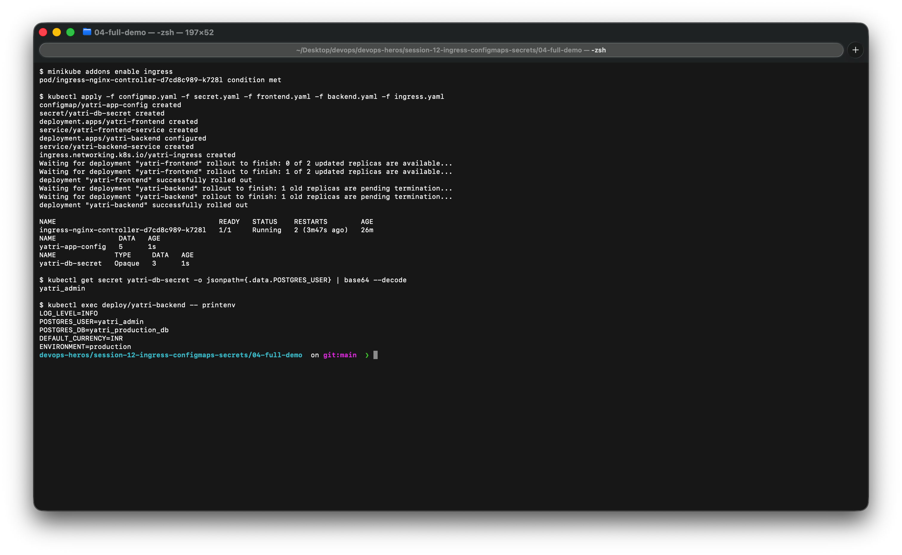
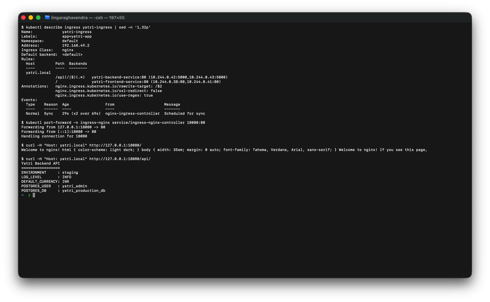
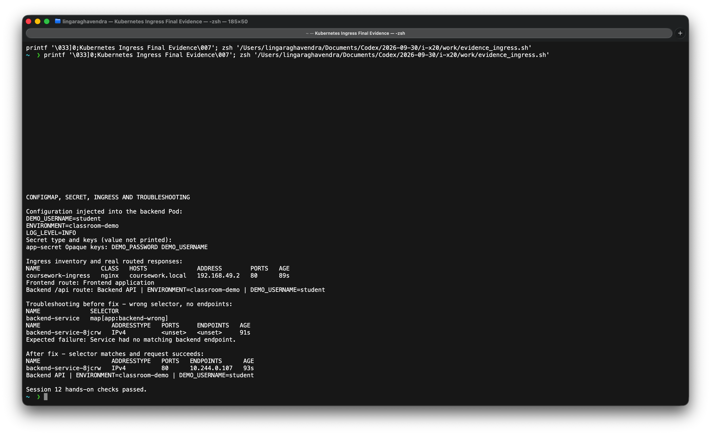

# Kubernetes Ingress, ConfigMaps & Secrets

**Name:** Raghavendra  
**Enrollment number:** 24BCS10250  
**Class:** Lecture 12

## Aim

The aim of this session was to use a ConfigMap and Secret in an application, route requests with Ingress, understand the difference between Ingress and an Ingress controller, and troubleshoot a Service problem.

I ran the commands below from this folder.

## 1. ConfigMap

A ConfigMap stores non-sensitive configuration separately from the container image. The example stores the environment name and log level.

```bash
kubectl apply -f configmap.yaml
kubectl get configmap app-config
kubectl describe configmap app-config
```

The backend Deployment uses `envFrom` to load both values:

```yaml
envFrom:
  - configMapRef:
      name: app-config
```

## 2. Secret

A Secret stores sensitive values such as usernames, passwords, or tokens. The values in `secret-demo.yaml` are only classroom demo values.

```bash
kubectl apply -f secret-demo.yaml
kubectl get secret app-secret
kubectl describe secret app-secret
```

The backend reads the two keys with `secretKeyRef`. I applied the backend and checked that the variables were present:

```bash
kubectl apply -f backend.yaml
kubectl rollout status deployment/backend
kubectl exec deployment/backend -- printenv ENVIRONMENT
kubectl exec deployment/backend -- printenv LOG_LEVEL
kubectl exec deployment/backend -- printenv DEMO_USERNAME
kubectl exec deployment/backend -- sh -c 'test -n "$DEMO_PASSWORD" && echo "DEMO_PASSWORD is set"'
```

The ConfigMap values and demo username are visible, and the final command confirms that the password variable is set without printing it.

Real passwords and tokens should not be committed to Git. In a real project, they should be created separately and access should be limited to the workloads that need them.



## 3. Ingress

Ingress uses rules to route HTTP requests to Services. This example sends `/` to the frontend and `/api` to the backend.

I enabled the Minikube Ingress controller and applied the application files:

```bash
minikube addons enable ingress
kubectl apply -f configmap.yaml
kubectl apply -f secret-demo.yaml
kubectl apply -f frontend.yaml
kubectl apply -f backend.yaml
kubectl apply -f ingress.yaml
kubectl rollout status deployment/frontend
kubectl rollout status deployment/backend
kubectl get ingress coursework-ingress
kubectl describe ingress coursework-ingress
```

For a local test, I forwarded the Ingress controller port:

```bash
kubectl port-forward -n ingress-nginx service/ingress-nginx-controller 8080:80
```

In another terminal, I tested both paths using the host from `ingress.yaml`:

```bash
curl -H 'Host: coursework.local' http://127.0.0.1:8080/
curl -H 'Host: coursework.local' http://127.0.0.1:8080/api/
```

The first request returned `Frontend application`. The second returned the backend response.



## 4. Ingress and Ingress controller

| Ingress | Ingress controller |
|---|---|
| A Kubernetes resource containing host and path rules | The running software that reads and applies those rules |
| Created from `ingress.yaml` | Installed separately, such as the Minikube Nginx controller |
| Says which Service should receive a request | Receives the request and forwards it to that Service |

Both are required. An Ingress resource by itself is only a set of rules. Without a controller, no component is present to handle the traffic.

In this work, `coursework-ingress` is the Ingress resource and `ingress-nginx-controller` is the controller.

## 5. Troubleshooting task

The troubleshooting example is in the [`troubleshooting`](troubleshooting/README.md) folder.

The problem was a Service selector that did not match the backend Pod label:

```text
Broken selector: app=backend-wrong
Correct label:   app=backend
```

I reproduced the problem and checked the Service endpoints:

```bash
kubectl apply -f troubleshooting/broken-service.yaml
kubectl get pods --show-labels
kubectl describe service backend-service
kubectl get endpointslice -l kubernetes.io/service-name=backend-service
```

The Service had no ready endpoint. I applied the corrected selector and tested the Service again:

```bash
kubectl apply -f troubleshooting/fixed-service.yaml
kubectl get endpointslice -l kubernetes.io/service-name=backend-service
kubectl run curl-client --image=curlimages/curl:8.12.1 --restart=Never --command -- sleep 3600
kubectl wait --for=condition=Ready pod/curl-client --timeout=120s
kubectl exec curl-client -- curl -s http://backend-service
```

After the fix, the EndpointSlice contained the backend Pod address and the request returned the backend response.



## Cleanup

```bash
kubectl delete -f ingress.yaml --ignore-not-found
kubectl delete -f frontend.yaml --ignore-not-found
kubectl delete -f backend.yaml --ignore-not-found
kubectl delete -f configmap.yaml --ignore-not-found
kubectl delete -f secret-demo.yaml --ignore-not-found
kubectl delete pod curl-client --ignore-not-found
```
