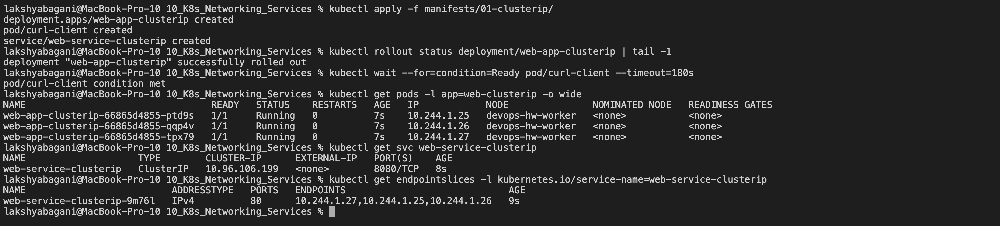
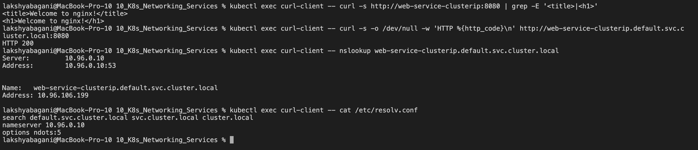
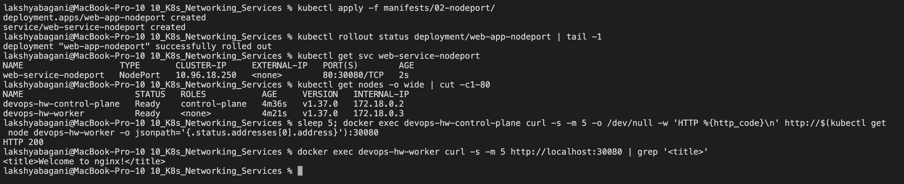
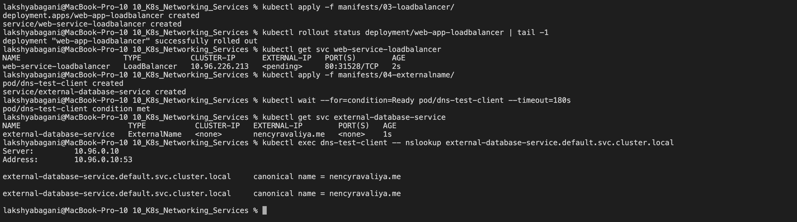
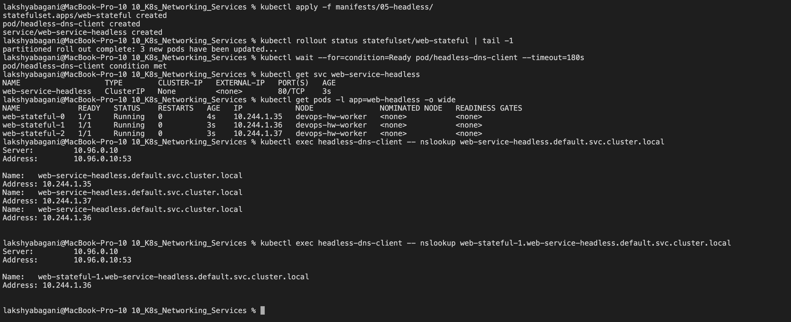
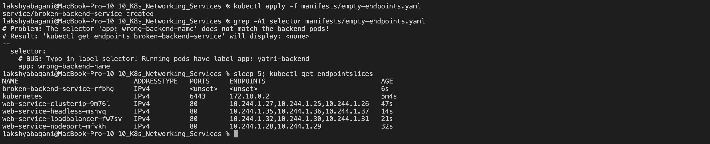

# Kubernetes Networking & Services

**Name:** Raghavendra  
**Enrollment number:** 24BCS10250  
**Class:** Lecture 11

Pods can disappear and come back with different IP addresses. A Service gives clients a stable name and a stable way to reach the current healthy Pods. These notes cover the five Service types from class and the DNS details around them.

> The screenshots are reference runs from our class repositories. The exact IP addresses and generated ports will be different on another cluster.

## 1. The four ports

This is the path I use to remember them:

```text
outside client
      |
      v
nodeIP:nodePort -> ServiceIP:port -> PodIP:targetPort -> application
                                                        (containerPort documents it)
```

| Field | Scope | Example |
|---|---|---|
| `containerPort` | Pod template | Documents that the application listens on port `80`; it does not expose traffic by itself. |
| `targetPort` | Service backend | Sends Service traffic to port `80` on a selected Pod. |
| `port` | Service | Port used by clients of the Service, for example `8080`. |
| `nodePort` | Cluster node | High port, normally from `30000-32767`, opened for a NodePort Service. |

```yaml
ports:
  - port: 8080
    targetPort: 80
    nodePort: 30080
```

The complete path is `node:30080 -> Service:8080 -> Pod:80`.

## 2. ClusterIP

`ClusterIP` is the default type. It is for communication inside the cluster and normally should not be reachable directly from my laptop.

```bash
kubectl apply -f 01-clusterip/
kubectl get pods -l app=web-clusterip -o wide
kubectl get service web-service-clusterip
kubectl get endpointslice \
  -l kubernetes.io/service-name=web-service-clusterip

kubectl exec curl-client -- \
  curl -s http://web-service-clusterip:8080
```

The Service selector must match the Pod labels. If it does not, the Service exists but its EndpointSlice contains no ready backends.



### DNS names

The same Service can be reached as:

```text
web-service-clusterip
web-service-clusterip.default
web-service-clusterip.default.svc.cluster.local
```

The full pattern is:

```text
<service>.<namespace>.svc.<cluster-domain>
```



## 3. NodePort

NodePort builds on ClusterIP and exposes a port on every node.

```bash
kubectl apply -f 02-nodeport/
kubectl get service web-service-nodeport
minikube service web-service-nodeport --url
```

On a directly reachable Linux node, the normal address is:

```text
http://<node-ip>:30080
```



## 4. LoadBalancer

`LoadBalancer` asks an external implementation, normally a cloud provider, to give the Service an outside address. Underneath it still has ClusterIP behavior and usually a NodePort allocation.

```bash
kubectl apply -f 03-loadbalancer/
kubectl get service web-service-loadbalancer -w
```

On Minikube, an external IP normally needs a tunnel:

```bash
# Keep this running in another terminal
minikube tunnel

# Check again in the first terminal
kubectl get service web-service-loadbalancer
```

If it stays `<pending>` on a local cluster, that usually means there is no cloud load-balancer controller or local equivalent handling the request.

## 5. ExternalName

ExternalName creates a DNS alias to a name outside Kubernetes. It has no selector, ClusterIP or Pod endpoints.

```yaml
apiVersion: v1
kind: Service
metadata:
  name: external-api
spec:
  type: ExternalName
  externalName: api.github.com
```

```bash
kubectl apply -f 04-externalname/
kubectl get service external-api
kubectl exec dns-test-client -- nslookup external-api
```

DNS should show a CNAME chain. HTTP or HTTPS may still need the correct `Host` header and TLS server name, so an ExternalName is not a general-purpose proxy.



## 6. Headless Service

A headless Service uses `clusterIP: None`. DNS returns individual ready Pod addresses instead of one Service virtual IP. This is useful when clients must discover specific StatefulSet replicas.

```bash
kubectl apply -f 05-headless/
kubectl rollout status statefulset/web-stateful
kubectl get service web-service-headless
kubectl get pods -l app=web-headless -o wide

kubectl exec headless-dns-client -- \
  nslookup web-service-headless.default.svc.cluster.local

kubectl exec headless-dns-client -- \
  nslookup web-stateful-0.web-service-headless.default.svc.cluster.local
```



## 7. Service without a selector

A selectorless Service can represent a backend that Kubernetes does not manage, such as a legacy database. On current Kubernetes versions, I should create an `EndpointSlice`; the older `Endpoints` object is deprecated.

```yaml
apiVersion: v1
kind: Service
metadata:
  name: legacy-db
spec:
  ports:
    - name: mysql
      port: 3306
      targetPort: 3306
---
apiVersion: discovery.k8s.io/v1
kind: EndpointSlice
metadata:
  name: legacy-db-1
  labels:
    kubernetes.io/service-name: legacy-db
addressType: IPv4
ports:
  - name: mysql
    protocol: TCP
    port: 3306
endpoints:
  - addresses: ["192.0.2.10"]
```

`192.0.2.10` is a documentation-only example address. A real lab must use a reachable backend and must not point to an arbitrary private machine.

```bash
kubectl get endpointslice \
  -l kubernetes.io/service-name=legacy-db
```

The next screenshot shows the related failure case: a normal Service whose selector matched no Pods.



## 8. CoreDNS and FQDN details

```bash
kubectl get pods -n kube-system -l k8s-app=kube-dns
kubectl exec curl-client -- cat /etc/resolv.conf
kubectl exec curl-client -- nslookup web-service-clusterip
kubectl exec curl-client -- \
  nslookup web-service-clusterip.default.svc.cluster.local
```

A Pod commonly receives settings similar to:

```text
nameserver 10.96.0.10
search default.svc.cluster.local svc.cluster.local cluster.local
options ndots:5
```

The search list lets a short name expand to a full cluster name. With `ndots:5`, names with fewer than five dots may be tried against search suffixes first. That can add DNS queries for external names, so latency claims should be confirmed with the cluster's actual resolver configuration rather than assumed.

## 9. Deployment identity vs StatefulSet identity

```bash
kubectl get pods -l app=web-clusterip
kubectl get pods -l app=web-headless

kubectl delete pod <one-deployment-pod>
kubectl delete pod web-stateful-0
kubectl get pods -w
```

- A Deployment replacement receives a new generated Pod name.
- The StatefulSet replacement keeps the ordinal name `web-stateful-0`.
- Stable identity does not mean the Pod process never restarts; it means the controller recreates that numbered identity.

## 10. Deployment, StatefulSet and DaemonSet

| Point | Deployment | StatefulSet | DaemonSet |
|---|---|---|---|
| Best for | Stateless APIs and websites | Databases and clustered systems | Node-level agents |
| Pod identity | Disposable generated names | Stable ordinal names | One Pod per eligible node |
| Startup order | Usually parallel | Ordered by default | Parallel across nodes |
| Storage | Shared or disposable volumes | Usually one PVC per ordinal | Often node-local or `hostPath` |
| Networking | Normal Service | Usually headless Service for stable Pod DNS | Often no user-facing Service |
| Scaling | Set replica count | Ordered scale up/down | Follows eligible node count |

## 11. Choosing a Service without wasting load balancers

```text
Only needed inside the cluster?
  |-- ordinary app -> ClusterIP
  `-- direct StatefulSet Pod discovery -> Headless Service

Need to refer to an outside DNS name?
  `-- ExternalName, after checking DNS/TLS behavior

Need outside traffic?
  |-- local practice -> NodePort or port-forward
  |-- one TCP/UDP service -> LoadBalancer when appropriate
  `-- many HTTP services -> one Gateway/Ingress entry point + ClusterIP backends
```

Creating one cloud load balancer for every HTTP microservice multiplies cost and public entry points. A shared Layer 7 gateway can route by hostname or path to internal ClusterIP Services.

The classroom estimate used `$25` per load balancer per month. With that assumption, 50 separate load balancers cost `50 x $25 = $1,250/month`; one shared entry point costs `$25/month`, an illustrative saving of `$1,225/month`. This is class arithmetic, not a current cloud quote. Real prices depend on provider, region, hours, capacity and traffic, so I would check the provider calculator before making a production estimate.

## 12. Minikube Docker-driver networking on macOS and Windows

With the Docker driver, the Minikube node can live inside an isolated Docker network. The node IP may not be directly reachable from the host.

For NodePort:

```bash
minikube service web-service-nodeport --url
```

Keep that command running if it creates a local tunnel, then test the printed `127.0.0.1` URL from another terminal.

For LoadBalancer:

```bash
minikube tunnel
```

Then inspect the external address with:

```bash
kubectl get service web-service-loadbalancer
```

This is a local-driver limitation, not a failure of the Kubernetes Service itself.

## Quick comparison

| Type | ClusterIP | Outside access | Main use |
|---|---:|---:|---|
| ClusterIP | Yes | No by default | Internal application traffic |
| NodePort | Yes | Node IP and high port | Development or simple on-prem access |
| LoadBalancer | Yes | External implementation | Managed external entry point |
| ExternalName | No | DNS alias only | Stable in-cluster name for outside DNS |
| Headless | `None` | No virtual IP | Direct Pod discovery |

## Cleanup

```bash
kubectl delete -f 05-headless/
kubectl delete -f 04-externalname/
kubectl delete -f 03-loadbalancer/
kubectl delete -f 02-nodeport/
kubectl delete -f 01-clusterip/
```
