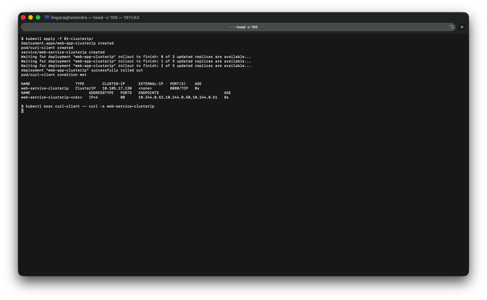
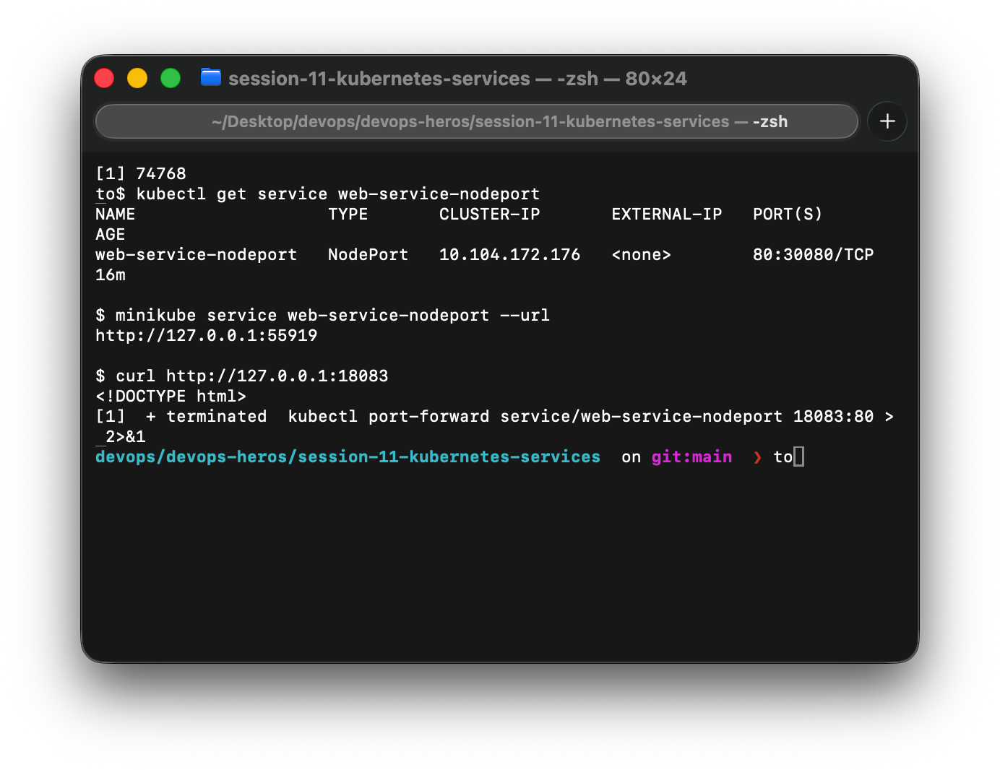
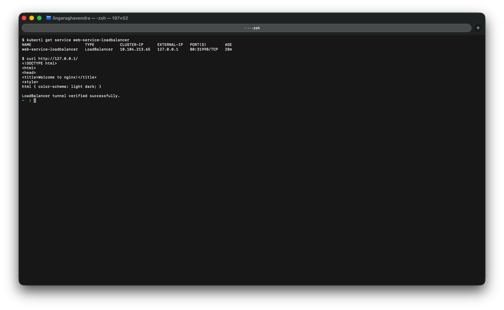
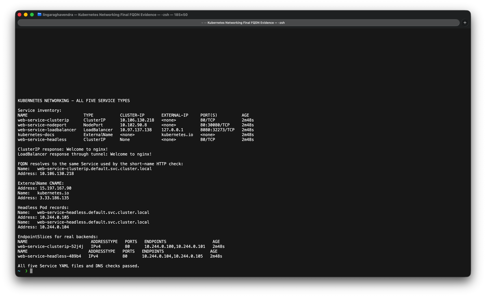

# Kubernetes Networking & Services

**Name:** Raghavendra  
**Enrollment number:** 24BCS10250  
**Class:** Lecture 11

## Aim

The aim of this session was to create and test the five main Service types, study Kubernetes DNS, and compare Deployments, ReplicaSets, DaemonSets, StatefulSets, and Services.

I ran the commands below from this folder.

I started the cluster and created a temporary client Pod for the internal tests:

```bash
minikube start --driver=docker
kubectl run dns-client --image=busybox:1.36 --command -- sleep 3600
kubectl wait --for=condition=Ready pod/dns-client --timeout=90s
```

## 1. ClusterIP Service

ClusterIP is the default Service type. It can be reached only from inside the cluster.

```bash
kubectl apply -f 01-clusterip.yaml
kubectl get service web-service-clusterip
kubectl get endpointslice -l kubernetes.io/service-name=web-service-clusterip
kubectl exec dns-client -- wget -qO- http://web-service-clusterip
```

The request returned the Nginx page, so the Service correctly forwarded traffic to its Pods.



## 2. NodePort Service

NodePort exposes a Service on a port from `30000` to `32767` on each node. This example uses port `30080`.

```bash
kubectl apply -f 02-nodeport.yaml
kubectl get service web-service-nodeport
minikube service web-service-nodeport --url
```

I opened the URL printed by Minikube and received the Nginx page.



## 3. LoadBalancer Service

LoadBalancer normally receives an external address from a cloud provider. For Minikube, I used `minikube tunnel`.

```bash
kubectl apply -f 03-loadbalancer.yaml
minikube tunnel
```

In another terminal:

```bash
kubectl get service web-service-loadbalancer
curl http://127.0.0.1:8080
```



## 4. ExternalName Service

ExternalName creates a DNS alias for an external domain. It does not create Pod endpoints.

```bash
kubectl apply -f 04-externalname.yaml
kubectl get service kubernetes-docs
kubectl exec dns-client -- nslookup kubernetes-docs
```

The DNS result shows that `kubernetes-docs` points to `kubernetes.io`.

## 5. Headless Service

A headless Service uses `clusterIP: None`. DNS returns the individual Pod addresses instead of one Service IP. This is useful with StatefulSets.

```bash
kubectl apply -f 05-headless.yaml
kubectl get service web-service-headless
kubectl get pods -l app=web-headless
kubectl get endpointslice -l kubernetes.io/service-name=web-service-headless
kubectl exec dns-client -- nslookup web-service-headless
kubectl exec dns-client -- nslookup web-headless-0.web-service-headless
```

The StatefulSet Pods have stable names such as `web-headless-0` and `web-headless-1`.



## Service type comparison

| Service type | How it is reached | Common use |
|---|---|---|
| ClusterIP | Inside the cluster | Communication between applications |
| NodePort | Node IP and a high port | Simple external access for testing |
| LoadBalancer | External IP from a load balancer | Public application in a cloud cluster |
| ExternalName | Kubernetes DNS name that points outside the cluster | Giving an external service a local alias |
| Headless | DNS records for individual Pods | Stateful applications and direct Pod discovery |

## Deployment and ReplicaSet

| Point | Deployment | ReplicaSet |
|---|---|---|
| Purpose | Manages application releases | Keeps a fixed number of matching Pods running |
| Pod management | Creates and manages ReplicaSets | Creates and replaces Pods directly |
| Scaling | Changes the replica count through the Deployment | Can be scaled directly, but normally belongs to a Deployment |
| Rolling updates | Supports rolling updates and rollback | Does not manage release history |
| Relationship | Owns ReplicaSets | Is normally owned by a Deployment |

A Deployment is normally used for an application because it gives update and rollback features. The ReplicaSet created by it makes sure the requested number of Pods stay available.

## Deployment, DaemonSet, and StatefulSet

| Point | Deployment | DaemonSet | StatefulSet |
|---|---|---|---|
| Main use | Stateless applications | One Pod on every suitable node | Stateful applications |
| Pod creation | Requested number of replicas | One Pod per selected node | Ordered Pods with stable names |
| Scaling | Change `replicas` | Add or remove nodes, or change node selection | Change `replicas` |
| Networking | Pods are normally reached through a Service | Each Pod runs on a node | Often uses a headless Service |
| Storage | Usually interchangeable Pods | Often reads node-level data | Can use stable storage for each Pod |
| Example | Web application | Log collector | Database cluster |

## ReplicaSet and Service

| ReplicaSet | Service |
|---|---|
| Keeps the required number of Pods running | Gives matching Pods a stable network address |
| Replaces failed Pods | Sends traffic to ready endpoints |
| Selects Pods using labels | Selects Pods using labels |

Pod IP addresses can change when Pods are replaced. A Service keeps the same name and virtual IP, selects the new Pods by label, and forwards requests to them.

## Kubernetes FQDN and CoreDNS

Detailed notes are available here:

- [FQDN and Service DNS](fqdn/README.md)
- [CoreDNS](coredns/README.md)

I checked DNS with:

```bash
kubectl get pods -n kube-system -l k8s-app=kube-dns
kubectl get configmap coredns -n kube-system
kubectl exec dns-client -- nslookup web-service-clusterip.default.svc.cluster.local
```

The full Service name follows this pattern:

```text
service-name.namespace.svc.cluster.local
```

## Cleanup

```bash
kubectl delete -f 01-clusterip.yaml --ignore-not-found
kubectl delete -f 02-nodeport.yaml --ignore-not-found
kubectl delete -f 03-loadbalancer.yaml --ignore-not-found
kubectl delete -f 04-externalname.yaml --ignore-not-found
kubectl delete -f 05-headless.yaml --ignore-not-found
kubectl delete pod dns-client --ignore-not-found
```
