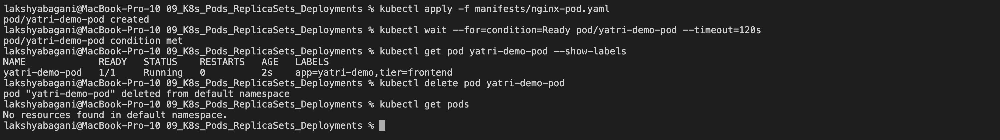
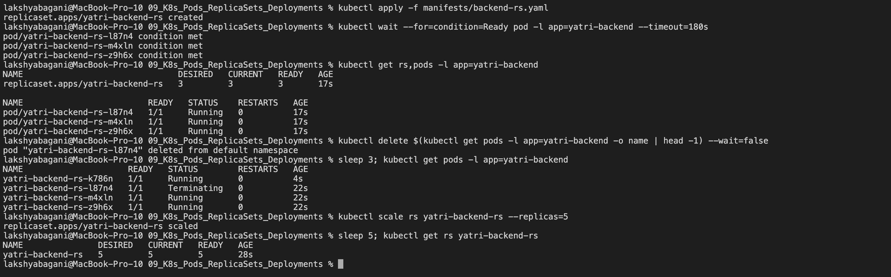
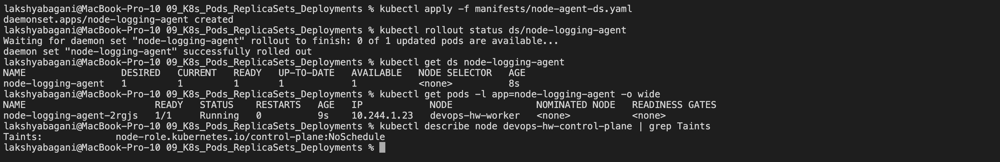
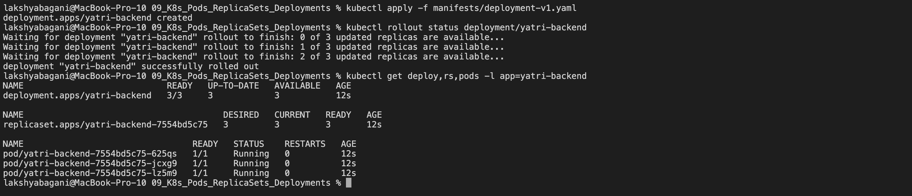
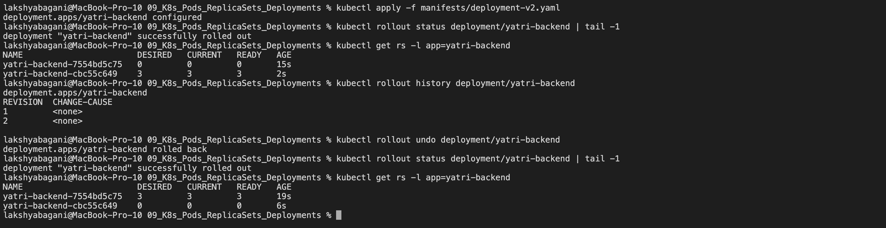
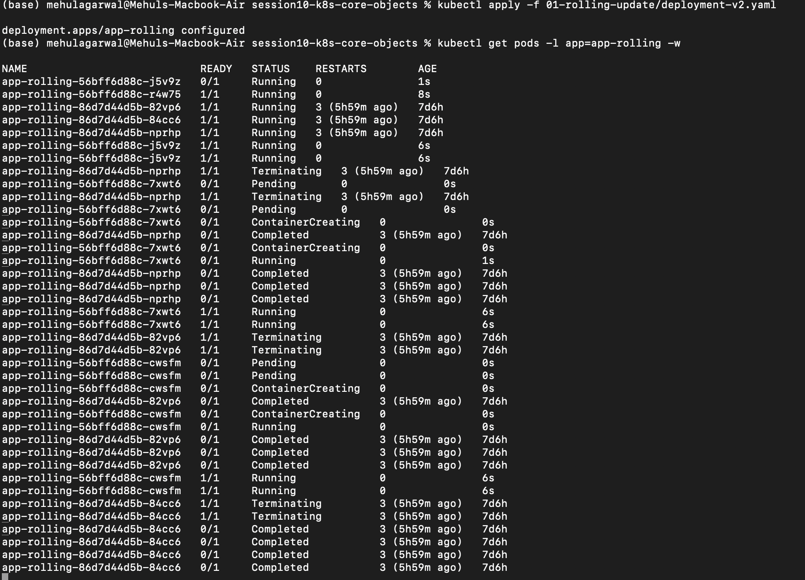
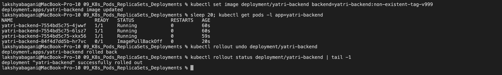
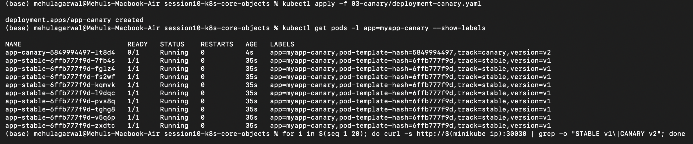
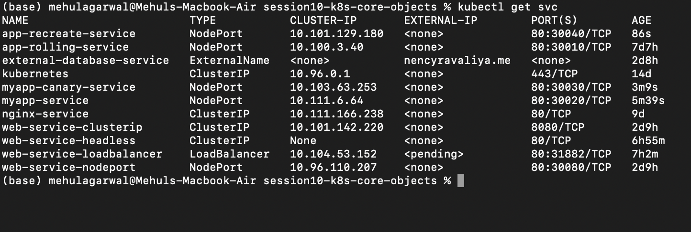

# Kubernetes Pods, ReplicaSets & Deployments

**Name:** Raghavendra  
**Enrollment number:** 24BCS10250  
**Class:** Lecture 10

This class was mainly about how Kubernetes keeps applications running and how it replaces one version with another. I arranged the notes in the same order as the tasks so they are easy to revise.

> The screenshots are reference runs from our class repositories. Commands that need the class YAML files are kept as repeatable steps rather than made-up output.

## 1. Start with a healthy cluster

```bash
minikube start
kubectl version --output=yaml
kubectl cluster-info
kubectl get nodes -o wide
kubectl get pods -n kube-system
```

I continue only when the node is `Ready` and CoreDNS is running. Otherwise later failures can look like manifest problems even when the cluster itself is unhealthy.

## 2. A standalone Pod

Every manifest has four main top-level fields:

```yaml
apiVersion: v1
kind: Pod
metadata:
  name: nginx-pod
  labels:
    app: nginx
spec:
  containers:
    - name: nginx
      image: nginx:alpine
      ports:
        - containerPort: 80
```

```bash
kubectl apply -f pod.yml
kubectl wait --for=condition=Ready pod/nginx-pod --timeout=120s
kubectl get pod nginx-pod -o wide --show-labels
kubectl logs nginx-pod
kubectl describe pod nginx-pod
kubectl delete pod nginx-pod
```

A bare Pod is not self-healing. If I delete it, no controller creates a replacement.



## 3. `ErrImagePull` and `ImagePullBackOff`

An invalid image can still pass API validation, so the Pod object is stored successfully. The failure happens later when kubelet asks the container runtime to pull the image.

```bash
kubectl apply -f broken-image.yaml
kubectl get pods -w
kubectl describe pod broken-image-pod
kubectl get events --sort-by=.metadata.creationTimestamp
```

The usual sequence is:

```text
Pending -> ErrImagePull -> ImagePullBackOff
```

`ImagePullBackOff` means Kubernetes is retrying with an increasing delay. The useful error is normally near the bottom of `kubectl describe pod`.

> Manual capture point: create `broken-image-pod`, then capture its `ImagePullBackOff` status and the pull error from `kubectl describe`. The deployment rollback screenshot later in these notes is a separate failure drill.

## 4. A short-lived Pod

This is a useful way to see a successful batch Pod:

```yaml
apiVersion: v1
kind: Pod
metadata:
  name: hello
spec:
  restartPolicy: Never
  containers:
    - name: hello
      image: busybox:1.36
      command: ["sh", "-c", "echo hello; sleep 5"]
```

Apply it and watch quickly from another terminal:

```bash
kubectl apply -f hello.yml
kubectl get pod hello -w
kubectl logs hello
```

The visible status normally moves through `ContainerCreating`, `Running`, then `Completed`. The Kubernetes Pod phase behind `Completed` is `Succeeded`.

## 5. Pod lifecycle and probes lab

The 12 lifecycle examples fit into four ideas: scheduling, process exit, health checks, and multi-container behavior.

| Lab | What it demonstrates | What I would inspect |
|---|---|---|
| `01-running.yaml` | Long-running healthy process | `Running`, `Ready 1/1` |
| `02-pending.yaml` | Pod cannot be scheduled, often because of impossible resource requests | `Pending` and scheduler events |
| `03-succeeded.yaml` | Process exits with code 0 and `restartPolicy: Never` | Phase `Succeeded`, display status `Completed` |
| `04-failed.yaml` | Process exits with a non-zero code | Phase `Failed` |
| `05-crashloopbackoff.yaml` | Process repeatedly crashes and is restarted | Restart count and backoff events |
| `06-imagepullbackoff.yaml` | Image cannot be downloaded | Pull error in events |
| `07-readiness.yaml` | Container can run before it is ready for Service traffic | `Running` but `READY 0/1` |
| `08-liveness.yaml` | Kubelet restarts an unhealthy container | Restart count increases |
| `09-startup.yaml` | Slow application gets time to start before other probes take over | Startup probe succeeds first |
| `10-init-container.yaml` | Setup containers run in order before app containers | `Init:` status and init logs |
| `11-multi-container.yaml` | Containers in one Pod share networking and volumes | Both containers shown in one Pod |
| `12-termination.yaml` | Graceful shutdown after `SIGTERM` | Termination message and grace period |

```bash
kubectl apply -f pod-lifecycle/
kubectl get pods -w
kubectl describe pod <pod-name>
kubectl logs <pod-name> -c <container-name>
kubectl get events --sort-by=.lastTimestamp
```

Important difference between probes:

| Probe | Question it answers | Failure effect |
|---|---|---|
| Startup | Has this slow application finished starting? | Other probes wait; repeated failure restarts the container. |
| Readiness | Can this Pod receive traffic now? | Pod stays running but is removed from Service endpoints. |
| Liveness | Is this process stuck or unhealthy? | Kubelet restarts the container. |

> Screenshots to add manually: capture one `CrashLoopBackOff`, one readiness failure, and one graceful termination. Suggested filenames are `pod-crashloop.png`, `readiness-probe.png`, and `graceful-termination.png`.

## 6. ReplicaSet and StatefulSet

### ReplicaSet

A ReplicaSet keeps a requested number of matching Pods alive. Labels connect the Pods to the controller.

```bash
kubectl apply -f replicaset.yml
kubectl get rs
kubectl get pods --show-labels
kubectl delete pod <one-replicaset-pod>
kubectl get pods -w
```

Deleting one Pod should make the ReplicaSet create another so the desired count is restored.



### StatefulSet

A StatefulSet is for workloads that need stable identity, ordered rollout, or persistent storage.

```bash
kubectl apply -f statefulset.yml
kubectl rollout status statefulset/mysql
kubectl get pods -l app=mysql
kubectl get pvc
```

Expected names are ordinal, such as `mysql-0` and `mysql-1`. If `mysql-0` is deleted, the replacement is still called `mysql-0`. Its persistent volume claim also remains tied to that identity.

## 7. DaemonSet

A DaemonSet normally runs one copy of a Pod on every eligible node. It is useful for node exporters, logging agents and security agents.

```bash
kubectl apply -f daemonset/node-agent-ds.yaml
kubectl get daemonset
kubectl get pods -l app=node-agent -o wide
kubectl get nodes
```

There is no normal `replicas` field. Adding an eligible node causes a new DaemonSet Pod to be scheduled there automatically.



## 8. Deployment, rolling update and rollback

A Deployment manages ReplicaSets. That extra layer gives rollout history, controlled updates and rollback.

```bash
kubectl apply -f deployment/deployment-v1.yaml
kubectl rollout status deployment/app
kubectl get deploy,rs,pods

kubectl apply -f deployment/deployment-v2.yaml
kubectl rollout status deployment/app
kubectl rollout history deployment/app

kubectl rollout undo deployment/app
kubectl rollout status deployment/app
```

For a zero-downtime rolling update:

```yaml
strategy:
  type: RollingUpdate
  rollingUpdate:
    maxSurge: 1
    maxUnavailable: 0
```

- `maxSurge: 1` allows one extra Pod above the desired replica count during the update.
- `maxUnavailable: 0` keeps all desired replicas available before an old Pod is removed.
- Percentage values are calculated from the desired replica count. `maxSurge` rounds up; `maxUnavailable` rounds down.







## 9. Troubleshooting drills

### Broken image during a Deployment update

```bash
kubectl set image deployment/app app=example/not-real:v999
kubectl rollout status deployment/app --timeout=60s
kubectl get pods
kubectl describe pod <new-broken-pod>
kubectl rollout undo deployment/app
```

With a safe rolling strategy, old healthy Pods stay available while the new ReplicaSet is stuck.



### Selector mismatch

The labels in `spec.selector.matchLabels` must match the Pod-template labels. A mismatch is rejected because the Deployment would not know which Pods it owns.

```bash
kubectl apply -f selector-mismatch.yaml
kubectl get events --sort-by=.lastTimestamp
```

Fix the manifest before creating the Deployment. A Deployment selector is immutable after creation, so changing it later normally requires recreating that Deployment.

## 10. Concepts I kept mixing up

### Ports

| Field | Meaning |
|---|---|
| `containerPort` | Documents the port used by the process inside a container. It does not expose the Pod by itself. |
| `targetPort` | Pod port to which a Service forwards traffic. |
| `port` | Port clients use on the Service. |
| `nodePort` | High port opened on each node for a NodePort Service. |

### Labels and selectors

Labels are key-value tags placed on objects. Selectors are queries controllers and Services use to find objects with the required labels.

```bash
kubectl get pods -l app=web
kubectl get pods --show-labels
```

### Requests and limits

| Setting | Meaning |
|---|---|
| CPU request | Used by the scheduler when choosing a node. |
| Memory request | Memory reserved for scheduling decisions. |
| CPU limit | CPU usage is throttled above the limit. |
| Memory limit | Exceeding it can cause an `OOMKilled` container. |

`1Gi` is 1,073,741,824 bytes, while `1G` is 1,000,000,000 bytes.

## 11. Blue-green deployment

Blue-green keeps two complete environments:

```text
Service selector: slot=blue  -> Blue v1 Pods
Service selector: slot=green -> Green v2 Pods
```

```bash
kubectl apply -f 02-blue-green/deployment-blue.yaml
kubectl apply -f 02-blue-green/deployment-green.yaml
kubectl apply -f 02-blue-green/service-blue.yaml
kubectl get endpointslice -l kubernetes.io/service-name=app-service

# Cut over to green
kubectl apply -f 02-blue-green/service-green.yaml

# Roll back immediately
kubectl apply -f 02-blue-green/service-blue.yaml
```

The switch is fast because the Service selector changes. The trade-off is running both versions at the same time.

> Manual capture point: show the Service selector and EndpointSlice before the switch, apply the green Service manifest, and show the changed endpoints after the switch.

## 12. Canary deployment

Canary releases a new version to a small part of the traffic first. With normal Kubernetes Service balancing, the split is an approximation based on the number of ready endpoints.

```bash
kubectl apply -f 03-canary/deployment-stable.yaml
kubectl apply -f 03-canary/deployment-canary.yaml
kubectl apply -f 03-canary/service.yaml

kubectl scale deployment app-stable --replicas=9
kubectl scale deployment app-canary --replicas=1
kubectl get endpointslice -l kubernetes.io/service-name=app-service

# Keep this running in Terminal 1; some drivers create a local tunnel.
minikube service app-service --url

# In Terminal 2, paste the exact URL printed above when prompted.
read -r -p 'Minikube URL: ' APP_URL
for i in $(seq 1 20); do
  curl -s "$APP_URL"
done

# Increase the canary share, or abort it
kubectl scale deployment app-stable --replicas=7
kubectl scale deployment app-canary --replicas=3
kubectl scale deployment app-canary --replicas=0
```

A 9:1 Pod ratio does not guarantee exactly 90:10 traffic for a small sample. For precise weighted routing, a service mesh or traffic-aware gateway is a better choice.





> Manual capture point: save the completed 20-request loop showing both stable and canary responses as `images/canary-responses.png`.

## 13. Recreate deployment

`Recreate` stops the old Pods before starting the new version. It is simple but creates a real outage window.

```yaml
strategy:
  type: Recreate
```

```bash
kubectl apply -f 04-recreate/deployment-v1.yaml
kubectl apply -f 04-recreate/service.yaml
kubectl rollout status deployment/app-recreate

# Terminal 1
kubectl get pods -l app=app-recreate -w

# Terminal 2: first keep this running to obtain the local URL
minikube service app-recreate --url

# Terminal 3: paste the exact URL printed by Terminal 2 when prompted
read -r -p 'Minikube URL: ' APP_URL
while true; do
  curl -s --connect-timeout 1 "$APP_URL" \
    || echo '[OUTAGE] no ready Pod';
  sleep 0.5;
done

# Terminal 4
kubectl apply -f 04-recreate/deployment-v2.yaml
```

> Screenshot to add manually: capture the request loop changing from v1 to an outage and then v2. Save it as `images/recreate-outage.png`.

## Deployment strategy summary

| Strategy | Downtime | Extra capacity | Traffic control | Best fit |
|---|---:|---:|---|---|
| Rolling update | Normally none | Small surge | Gradual Pod replacement | Default stateless application update |
| Blue-green | None during switch | About two full environments | All traffic switches through selector/routing change | Fast cutover and rollback |
| Canary | None | Small at first | Small group receives new version | Risk-controlled releases |
| Recreate | Yes | None | Old version stops before new starts | Incompatible versions or single-writer workloads |

## Cleanup

Delete only the resources created for the lab:

```bash
kubectl delete -f <lab-directory>
kubectl get all
```
