# Kubernetes Troubleshooting

**Name:** Raghavendra
**Enrollment number:** 24BCS10250
**Session:** 14

I used an isolated `troubleshooting-audit` namespace. For each problem, I inspected the resources and events before changing the configuration, applied the fix, and verified the result. The files under `issues/` deliberately reproduce failures.

## Commands

| Command | What it helped me check |
|---|---|
| `kubectl get` | Current resource status and readiness |
| `kubectl get pods -o wide` | Pod IP and node placement |
| `kubectl describe` | Configuration, conditions and events |
| `kubectl logs` | Application output; `--previous` reads the last failed container |
| `kubectl exec` | Commands inside a running container |
| `kubectl events` | Recent scheduling, startup and failure events |
| `kubectl explain` | Meaning and structure of API fields |
| `kubectl top` | Current Pod CPU and memory usage |

The [command practice output](outputs/02-commands.txt) contains every command above. Metrics Server must be ready before `top` can return measurements.

## Setup

Run from this folder:

```bash
kubectl create namespace troubleshooting-audit
kubectl -n troubleshooting-audit apply -f mini-project/deployment.yaml -f mini-project/service.yaml -f issues/client.yaml
kubectl -n troubleshooting-audit rollout status deployment/troubleshooting-app
kubectl -n troubleshooting-audit wait --for=condition=Ready pod/diagnostic-client --timeout=90s
kubectl -n troubleshooting-audit exec diagnostic-client -- wget -qO- http://troubleshooting-service
```

The [setup output](outputs/01-setup.txt) records a healthy starting application.

## CrashLoopBackOff

The container printed `starting`, exited with code 1 and restarted repeatedly. `describe`, events and `logs --previous` identified the failing command. I replaced it with a long-running command; the replacement Pod reached 1/1 Running.

```bash
kubectl -n troubleshooting-audit apply -f issues/crashloop-broken.yaml
kubectl -n troubleshooting-audit describe pod crashloop-demo
kubectl -n troubleshooting-audit logs crashloop-demo --previous
kubectl -n troubleshooting-audit delete pod crashloop-demo
kubectl -n troubleshooting-audit apply -f issues/crashloop-fixed.yaml
kubectl -n troubleshooting-audit wait --for=condition=Ready pod/crashloop-demo --timeout=90s
```

[Before](outputs/crashloop-before.txt), [after](outputs/crashloop-after.txt).

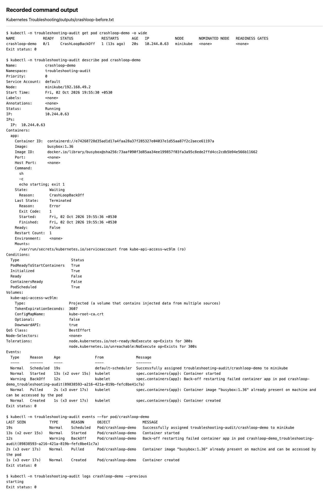

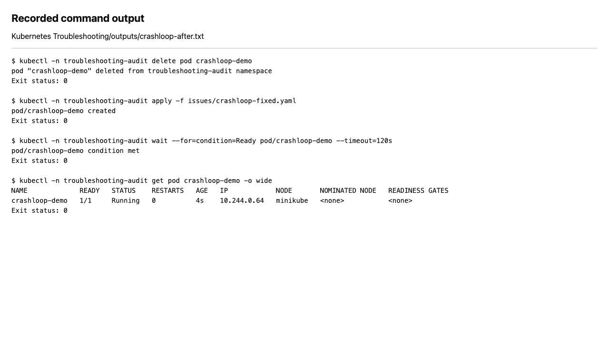

## Pending

The Pod requested 1000 CPU cores. Events reported `Insufficient cpu`, so it could not be scheduled on the node. I reduced the request to 10m and recreated the Pod; it was scheduled and became ready.

```bash
kubectl -n troubleshooting-audit apply -f issues/pending-broken.yaml
kubectl -n troubleshooting-audit describe pod pending-demo
kubectl -n troubleshooting-audit delete pod pending-demo
kubectl -n troubleshooting-audit apply -f issues/pending-fixed.yaml
kubectl -n troubleshooting-audit wait --for=condition=Ready pod/pending-demo --timeout=90s
```

[Before](outputs/pending-before.txt), [after](outputs/pending-after.txt).

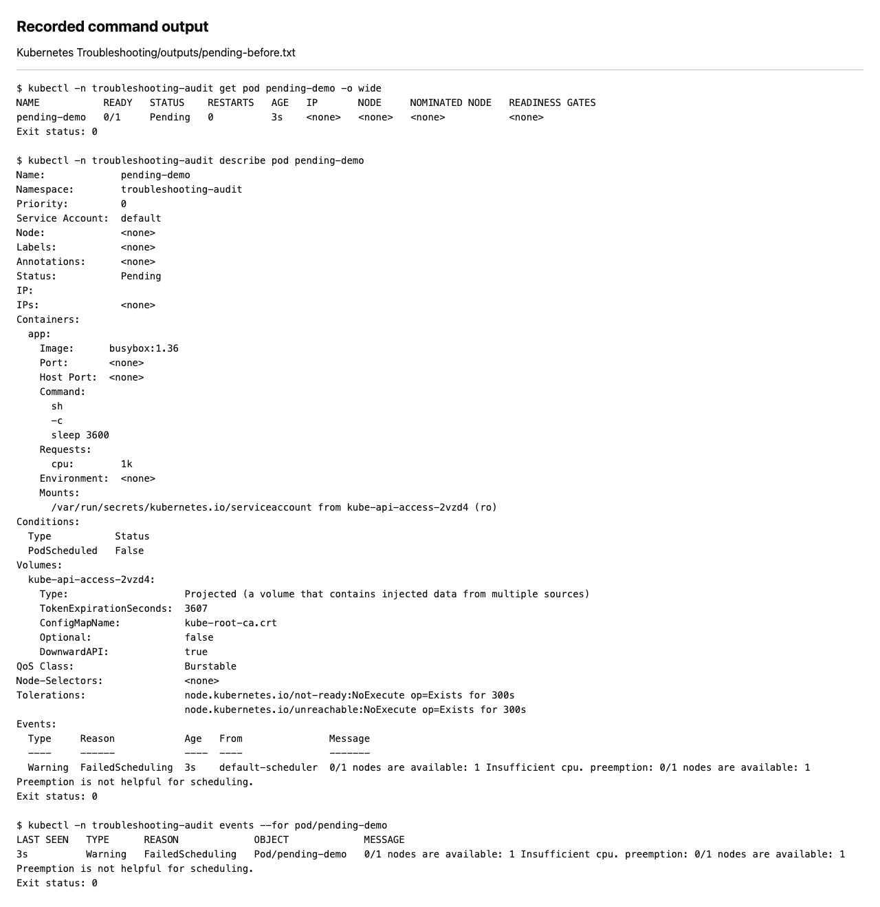

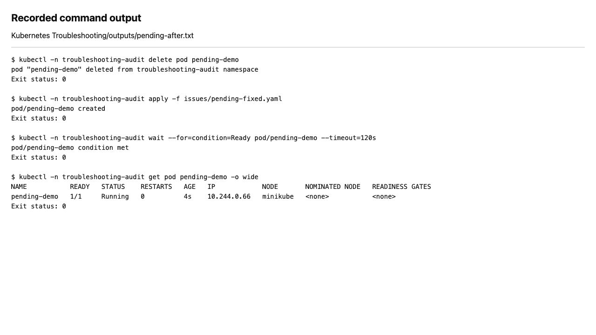

## ContainerCreating

The Pod was scheduled, but its ConfigMap volume could not mount. Events reported `FailedMount` because `volume-config` did not exist. Creating that ConfigMap allowed the mount and startup to finish; reading `/config/message` returned `mount-ready`.

```bash
kubectl -n troubleshooting-audit apply -f issues/containercreating-broken.yaml
kubectl -n troubleshooting-audit describe pod volume-mount-demo
kubectl -n troubleshooting-audit apply -f issues/volume-config.yaml
kubectl -n troubleshooting-audit wait --for=condition=Ready pod/volume-mount-demo --timeout=90s
kubectl -n troubleshooting-audit exec volume-mount-demo -- cat /config/message
```

[Before](outputs/containercreating-before.txt), [after](outputs/containercreating-after.txt).

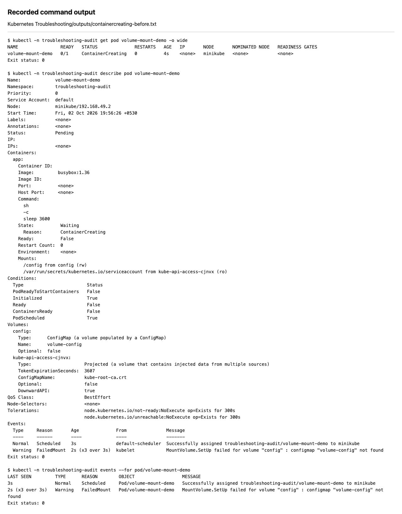

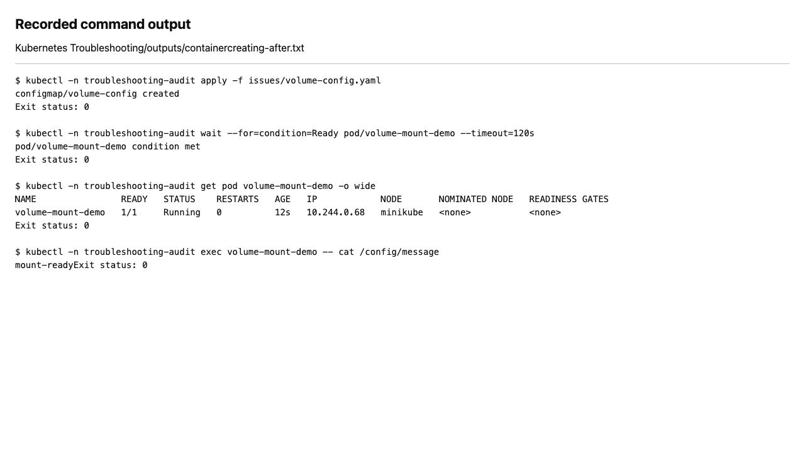

## Configuration error

The container referenced an absent ConfigMap through `envFrom`. It reported `CreateContainerConfigError`. Creating `required-config` fixed it, and `printenv ENVIRONMENT` returned `classroom`.

```bash
kubectl -n troubleshooting-audit apply -f issues/configuration-broken.yaml
kubectl -n troubleshooting-audit describe pod configuration-demo
kubectl -n troubleshooting-audit apply -f issues/configmap.yaml
kubectl -n troubleshooting-audit wait --for=condition=Ready pod/configuration-demo --timeout=90s
kubectl -n troubleshooting-audit exec configuration-demo -- printenv ENVIRONMENT
```

[Before](outputs/configuration-before.txt), [after](outputs/configuration-after.txt).

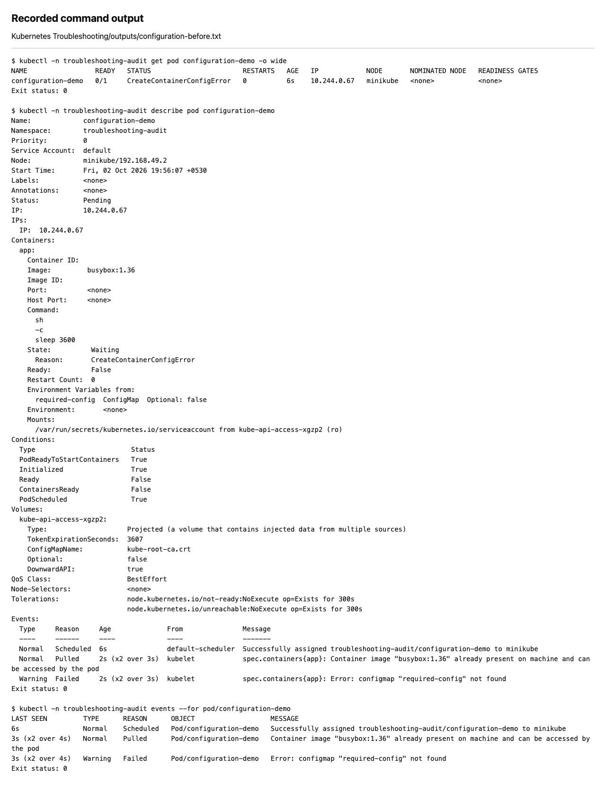

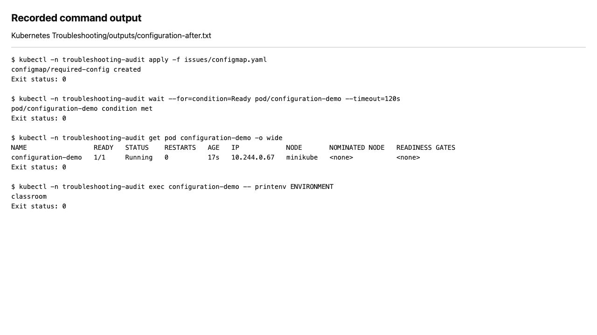

## ErrImagePull and ImagePullBackOff

The class mini-project Pod used `nginx:this-tag-does-not-exist`. Its events first showed `ErrImagePull` and then `ImagePullBackOff` when Kubernetes delayed further attempts. The registry reported that the tag was not found. Applying a real Nginx tag made the Pod ready.

```bash
kubectl -n troubleshooting-audit apply -f mini-project/broken-pod.yaml
kubectl -n troubleshooting-audit describe pod project-broken-pod
kubectl -n troubleshooting-audit events --for pod/project-broken-pod
kubectl -n troubleshooting-audit apply -f mini-project/fixed-pod.yaml
kubectl -n troubleshooting-audit wait --for=condition=Ready pod/project-broken-pod --timeout=90s
```

[Before](outputs/image-before.txt), [after](outputs/image-after.txt).

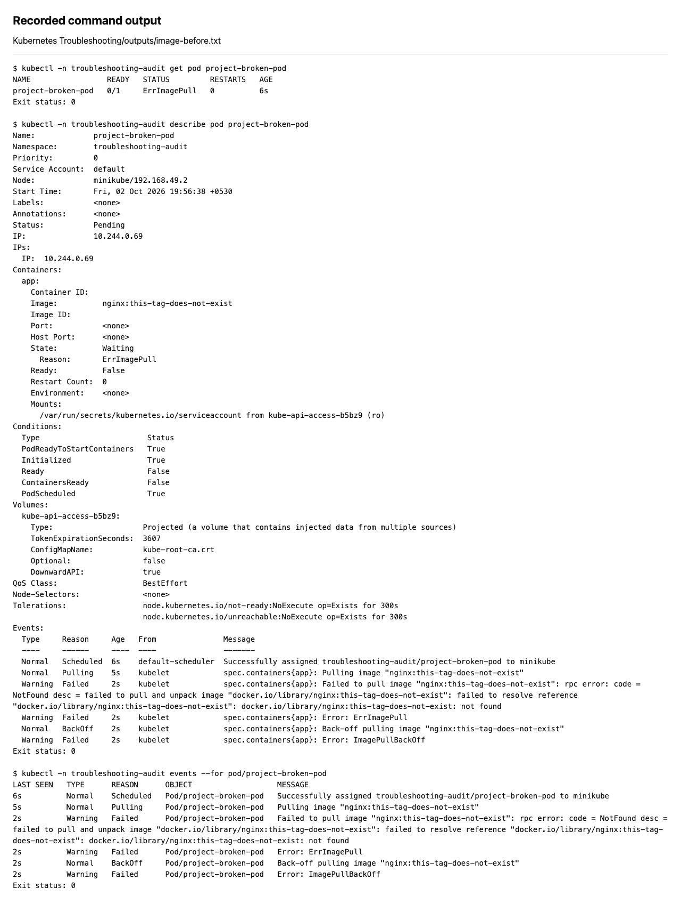

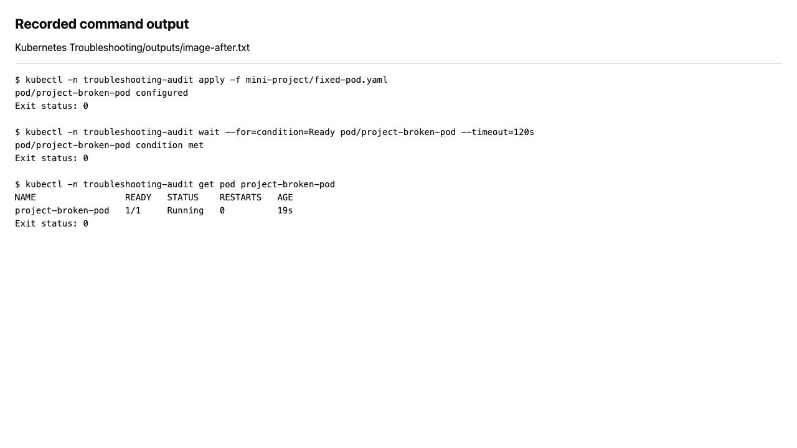

## Service connectivity

The Service selector used `app=wrong-app`, while the Pods used `app=troubleshooting-app`. It had no backend addresses and the client request failed. Restoring the selector populated its EndpointSlice and the same client received the Nginx page.

```bash
kubectl -n troubleshooting-audit apply -f mini-project/broken-service.yaml
kubectl -n troubleshooting-audit get pods --show-labels
kubectl -n troubleshooting-audit describe service troubleshooting-service
kubectl -n troubleshooting-audit get endpointslice -l kubernetes.io/service-name=troubleshooting-service
kubectl -n troubleshooting-audit apply -f mini-project/service.yaml
kubectl -n troubleshooting-audit exec diagnostic-client -- wget -qO- http://troubleshooting-service
```

[Before](outputs/service-before.txt), [after](outputs/service-after.txt).

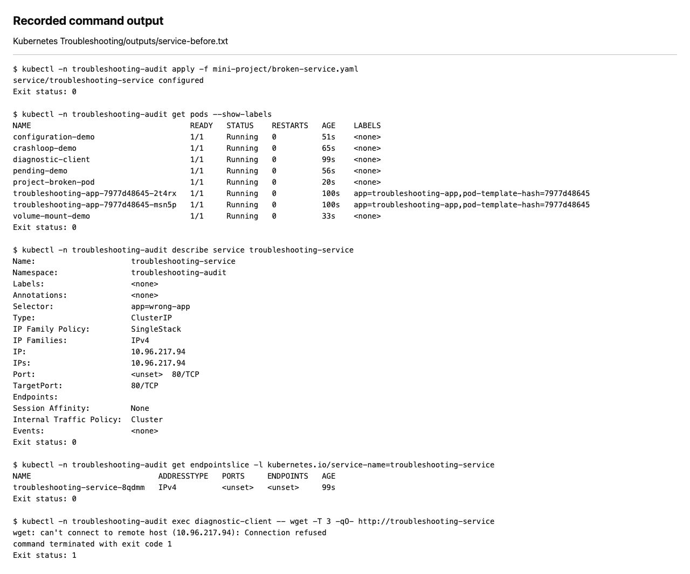

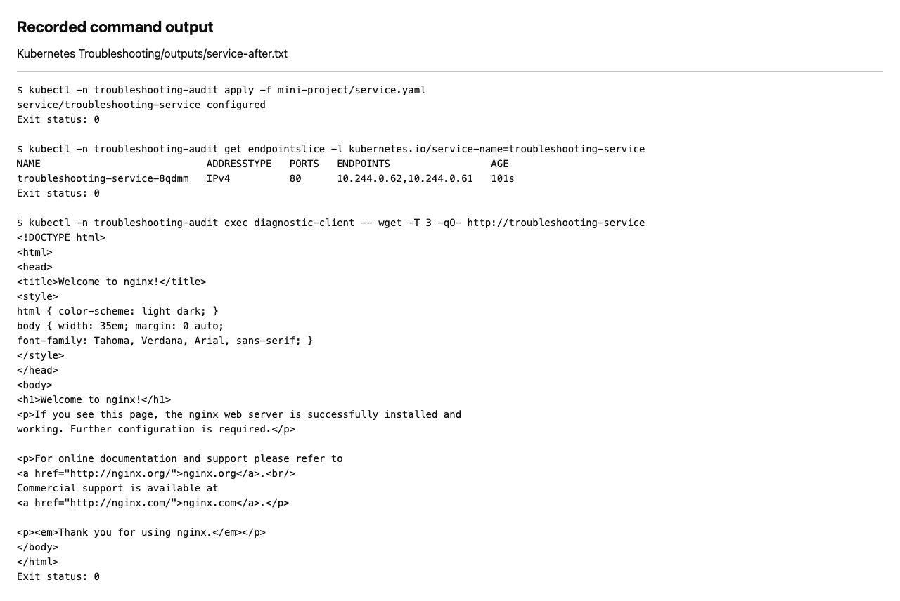

## DNS configuration

The test Pod had `dnsPolicy: None` and an incorrect nameserver. Looking at `/etc/resolv.conf` showed the wrong configuration; the Service lookup failed. Recreating it with `ClusterFirst` restored the Kubernetes resolver, and the full Service name and HTTP request worked.

```bash
kubectl -n troubleshooting-audit apply -f issues/dns-broken.yaml
kubectl -n troubleshooting-audit exec dns-broken -- cat /etc/resolv.conf
kubectl -n troubleshooting-audit exec dns-broken -- nslookup troubleshooting-service.troubleshooting-audit.svc.cluster.local. 192.0.2.1
kubectl -n troubleshooting-audit delete pod dns-broken
kubectl -n troubleshooting-audit apply -f issues/dns-fixed.yaml
kubectl -n troubleshooting-audit exec dns-broken -- nslookup troubleshooting-service.troubleshooting-audit.svc.cluster.local.
kubectl -n troubleshooting-audit exec dns-broken -- wget -qO- http://troubleshooting-service
```

[Before](outputs/dns-before.txt), [after](outputs/dns-after.txt).

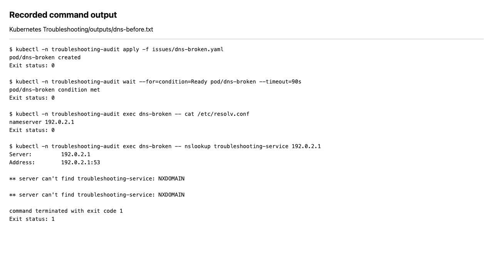

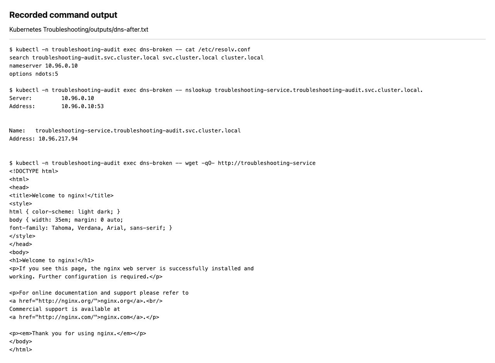

## Wrong target port

DNS resolved the Service and the application responded inside the Pod, but client HTTP requests were refused. The Service sent traffic to port 8081 while Nginx listened on 80. Changing `targetPort` back to 80 restored traffic to the Pod IPs.

```bash
kubectl -n troubleshooting-audit apply -f issues/wrong-port-service.yaml
kubectl -n troubleshooting-audit get pods -o wide
kubectl -n troubleshooting-audit describe service troubleshooting-service
kubectl -n troubleshooting-audit exec deployment/troubleshooting-app -- curl -fsS http://127.0.0.1:80
kubectl -n troubleshooting-audit apply -f mini-project/service.yaml
kubectl -n troubleshooting-audit exec diagnostic-client -- wget -qO- http://troubleshooting-service
```

[Before](outputs/port-before.txt), [after](outputs/port-after.txt).

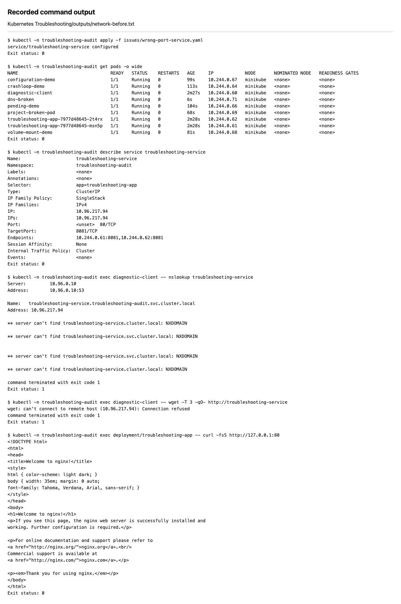

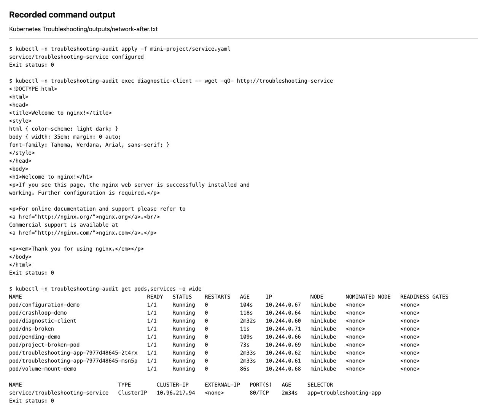

## Pod networking

The web container listened only on `127.0.0.1:80`. A request inside the container worked, but another Pod could not reach its Pod IP. The Nginx configuration and the two HTTP checks showed that this was a listening-address problem. I recreated the Pod with Nginx listening on port 80 on all interfaces; the client then reached the replacement Pod directly.

```bash
kubectl -n troubleshooting-audit apply -f issues/network-broken.yaml
kubectl -n troubleshooting-audit exec network-demo -- wget -qO- http://127.0.0.1:80
kubectl -n troubleshooting-audit get pod network-demo -o wide
kubectl -n troubleshooting-audit delete pod network-demo
kubectl -n troubleshooting-audit apply -f issues/network-fixed.yaml
```

Use the current Pod IP from `get -o wide` for the client request. A Pod IP can change after recreation. [Before](outputs/network-before.txt), [after](outputs/network-after.txt) include the actual IP addresses and requests.

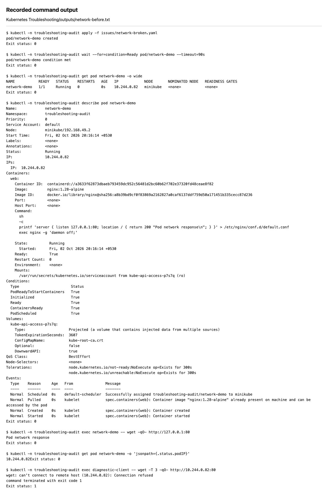

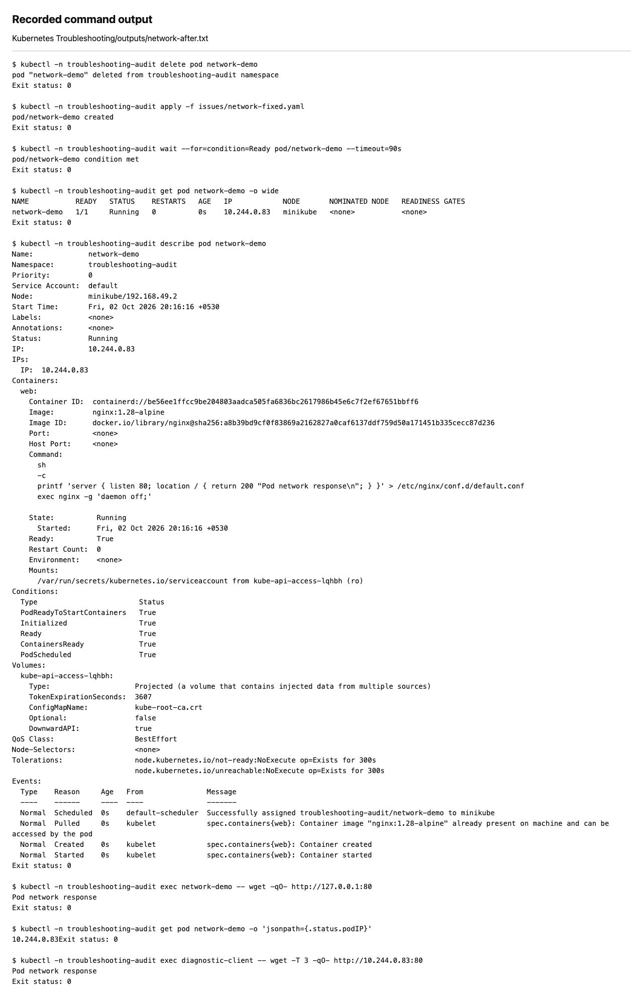

## Mini-project answers

The [mini-project README](mini-project/README.md) answers the class questions and records the broken image and Service investigations.

## Cleanup

```bash
kubectl delete namespace troubleshooting-audit
```

Deleting this exercise namespace removes both the healthy and deliberately broken examples.

The [metrics check](outputs/metrics.txt) records CPU and memory once Metrics Server had measurements for the new Pods.
