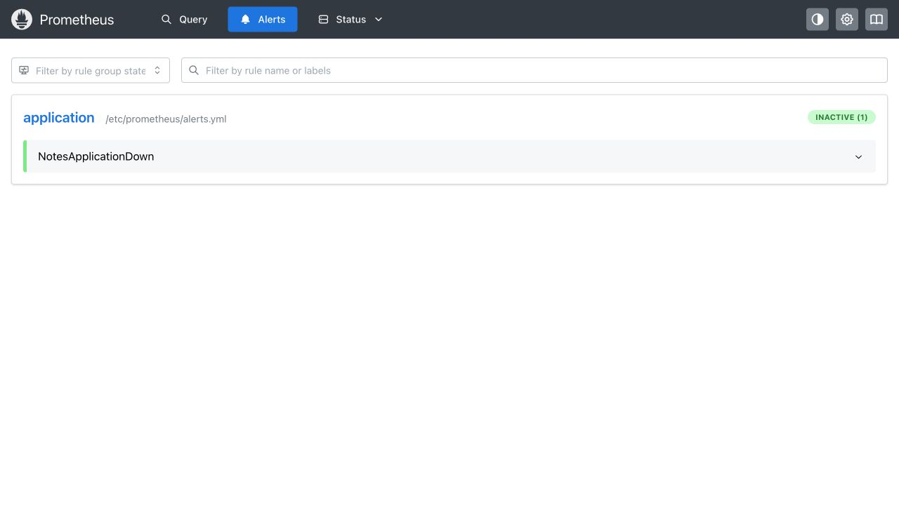
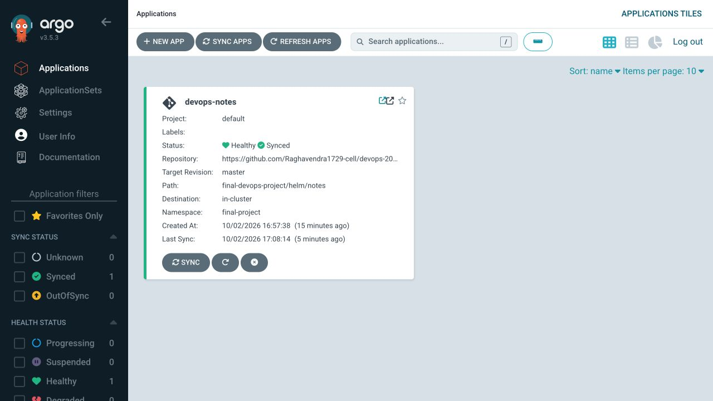

# Monitoring, Observability and GitOps

**Name:** Raghavendra  
**Enrollment number:** 24BCS10250  
**Session:** 20

## Monitoring

The [monitoring stack](../final-devops-project/monitoring/stack.yaml) runs Prometheus and Grafana. Prometheus scrapes the application every five seconds and evaluates an application-down alert. Grafana uses a provisioned dashboard for availability, request rate, CPU and memory. Both services store data on PVCs.

Start the Notes app using the final project's Helm instructions, then run:

```bash
./install-monitoring.sh
kubectl -n observability get pods,pvc
kubectl -n observability port-forward service/prometheus 9090:9090
```

In another terminal:

```bash
kubectl -n observability port-forward service/grafana 3000:3000
```

Open `http://127.0.0.1:3000/d/devops-notes`. Generate traffic to the Notes page or its `/work` endpoint. Inspect logs and utilization:

```bash
kubectl -n final-project logs deployment/notes --tail=20
kubectl -n final-project top pods
```

The dashboard measures the scraped application process. `kubectl top pods` gives Kubernetes Pod usage. These measurements have different scopes.

## Metrics, logs and traces

| Pillar | What it shows | Example and tools |
|---|---|---|
| Metrics | Numeric measurements over time | CPU, memory, error counts; Prometheus and Grafana |
| Logs | Events written by the application or service | A request returning 400; stdout, kubectl logs, Loki |
| Traces | One request's path through components | Time spent in API and database calls; OpenTelemetry, Jaeger |

Monitoring shows that something is wrong. Observability helps investigate why it is wrong. For example, a failed health metric points to an unavailable service; Pod events and application logs help explain the failure. Distributed traces become useful when a request passes through several services.

For Kubernetes, check Pods, events, probes, logs and Metrics Server alongside application metrics. This small single-service demo uses metrics and logs. The trace explanation describes how tracing would help a multi-service application.

## Alert demonstration

The `NotesApplicationDown` rule tests `up{job="notes"} == 0` for 15 seconds. Change the Service selector so that the scrape target has no endpoint, observe the alert, then restore the selector.

```bash
kubectl -n final-project patch service notes -p '{"spec":{"selector":{"app":"notes-wrong"}}}'
kubectl -n final-project get endpointslice -l kubernetes.io/service-name=notes
```

After checking the alert at `http://127.0.0.1:9090/alerts`, restore it:

```bash
kubectl -n final-project patch service notes -p '{"spec":{"selector":{"app":"notes"}}}'
curl -fsS 'http://127.0.0.1:9090/api/v1/query?query=up%7Bjob%3D%22notes%22%7D'
```

Do this before enabling Argo CD self-healing, or perform the deliberate change through Git. Otherwise reconciliation may fix the selector before the alert fires.

## GitOps

Git stores the intended configuration. Argo CD reads the [Application](../final-devops-project/gitops/application.yaml), renders the Helm chart and continuously compares Git with Kubernetes. Automated sync applies Git changes; self-healing restores manual drift.

Follow the final project's Argo CD installation commands, then:

```bash
kubectl apply -f ../final-devops-project/gitops/application-local.yaml
kubectl -n argocd get application devops-notes
```

Change the greeting in `final-devops-project/gitops/values.yaml`, commit and push. Argo CD synchronizes the ConfigMap and Deployment. Verify the greeting using the browser and inspect the Application's Git revision.

To check self-healing:

```bash
kubectl -n final-project patch configmap notes-config --type merge -p '{"data":{"GREETING":"Manual change"}}'
kubectl -n final-project get configmap notes-config -o jsonpath='{.data.GREETING}'
```

After reconciliation the value returns to the greeting in Git. A manual `kubectl` change is not a permanent GitOps update.

[Prometheus alert rules](https://prometheus.io/docs/prometheus/latest/configuration/alerting_rules/), [Argo CD automated sync](https://argo-cd.readthedocs.io/en/stable/user-guide/auto_sync/).

## Results

The [storage and metrics output](outputs/storage-and-metrics.txt) shows the two PVCs bound and the application target available. Traffic generated through `/work` increased the request rate and CPU graph.


The wrong Service selector removed its ready endpoints. Prometheus reported the application-down alert as firing. Restoring the selector returned the endpoints and cleared the alert.




The exact results are in [broken Service output](outputs/broken-service.txt), [firing alert](outputs/alert-firing.json), [restored Service](outputs/service-restored.txt) and [recovered alert](outputs/alert-recovered.json).

Argo CD synchronized the configuration from Git and reported Healthy. Changing the greeting in Git updated the running page to My DevOps Notes. The [self-healing output](outputs/gitops-self-healing.txt) records the manual change and restoration; the [final state](outputs/gitops-healthy.txt) confirms Synced and Healthy.




