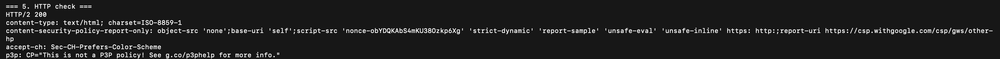

# Networking Fundamentals

For this homework, I ran some basic networking commands and checked how my system connects to the internet.

## 1. Ping

I used `ping` to check whether `google.com` was reachable and to see the response time.

```bash
ping -c 2 google.com
```

Both packets were received with `0.0%` packet loss, so the connection to Google was working.


## 2. Traceroute

I used `traceroute` to see the first few routers between my system and Google.

```bash
traceroute -m 3 -w 1 google.com
```

Each line is one network hop. This helps find where a connection might be slow or fail.


## 3. Listening TCP ports

I used `netstat` to see ports on my computer that were waiting for network connections.

```bash
netstat -an -p tcp | grep LISTEN | head -3
```

The `LISTEN` status means a program is ready to accept a connection on that port.


## 4. DNS lookup

I used `nslookup` to check that DNS could convert `google.com` into IP addresses.

```bash
nslookup google.com | tail -6
```

The result shows the IP addresses returned for `google.com`.


## 5. HTTP check

I used `curl` to check whether an HTTPS request to Google was successful.

```bash
curl -sS -I --max-time 10 https://www.google.com | head -5
```

The `HTTP/2 200` response means the website responded successfully.



## What I learned

- `ping` checks basic network connectivity and packet loss.
- `traceroute` shows the route packets take through different routers.
- `netstat` shows local ports that are open and listening.
- `nslookup` checks whether DNS can find an IP address for a domain name.
- `curl` checks whether a website responds over HTTP or HTTPS.

## Class reference

- [Network Troubleshooting](https://github.com/Nency-Ravaliya/Network-Troubleshooting)
