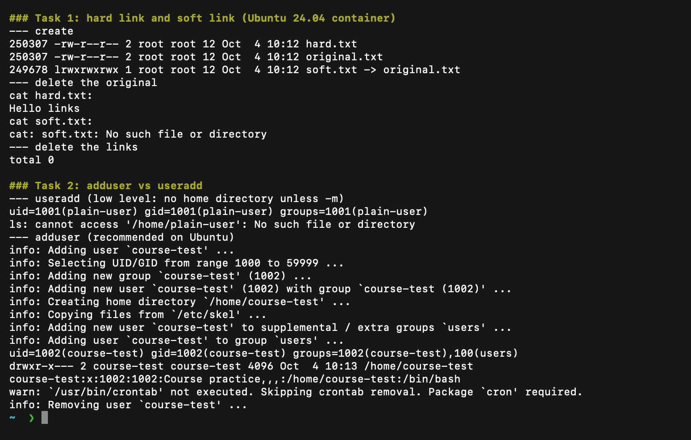
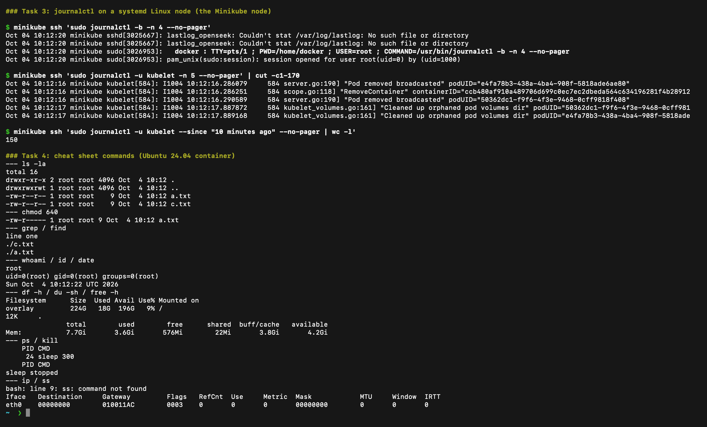

# Linux Fundamentals

**Name:** Raghavendra
**Enrollment number:** 24BCS10250

## Soft links and hard links

A hard link is another filename for the same inode. Removing the original name does not remove the data while another hard link still exists. A symbolic link stores a target path, so it becomes broken when that target disappears. Soft links can cross filesystems and point to directories; ordinary hard links cannot.

```bash
echo "Hello links" > original.txt
ln original.txt hard.txt
ln -s original.txt soft.txt
ls -li original.txt hard.txt soft.txt
rm original.txt
cat hard.txt
cat soft.txt
rm hard.txt soft.txt
```

The original and hard link had the same inode. After deleting the original, the hard link still returned the text and the soft link failed. These are the main points I would explain in an interview. The [Linux practice output](outputs/linux-practice.txt) records creation, inspection and deletion.

## adduser and useradd

`useradd` is the low-level command from the system tools. By default it only adds the entry to `/etc/passwd`; it does not create a home directory unless I pass `-m`, and the login shell and password also need extra flags. `adduser` is a friendlier Perl wrapper on Debian and Ubuntu around `useradd`. It creates the home directory (copying files from `/etc/skel`), creates a group with the same name, asks for a password and sets sensible defaults from `/etc/adduser.conf`. That is why `adduser` is the one to use on Ubuntu for normal users, and `useradd` is better inside scripts where nothing should prompt.

I created a test user in a disposable Ubuntu 24.04 container. The exercise used a disabled password because the test user did not need to log in.

```bash
adduser --disabled-password --gecos "Course practice" course-test
id course-test
ls -ld /home/course-test
deluser course-test

# for comparison: useradd without -m creates no home directory
useradd plain-user
ls -ld /home/plain-user
userdel plain-user
```

`id` shows the new UID and group, and `ls -ld` shows the home directory. I removed the user afterwards.

## journalctl

`journalctl` reads logs collected by systemd-journald. I used the local Minikube Linux node, which runs systemd, for this exercise.

```bash
sudo journalctl -b -n 5 --no-pager
sudo journalctl -u kubelet -n 5 --no-pager
sudo journalctl -u kubelet --since "10 minutes ago" --no-pager
sudo journalctl -u kubelet -f
```

`-b` selects this boot, `-u` selects a service, `--since` limits the time, and `-f` follows new entries until Ctrl+C. The captured boot and kubelet logs are at the end of the [practice output](outputs/linux-practice.txt). Some kubelet errors came from the intentionally broken Pod exercises.

## Command cheat sheet

I went through the [Linux cheat sheet PDF](../notes/linux_cheat_sheet.pdf) from class and practised the commands below.

| Commands | What I used them for |
|---|---|
| `pwd`, `ls -la`, `cd` | Check paths and move between directories |
| `mkdir`, `rmdir` | Create and remove directories |
| `touch`, `cp`, `mv`, `rm` | Create, copy, rename and remove files |
| `cat`, `head`, `tail`, `grep`, `find` | Read files and find text or filenames |
| `chmod`, `chown` | Change permissions and ownership |
| `whoami`, `id`, `date` | Inspect the current identity and date |
| `df -h`, `du -sh`, `free -h` | Check filesystem, directory and memory usage |
| `ps`, `top`, `uptime` | Inspect processes and resource usage |
| `kill PID` | Stop a selected process; I used a temporary sleep process |
| `ip addr`, `ip route`, `ss -tuln` (on the Minikube node) | Inspect interfaces, routes and listening sockets |
| `lsblk`, `findmnt` | Inspect devices and mounted filesystems |
| `mount`, `umount` | Attach or detach a filesystem when needed |
| `journalctl` | Read system and service logs |

For permissions, `640` means owner read/write, group read, and no access for others. I worked in a temporary directory and removed the exercise files afterwards. Network practice is in the [networking notes](../Session-4-Networking/README.md).

[Additional permissions and mount practice](outputs/permissions-and-mount.txt) includes touch, ownership, executable permissions, directory size, time-filtered service logs and a temporary tmpfs mount.

Real runs in an Ubuntu 24.04 container. Tasks 1 and 2: the hard link survives `rm original.txt` while the soft link breaks, and `useradd` creates a user with no home directory while `adduser` creates the home directory, the group and the `/etc/passwd` entry:



Tasks 3 and 4: `journalctl` on the Minikube node (a systemd Linux machine) and the cheat-sheet commands:



