# Kubernetes Pods, ReplicaSets & Deployments

**Name:** Raghavendra
**Enrollment number:** 24BCS10250
**Class:** Lecture 10

## Aim

The aim of this session was to practise four deployment strategies and observe different Pod lifecycle states.

I ran the commands below from this folder.

Before starting, I checked the cluster:

```bash
minikube start --driver=docker
kubectl get nodes
```

## 1. Rolling update

A rolling update replaces old Pods gradually. The application can remain available while the new version is being created.

```bash
kubectl apply -f 01-rolling-update/deployment-v1.yaml
kubectl rollout status deployment/rolling-web
kubectl get pods -l app=rolling-web --show-labels

kubectl apply -f 01-rolling-update/deployment-v2.yaml
kubectl rollout status deployment/rolling-web
kubectl get pods -l app=rolling-web --show-labels
kubectl get replicasets
```

The Deployment uses `maxSurge: 1` and `maxUnavailable: 0`. Kubernetes creates a new Pod before removing an old one. After the update, all three Pods have the `version=v2` label.

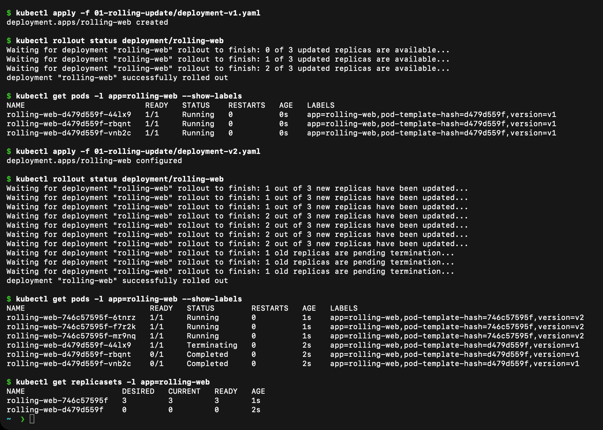

The old `rolling-web-d479d559f` ReplicaSet scaled to 0 while the new `rolling-web-746c57595f` ReplicaSet scaled to 3. The old Pods show `Terminating` only after new Pods were already running.

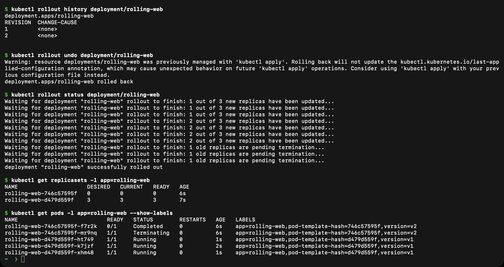

If an update has a problem, the previous revision can be restored:

```bash
kubectl rollout history deployment/rolling-web
kubectl rollout undo deployment/rolling-web
kubectl rollout status deployment/rolling-web
```

## 2. Blue-green deployment

Blue is the current version and green is the new version. Both versions run at the same time, but the Service sends traffic to only one of them.

```bash
kubectl apply -f 02-blue-green/blue.yaml
kubectl apply -f 02-blue-green/green.yaml
kubectl apply -f 02-blue-green/service-blue.yaml
kubectl get pods -l app=strategy-app --show-labels
kubectl get service strategy-service -o jsonpath='{.spec.selector.slot}'
```

The selector first returns `blue`. I switched the Service to green with:

```bash
kubectl apply -f 02-blue-green/service-green.yaml
kubectl get service strategy-service -o jsonpath='{.spec.selector.slot}'
kubectl run blue-green-test --rm -i --restart=Never --image=curlimages/curl:8.12.1 -- sh -c "sleep 3; curl -s http://strategy-service"
```

The response changed from `BLUE v1` to `GREEN v2`.

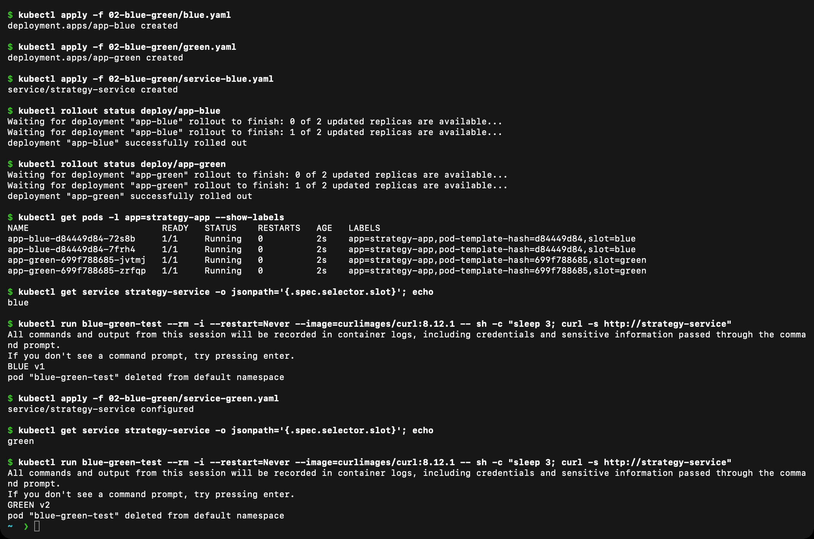

## 3. Canary deployment

A canary deployment sends a small part of the traffic to the new version. I used four stable Pods and one canary Pod behind the same Service.

```bash
kubectl apply -f 03-canary/stable.yaml
kubectl apply -f 03-canary/canary.yaml
kubectl apply -f 03-canary/service.yaml
kubectl get pods -l app=canary-app --show-labels
kubectl get endpointslice -l kubernetes.io/service-name=canary-service
```

I sent repeated requests from a temporary Pod:

```bash
kubectl run canary-test --rm -i --restart=Never --image=curlimages/curl:8.12.1 -- sh -c "sleep 3; for i in 1 2 3 4 5 6 7 8 9 10; do curl -s http://canary-service; done"
```

Most responses came from `STABLE v1`, while some came from `CANARY v2`. The exact order can change because the Service distributes requests between its endpoints.

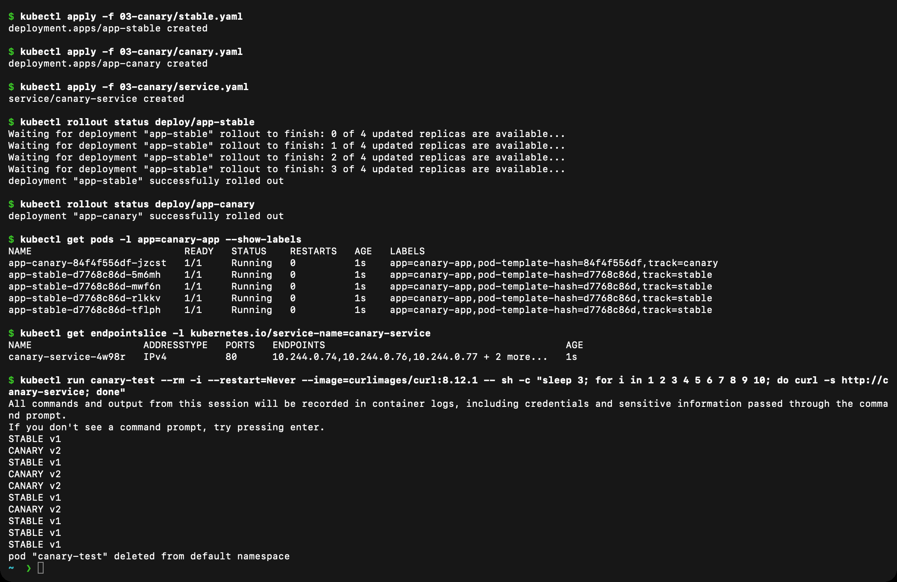

## 4. Recreate deployment

The Recreate strategy stops all old Pods before creating the new Pods. This causes a short period when the application is unavailable.

```bash
kubectl apply -f 04-recreate/deployment-v1.yaml
kubectl apply -f 04-recreate/service.yaml
kubectl rollout status deployment/app-recreate
kubectl get pods -l app=app-recreate

kubectl apply -f 04-recreate/deployment-v2.yaml
kubectl get pods -l app=app-recreate
kubectl rollout status deployment/app-recreate
```

I verified the final version with:

```bash
kubectl run recreate-test --rm -i --restart=Never --image=curlimages/curl:8.12.1 -- sh -c "sleep 3; curl -s http://recreate-service"
```

The final response was `Application v2`.

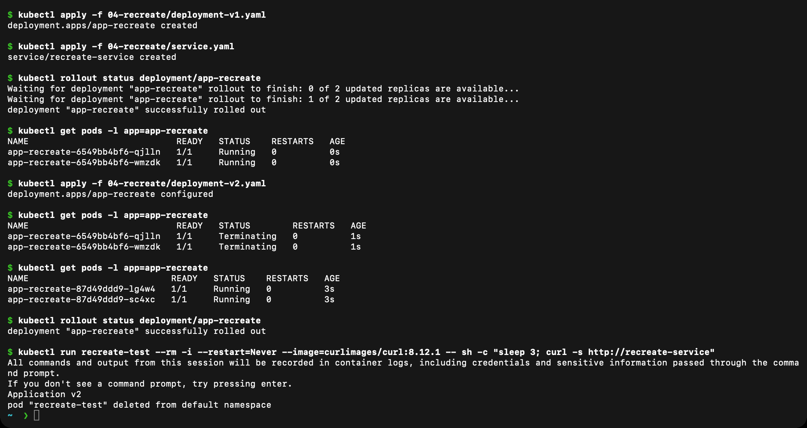

## Deployment strategy comparison

| Strategy | How it works | Main point |
|---|---|---|
| Rolling update | Replaces Pods gradually | Application stays available |
| Blue-green | Runs two complete versions and switches the Service | Easy to switch back |
| Canary | Runs a small number of new-version Pods | New version is tested with limited traffic |
| Recreate | Deletes old Pods before creating new ones | Simple, but has downtime |

## Pod lifecycle practice

I applied the lifecycle examples with:

```bash
kubectl apply -f pod-lifecycle/
kubectl get pods -l lab=pod-lifecycle
kubectl get pods -l lab=pod-lifecycle -w
```

These files intentionally create different states and behaviours:

| File | What I observed |
|---|---|
| `01-running.yaml` | A long-running Pod reaches `Running` |
| `02-pending.yaml` | A large CPU request keeps the Pod in `Pending` on the local cluster |
| `03-succeeded.yaml` | A successful one-time command ends in `Succeeded` |
| `04-failed.yaml` | A command with exit code 1 ends in `Failed` |
| `05-crashloopbackoff.yaml` | The container repeatedly exits and reaches `CrashLoopBackOff` |
| `06-imagepullbackoff.yaml` | An invalid image causes `ImagePullBackOff` |
| `07-readiness.yaml` | A failing readiness check keeps the Pod running but not ready |
| `08-liveness.yaml` | A failing liveness check restarts the container |
| `09-startup.yaml` | The startup probe allows time for Nginx to start |
| `10-init-container.yaml` | The init container completes before the main container starts |
| `11-multi-container.yaml` | Two containers share a file using an `emptyDir` volume |
| `12-termination.yaml` | The container handles `SIGTERM` before it exits |

I used these commands to inspect the Pods, events, and logs:

```bash
kubectl describe pod lifecycle-crashloop
kubectl logs lifecycle-crashloop --previous
kubectl describe pod lifecycle-imagepull
kubectl describe pod lifecycle-readiness
kubectl get events --sort-by=.metadata.creationTimestamp
```

## ReplicaSet, DaemonSet and StatefulSet examples

The examples in the `controllers` folder show three different controllers:

```bash
kubectl apply -f controllers/
kubectl get replicasets
kubectl get daemonsets
kubectl get statefulsets
kubectl get pods -o wide
```

- A ReplicaSet keeps the requested number of identical Pods running.
- A DaemonSet runs one Pod on every suitable node.
- A StatefulSet gives its Pods stable names and ordered identities.

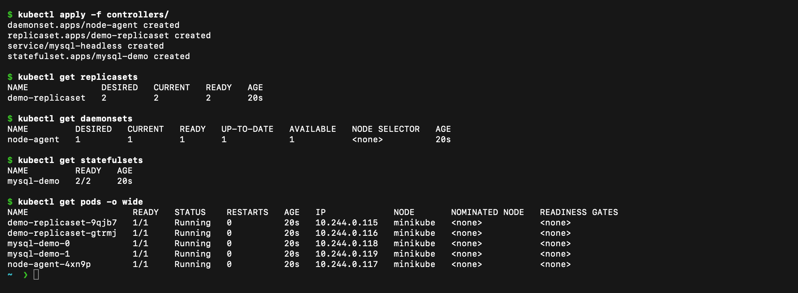

## Cleanup

```bash
kubectl delete -f pod-lifecycle/ --ignore-not-found
kubectl delete -f controllers/ --ignore-not-found
kubectl delete -f 01-rolling-update/deployment-v2.yaml --ignore-not-found
kubectl delete -f 02-blue-green/ --ignore-not-found
kubectl delete -f 03-canary/ --ignore-not-found
kubectl delete -f 04-recreate/ --ignore-not-found
```

## Output for each lifecycle YAML

For each file I ran `kubectl apply -f`, waited for the state to appear, then checked `kubectl get pod -o wide`, `kubectl describe pod` (filtered to state, reason, restart count and events) and the logs where they were useful. The screenshots are real terminal captures from my Minikube cluster. The full text output is also saved in the `outputs` folder.

### 01-running

[Commands and details](outputs/01-running.txt)

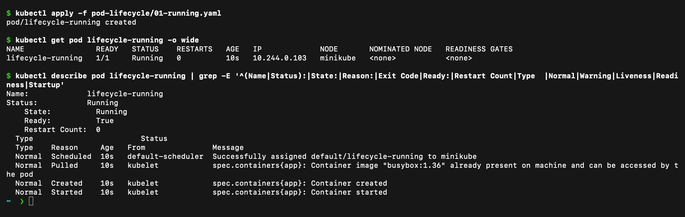

**What I observed:** The Pod reached `Running` with `1/1` ready and 0 restarts. Events show Scheduled, Pulled, Created and Started in order.

### 02-pending

[Commands and details](outputs/02-pending.txt)

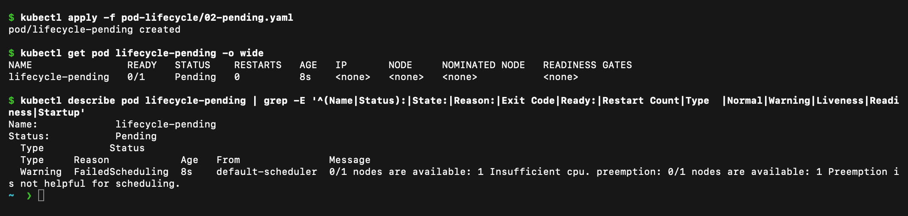

**What I observed:** The Pod stayed `Pending`. The scheduler event `FailedScheduling: 0/1 nodes are available: 1 Insufficient cpu` explains why: the Pod asks for more CPU than the single Minikube node has.

### 03-succeeded

[Commands and details](outputs/03-succeeded.txt)

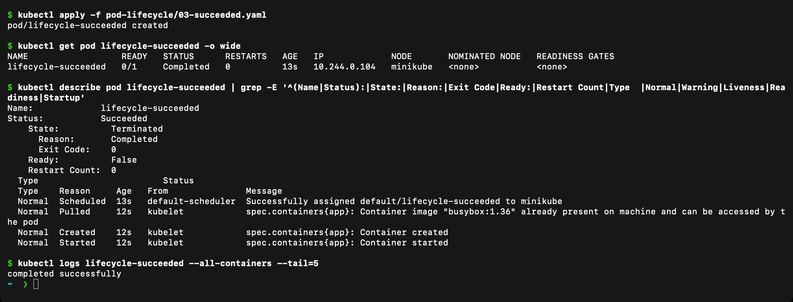

**What I observed:** The container ran once and exited with code 0, so the Pod phase became `Succeeded` (`READY 0/1`, state `Terminated`, reason `Completed`). The log shows `completed successfully`.

### 04-failed

[Commands and details](outputs/04-failed.txt)

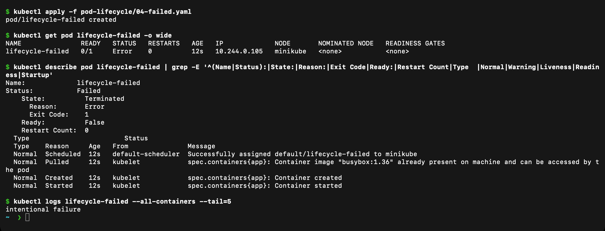

**What I observed:** The container exited with code 1, so the Pod phase became `Failed` with reason `Error`. The log shows `intentional failure`.

### 05-crashloopbackoff

[Commands and details](outputs/05-crashloopbackoff.txt)

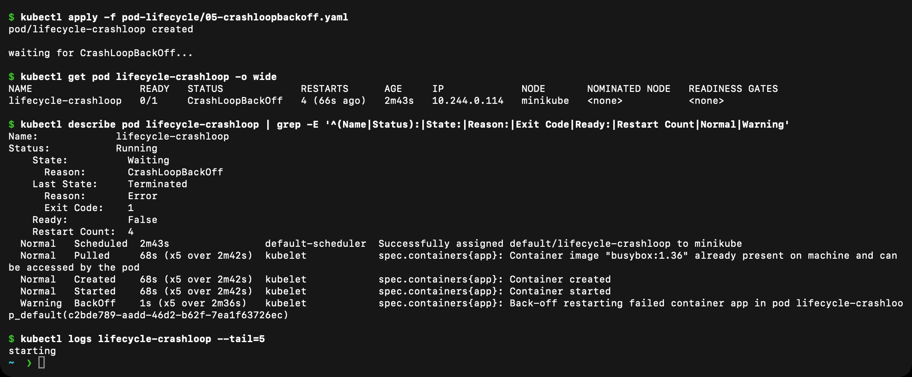

**What I observed:** The container keeps exiting with code 1, and Kubernetes restarts it with increasing delays. `kubectl get pod` shows `CrashLoopBackOff`, the restart count rises, and the `BackOff` warning appears in the events.

### 06-imagepullbackoff

[Commands and details](outputs/06-imagepullbackoff.txt)

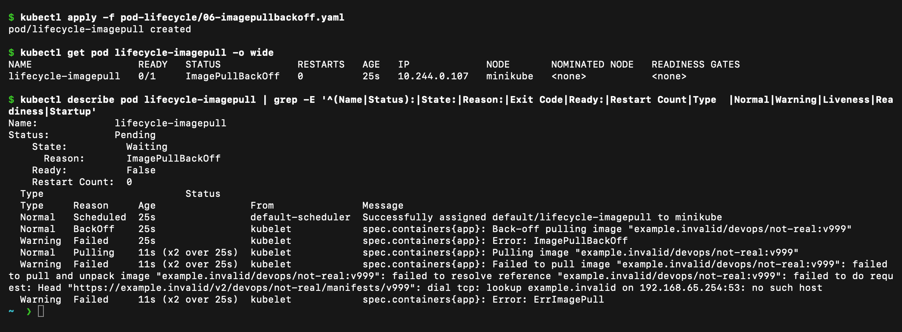

**What I observed:** The image `example.invalid/devops/not-real:v999` cannot be pulled because the registry host does not resolve. The Pod shows `ErrImagePull` first and then `ImagePullBackOff` with `Failed` and `BackOff` events.

### 07-readiness

[Commands and details](outputs/07-readiness.txt)

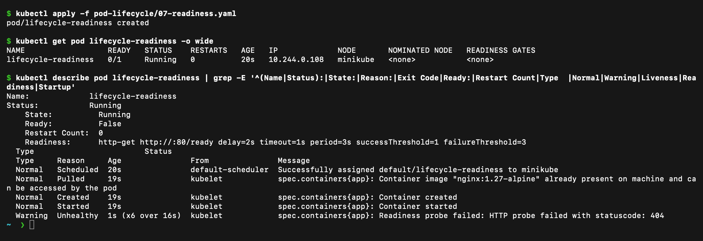

**What I observed:** The container is `Running` but `READY 0/1`. The readiness probe on `/ready` returns 404, so the Pod is kept out of Service endpoints without being restarted.

### 08-liveness

[Commands and details](outputs/08-liveness.txt)

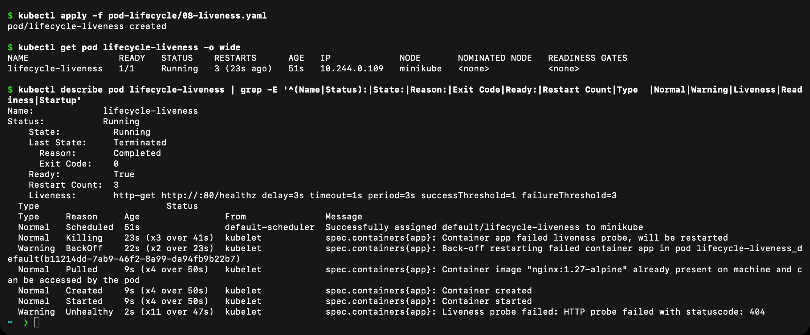

**What I observed:** The liveness probe on `/healthz` returns 404, so the kubelet kills and restarts the container (`Killing` event, restart count increases). This is different from a readiness failure, which never restarts the container.

### 09-startup

[Commands and details](outputs/09-startup.txt)

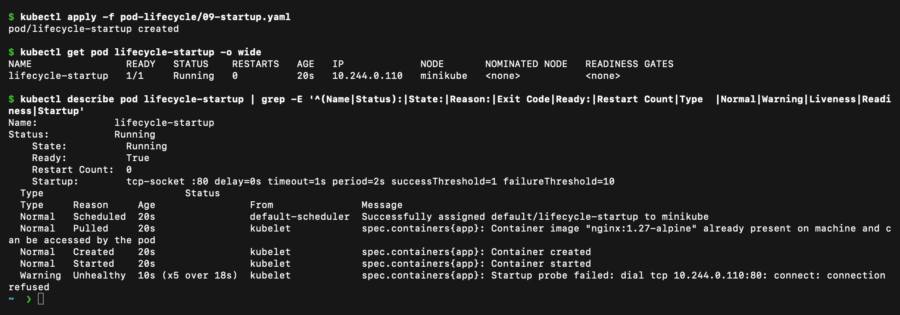

**What I observed:** The startup probe checks TCP port 80 and fails a few times with `connection refused` while Nginx is starting. After it succeeds, the Pod becomes `1/1` with 0 restarts.

### 10-init-container

[Commands and details](outputs/10-init-container.txt)

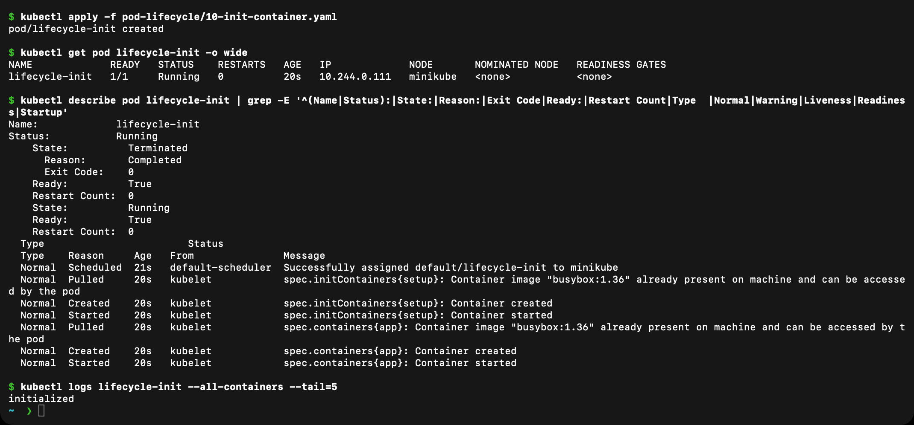

**What I observed:** The `setup` init container finished first (`Terminated`, reason `Completed`, exit code 0). Only then did the main container start. The log shows `initialized`.

### 11-multi-container

[Commands and details](outputs/11-multi-container.txt)

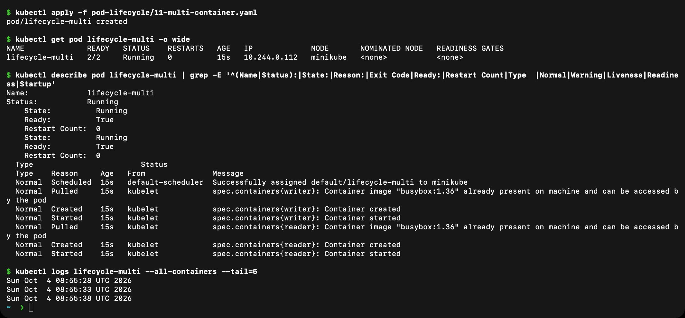

**What I observed:** The Pod has two containers (`2/2` ready) that share an `emptyDir` volume. The writer container overwrites a file with the current time and the reader container prints them, as the logs show.

### 12-termination

[Commands and details](outputs/12-termination.txt)

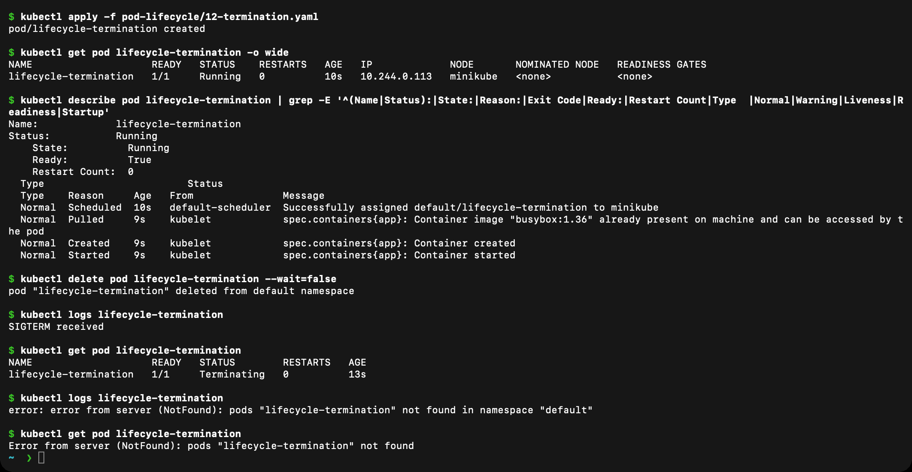

**What I observed:** After `kubectl delete pod`, the Pod stayed `Terminating` while the container handled `SIGTERM` (log: `SIGTERM received`), finished its cleanup and exited. Afterwards the Pod no longer exists (`NotFound`).

