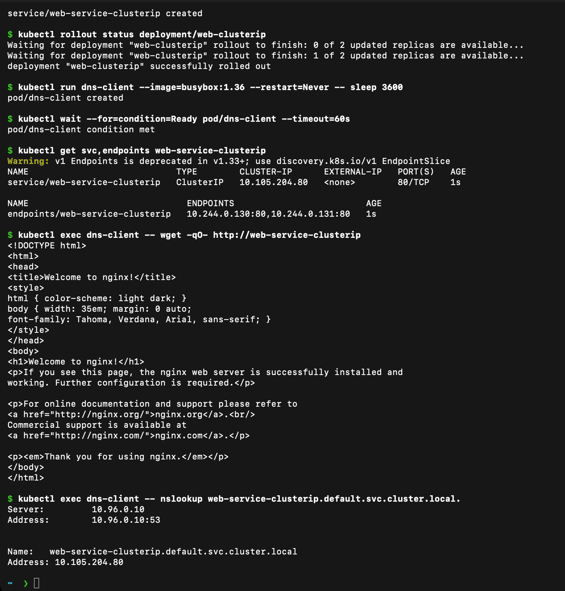
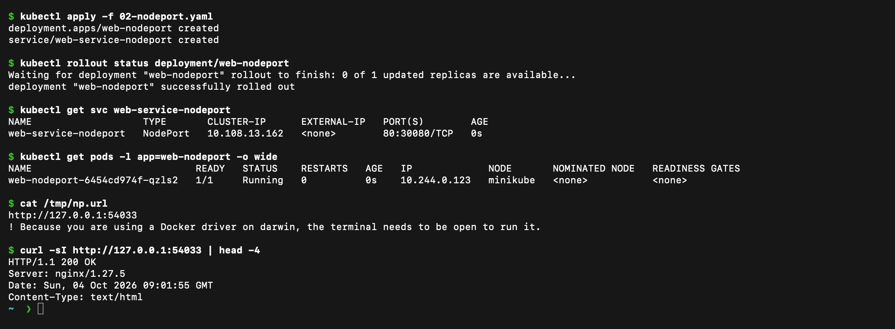
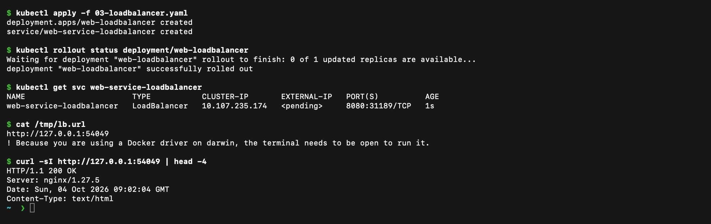
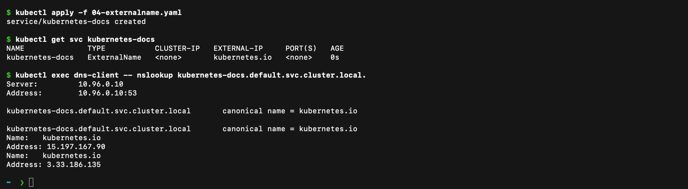
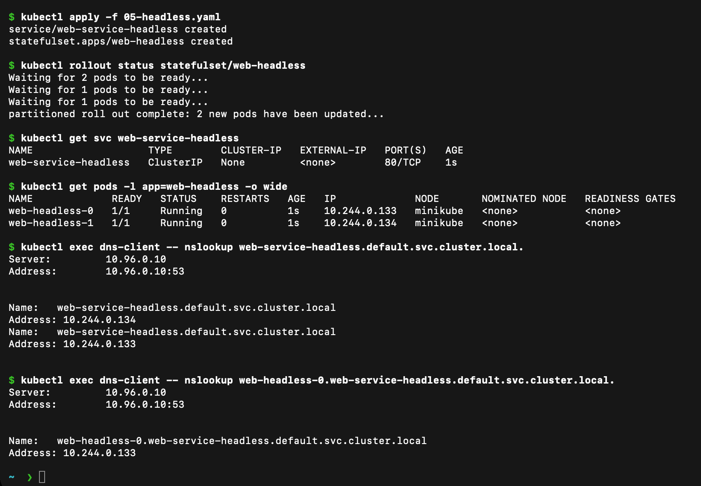

# Kubernetes Networking & Services

**Name:** Raghavendra
**Enrollment number:** 24BCS10250
**Class:** Lecture 11

## Aim

The aim of this session was to create and test the five main Service types, study Kubernetes DNS, and compare Deployments, ReplicaSets, DaemonSets, StatefulSets, and Services.

I ran the commands below from this folder.

I started the cluster and created a temporary client Pod for the internal tests:

```bash
minikube start --driver=docker
kubectl run dns-client --image=busybox:1.36 --command -- sleep 3600
kubectl wait --for=condition=Ready pod/dns-client --timeout=90s
```

## 1. ClusterIP Service

ClusterIP is the default Service type. It can be reached only from inside the cluster.

```bash
kubectl apply -f 01-clusterip.yaml
kubectl get service web-service-clusterip
kubectl get endpointslice -l kubernetes.io/service-name=web-service-clusterip
kubectl exec dns-client -- wget -qO- http://web-service-clusterip
```

The request returned the Nginx page, so the Service correctly forwarded traffic to its Pods.



The Service got ClusterIP `10.105.204.80` and two endpoints (the two Pod IPs). The client Pod reached Nginx through the Service name, and the full DNS name resolved to the ClusterIP.

## 2. NodePort Service

NodePort exposes a Service on a port from `30000` to `32767` on each node. This example uses port `30080`.

```bash
kubectl apply -f 02-nodeport.yaml
kubectl get service web-service-nodeport
minikube service web-service-nodeport --url
```

I opened the URL printed by Minikube and received the Nginx page.



The Service shows `80:30080/TCP`. On macOS with the Docker driver the node IP is not reachable directly, so `minikube service --url` opens a local tunnel (`127.0.0.1:<port>`), and `curl -I` through it returned `HTTP/1.1 200 OK` from Nginx.

## 3. LoadBalancer Service

LoadBalancer normally receives an external address from a cloud provider. Minikube has no cloud load balancer, so the `EXTERNAL-IP` stays `<pending>` until a tunnel is running. I used `minikube service --url`, which creates the tunnel for the Docker driver.

```bash
kubectl apply -f 03-loadbalancer.yaml
kubectl rollout status deployment/web-loadbalancer
kubectl get service web-service-loadbalancer
minikube service web-service-loadbalancer --url
curl -I <printed-url>
```



The Service was created with type `LoadBalancer` and a NodePort (`8080:31189/TCP`). `EXTERNAL-IP` is `<pending>` because Minikube has no cloud provider. Through the tunnel the application answered `HTTP/1.1 200 OK`.

## 4. ExternalName Service

ExternalName creates a DNS alias for an external domain. It does not create Pod endpoints.

```bash
kubectl apply -f 04-externalname.yaml
kubectl get service kubernetes-docs
kubectl exec dns-client -- nslookup kubernetes-docs
```



The Service has no ClusterIP (`<none>`) and its `EXTERNAL-IP` column shows `kubernetes.io`. The DNS query returns `canonical name = kubernetes.io`, which proves that the Service is only a DNS alias (CNAME).

The DNS result shows that `kubernetes-docs` points to `kubernetes.io`. ExternalName changes DNS, not the HTTP Host header or TLS hostname. A request using the alias as its HTTP hostname can be rejected by the external site, which is why the plain `wget` to the alias returns HTTP 400. The [HTTPS check](outputs/externalname-http.txt) shows the response when the real hostname is kept.

## 5. Headless Service

A headless Service uses `clusterIP: None`. DNS returns the individual Pod addresses instead of one Service IP. This is useful with StatefulSets.

```bash
kubectl apply -f 05-headless.yaml
kubectl get service web-service-headless
kubectl get pods -l app=web-headless
kubectl get endpointslice -l kubernetes.io/service-name=web-service-headless
kubectl exec dns-client -- nslookup web-service-headless
kubectl exec dns-client -- nslookup web-headless-0.web-service-headless
```

The StatefulSet Pods have stable names such as `web-headless-0` and `web-headless-1`.



`CLUSTER-IP` is `None`. A query for the Service name returns both Pod IPs (`10.244.0.133` and `10.244.0.134`) instead of one virtual IP, and each StatefulSet Pod also has its own stable DNS name.

## Service type comparison

| Service type | How it is reached | Common use |
|---|---|---|
| ClusterIP | Inside the cluster | Communication between applications |
| NodePort | Node IP and a high port | Simple external access for testing |
| LoadBalancer | External IP from a load balancer | Public application in a cloud cluster |
| ExternalName | Kubernetes DNS name that points outside the cluster | Giving an external service a local alias |
| Headless | DNS records for individual Pods | Stateful applications and direct Pod discovery |

## Deployment and ReplicaSet

| Point | Deployment | ReplicaSet |
|---|---|---|
| Purpose | Manages application releases | Keeps a fixed number of matching Pods running |
| Pod management | Creates and manages ReplicaSets | Creates and replaces Pods directly |
| Scaling | Changes the replica count through the Deployment | Can be scaled directly, but normally belongs to a Deployment |
| Rolling updates | Supports rolling updates and rollback | Does not manage release history |
| Relationship | Owns ReplicaSets | Is normally owned by a Deployment |

A Deployment is normally used for an application because it gives update and rollback features. The ReplicaSet created by it makes sure the requested number of Pods stay available.

## Deployment, DaemonSet, and StatefulSet

| Point | Deployment | DaemonSet | StatefulSet |
|---|---|---|---|
| Main use | Stateless applications | One Pod on every suitable node | Stateful applications |
| Pod creation | Requested number of replicas | One Pod per selected node | Ordered Pods with stable names |
| Scaling | Change `replicas` | Add or remove nodes, or change node selection | Change `replicas` |
| Networking | Pods are normally reached through a Service | Each Pod runs on a node | Often uses a headless Service |
| Storage | Usually interchangeable Pods | Often reads node-level data | Can use stable storage for each Pod |
| Example | Web application | Log collector | Database cluster |

## ReplicaSet and Service

| ReplicaSet | Service |
|---|---|
| Keeps the required number of Pods running | Gives matching Pods a stable network address |
| Replaces failed Pods | Sends traffic to ready endpoints |
| Selects Pods using labels | Selects Pods using labels |

**Why a Service is required:** a ReplicaSet only keeps the right number of Pods alive. It does nothing about networking. Every time it replaces a Pod the new Pod gets a different IP, so a client that stored the old IP would break. A Service gives the group of Pods one stable name and virtual IP (ClusterIP) that never changes.

**How traffic reaches the Pods:**

1. A client calls the Service name, for example `web-service-clusterip`. CoreDNS turns the name into the Service's ClusterIP.
2. The Service has a label selector. Kubernetes watches for Ready Pods with matching labels and lists their IPs in an EndpointSlice.
3. `kube-proxy` on each node uses that list to forward the request from the ClusterIP to one of the Pod IPs, so requests are spread across the Pods.
4. If a Pod fails its readiness probe or is replaced, its IP is removed from (or added to) the EndpointSlice automatically and the client keeps using the same address.

So the ReplicaSet decides *how many* Pods exist and the Service decides *where traffic goes*. Both use labels, but they do not depend on each other.

## Kubernetes FQDN and CoreDNS

Detailed notes are available here:

- [FQDN and Service DNS](fqdn/README.md)
- [CoreDNS](coredns/README.md)

I checked DNS with:

```bash
kubectl get pods -n kube-system -l k8s-app=kube-dns
kubectl get configmap coredns -n kube-system
kubectl exec dns-client -- nslookup web-service-clusterip.default.svc.cluster.local
```

The full Service name follows this pattern:

```text
service-name.namespace.svc.cluster.local
```

## Cleanup

```bash
kubectl delete -f 01-clusterip.yaml --ignore-not-found
kubectl delete -f 02-nodeport.yaml --ignore-not-found
kubectl delete -f 03-loadbalancer.yaml --ignore-not-found
kubectl delete -f 04-externalname.yaml --ignore-not-found
kubectl delete -f 05-headless.yaml --ignore-not-found
kubectl delete pod dns-client --ignore-not-found
```
