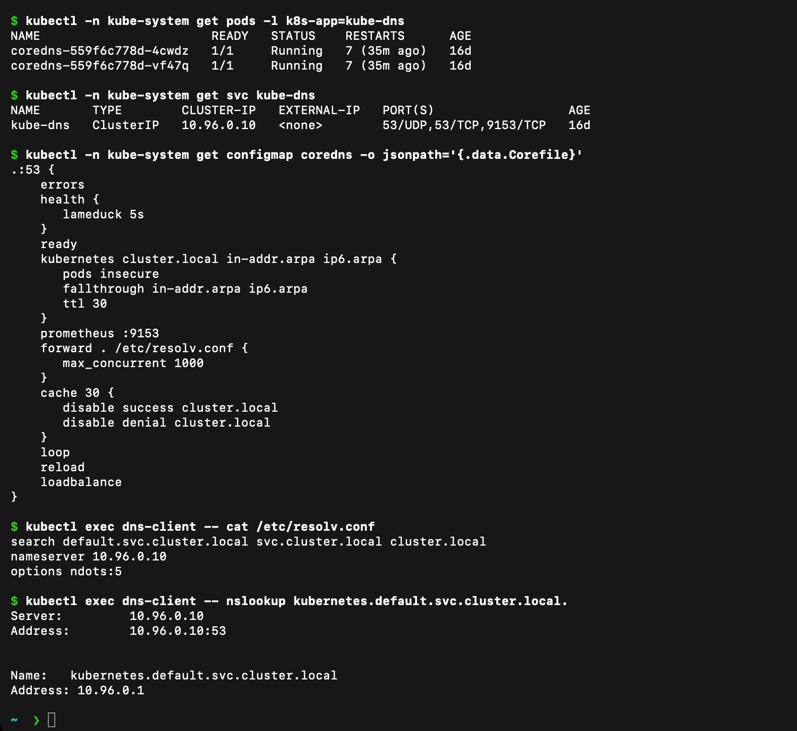

# CoreDNS in Kubernetes

CoreDNS is the cluster DNS server. Kubernetes installs it as a Deployment and exposes it through the `kube-dns` Service for compatibility. Pods send DNS queries to that Service IP.

When a Service is created, Kubernetes DNS records are generated from the Service name and namespace. A normal Service name resolves to its stable ClusterIP. A headless Service returns Pod IP records instead. An `ExternalName` Service returns a CNAME for the configured external hostname.

## Configuration and checks

```bash
kubectl get deployment coredns -n kube-system
kubectl get service kube-dns -n kube-system
kubectl get configmap coredns -n kube-system -o yaml
kubectl get pods -n kube-system -l k8s-app=kube-dns
kubectl logs -n kube-system -l k8s-app=kube-dns --tail=20
kubectl exec dns-client -- cat /etc/resolv.conf
```

The Corefile inside the ConfigMap controls plugins such as `kubernetes`, `forward`, `cache`, `health`, and `ready`. The `kubernetes` plugin answers cluster-local records; `forward` sends non-cluster queries to upstream resolvers.

## Troubleshooting order

1. Check that the CoreDNS Pods are Running and Ready.
2. Check that the `kube-dns` Service and EndpointSlices exist.
3. Inspect `/etc/resolv.conf` inside the affected Pod.
4. Try both the short Service name and the full FQDN.
5. Confirm the Service name, namespace, selector, and EndpointSlices.
6. Read CoreDNS logs and the CoreDNS ConfigMap for errors.

```bash
kubectl get endpointslice -n kube-system \
  -l kubernetes.io/service-name=kube-dns
kubectl exec dns-client -- nslookup kubernetes.default.svc.cluster.local
kubectl exec dns-client -- nslookup kubernetes.io
```

If cluster names fail but external names work, I check the Service name, namespace, and CoreDNS Kubernetes plugin. If both fail, I check the Pod resolver configuration, NetworkPolicies, and CoreDNS health.

## Real cluster output



From my Minikube cluster:

- Two `coredns` Pods run in `kube-system` and are `Ready`. The `kube-dns` Service has ClusterIP `10.96.0.10` and exposes `53/UDP`, `53/TCP` and `9153/TCP` (metrics).
- The Corefile uses `errors`, `health`, `ready`, `kubernetes cluster.local in-addr.arpa ip6.arpa`, `prometheus :9153`, `forward . /etc/resolv.conf`, `cache 30`, `loop`, `reload` and `loadbalance`.
- A Pod's `/etc/resolv.conf` is `search default.svc.cluster.local svc.cluster.local cluster.local`, `nameserver 10.96.0.10` and `options ndots:5`.

## Why Kubernetes uses CoreDNS

Pods are created and deleted all the time and their IPs change. Services give a stable name, and CoreDNS turns that name into the current Service IP (or Pod IPs for a headless Service). CoreDNS is a small, plugin-based DNS server written in Go. The `kubernetes` plugin watches the API server for Services and EndpointSlices, so DNS answers follow the cluster state automatically without anyone editing zone files.

## How a DNS query is resolved

1. An application in a Pod asks for `web-service-clusterip`.
2. The resolver reads `/etc/resolv.conf`. The name has fewer than 5 dots (`ndots:5`), so it tries the search domains in order: `web-service-clusterip.default.svc.cluster.local`, then `...svc.cluster.local`, then `...cluster.local`, and only after that the bare name.
3. The query goes to `10.96.0.10` (the `kube-dns` Service), which load-balances to a CoreDNS Pod.
4. The `kubernetes` plugin matches `cluster.local`, looks up the Service and returns its ClusterIP (an `A` record). For a headless Service it returns one `A` record per ready Pod, and for `ExternalName` it returns a `CNAME`.
5. Names outside `cluster.local` (for example `kubernetes.io`) are passed to `forward`, which sends them to the node's upstream resolver. Answers are cached for up to 30 seconds.

Because of `ndots:5`, an external name such as `kubernetes.io` is first tried with the cluster search domains. Writing a trailing dot (`kubernetes.io.`) skips this and makes the lookup faster.
