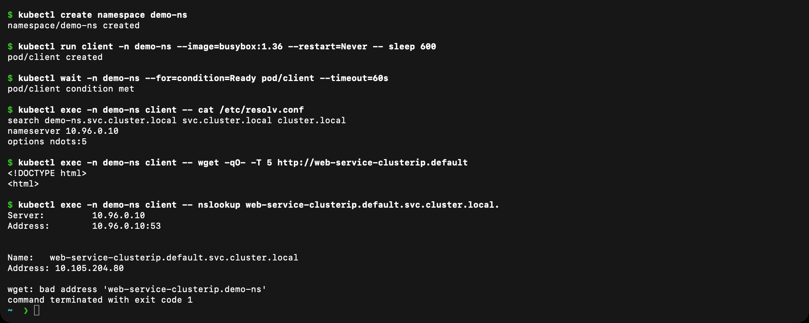

# Kubernetes FQDN

An FQDN is a fully qualified domain name. It gives the complete DNS path instead of relying on the search domains in a Pod's `/etc/resolv.conf`.

For a normal Service, the pattern is:

```text
<service>.<namespace>.svc.<cluster-domain>
```

The usual cluster domain is `cluster.local`, so the ClusterIP example in the `default` namespace is:

```text
web-service-clusterip.default.svc.cluster.local
```

Pods in `default` can normally use the short name `web-service-clusterip`. A Pod in another namespace can use `web-service-clusterip.default`, while the full name works regardless of the caller's namespace.

The headless StatefulSet also gives stable Pod records:

```text
web-headless-0.web-service-headless.default.svc.cluster.local
web-headless-1.web-service-headless.default.svc.cluster.local
```

## Hands-on check

```bash
kubectl apply -f ../01-clusterip.yaml
kubectl apply -f ../05-headless.yaml
kubectl run dns-client --image=busybox:1.36 --restart=Never -- sleep 3600
kubectl wait --for=condition=Ready pod/dns-client --timeout=120s

kubectl exec dns-client -- nslookup web-service-clusterip
kubectl exec dns-client -- \
  nslookup web-service-clusterip.default.svc.cluster.local
kubectl exec dns-client -- \
  nslookup web-headless-0.web-service-headless.default.svc.cluster.local
```

The first two queries resolve the Service. The StatefulSet query resolves one stable Pod identity behind the headless Service.

## Pod DNS records

Pods also get a DNS name made from their IP with dots replaced by dashes:

```text
10-244-0-133.default.pod.cluster.local
```

StatefulSet Pods behind a headless Service have the better, stable form `web-headless-0.web-service-headless.default.svc.cluster.local`, which does not change when the Pod IP changes.

## Namespace-based DNS and Pod-to-Service communication

The namespace is part of every Service name, so two namespaces can each have a Service called `web`. A Pod's search list starts with its own namespace. In the screenshot below, a Pod in the namespace `demo-ns` has `search demo-ns.svc.cluster.local svc.cluster.local cluster.local`. It can reach the Service in `default` by adding the namespace (`web-service-clusterip.default`) or by using the full FQDN. The final request, `web-service-clusterip.demo-ns`, fails with `bad address` on purpose, because there is no such Service in `demo-ns`. This shows that the short name only works inside the same namespace.



The same behaviour in a table:

| Caller | Name used | Result |
|---|---|---|
| Pod in `default` | `web-service-clusterip` | Works (same namespace) |
| Pod in `demo-ns` | `web-service-clusterip` | Fails (looks in `demo-ns`) |
| Pod in `demo-ns` | `web-service-clusterip.default` | Works |
| Any Pod | `web-service-clusterip.default.svc.cluster.local` | Works |

## More examples of Kubernetes FQDNs

| Resource | FQDN |
|---|---|
| ClusterIP Service | `web-service-clusterip.default.svc.cluster.local` |
| Headless Service (all Pod IPs) | `web-service-headless.default.svc.cluster.local` |
| StatefulSet Pod | `web-headless-0.web-service-headless.default.svc.cluster.local` |
| ExternalName Service | `kubernetes-docs.default.svc.cluster.local` (CNAME to `kubernetes.io`) |
| API server | `kubernetes.default.svc.cluster.local` |
| DNS server | `kube-dns.kube-system.svc.cluster.local` |
