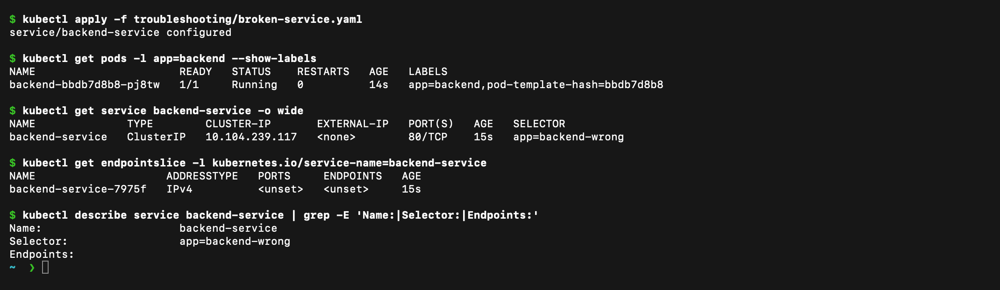
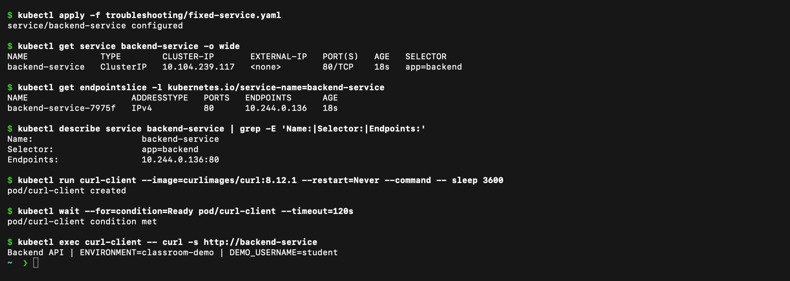

# Service troubleshooting demo

## Problem

The backend Pod is Running, but requests through `backend-service` fail. The broken Service uses `app: backend-wrong`, while the Deployment labels its Pod `app: backend`.

Before the fix:



## Investigation

```bash
kubectl apply -f ../configmap.yaml
kubectl apply -f ../secret-demo.yaml
kubectl apply -f ../backend.yaml
kubectl apply -f broken-service.yaml

kubectl get pods --show-labels
kubectl get service backend-service -o wide
kubectl get endpointslice \
  -l kubernetes.io/service-name=backend-service
kubectl describe service backend-service
```

The Service exists, but its EndpointSlice has no ready address because the selector does not match any Pod.

## Root cause

```text
Service selector: app=backend-wrong
Pod label:        app=backend
```

Kubernetes cannot send Service traffic to a Pod that its selector does not select.

## Fix and verification

```bash
kubectl apply -f fixed-service.yaml
kubectl get endpointslice \
  -l kubernetes.io/service-name=backend-service
kubectl run curl-client --image=curlimages/curl:8.12.1 \
  --restart=Never --command -- sleep 3600
kubectl wait --for=condition=Ready pod/curl-client --timeout=120s
kubectl exec curl-client -- curl -s http://backend-service
```

After the selector is fixed, the EndpointSlice contains the backend Pod IP and the request returns the backend response.

After the fix:


