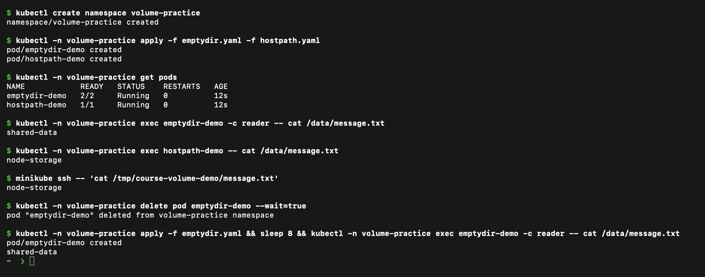
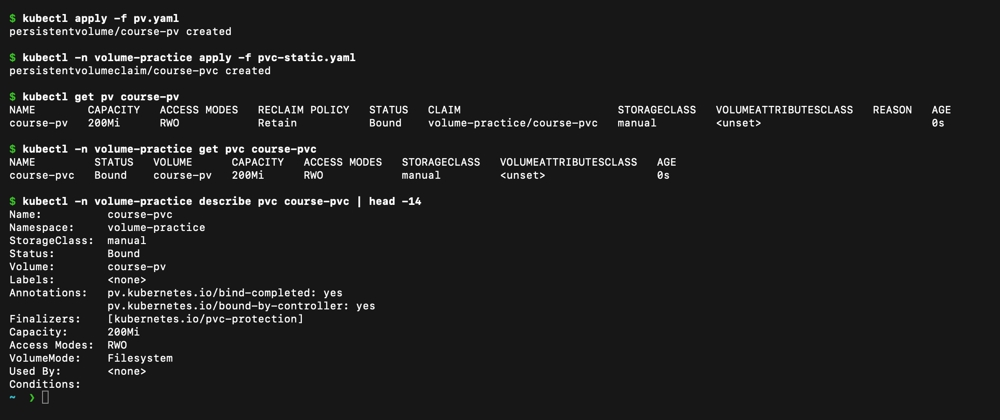
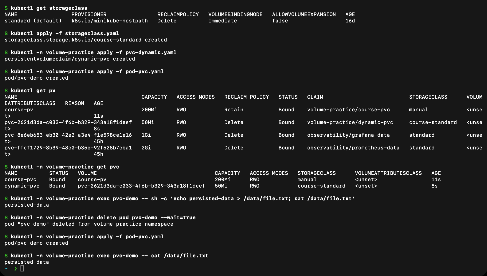

# Kubernetes Volumes

**Name:** Raghavendra
**Enrollment number:** 24BCS10250
**Session:** 13

| Type | What I learned | Example |
|---|---|---|
| emptyDir | Created for a Pod and shared by its containers. Survives container restarts, but is removed when the Pod is removed. | Writer and reader share `/data/message.txt` |
| hostPath | Mounts a path from the node. Data belongs to that node and may not be present if a Pod moves elsewhere. | `/tmp/course-volume-demo` mounted at `/data` |
| PersistentVolume | A cluster storage resource with capacity, access modes and a reclaim policy. | The provisioner creates a PV for `web-data` |
| PersistentVolumeClaim | A namespaced request for storage that a workload can mount. | Mini project requests 500Mi with ReadWriteOnce |
| StorageClass | Describes a provisioner and storage settings. | Minikube's `standard` class |
| Dynamic provisioning | Creates a PV when a compatible PVC is requested, without manually defining the PV first. | `web-data` becomes Bound automatically |

```bash
kubectl create namespace volume-practice
kubectl -n volume-practice apply -f emptydir.yaml -f hostpath.yaml
kubectl -n volume-practice exec emptydir-demo -c reader -- cat /data/message.txt
kubectl -n volume-practice exec hostpath-demo -- cat /data/message.txt
minikube ssh -- 'cat /tmp/course-volume-demo/message.txt'
kubectl get storageclass
kubectl get pv
kubectl -n production-webapp describe pvc web-data
```

The `kubectl` commands for the three practical examples below are visible in their screenshots.

The reader saw the writer's file through emptyDir. The hostPath file was also readable on the node. The [volume output](outputs/volumes.txt) shows these checks, the StorageClass, PV and bound PVC. The mini project verifies the PVC data after all application Pods are replaced.

ReadWriteOnce allows read/write mounting from one node; several Pods on that same node can share the claim. It does not make a shared database safe. Minikube's hostPath provisioner is useful for a local lab; it does not provide replicated storage across nodes.


## Practical examples

### 1. emptyDir and hostPath

[`emptydir.yaml`](emptydir.yaml) runs a writer and a reader container that share an `emptyDir` volume. [`hostpath.yaml`](hostpath.yaml) mounts `/tmp/course-volume-demo` from the Minikube node.



The reader container printed `shared-data`, which the writer container wrote into the shared `emptyDir`. The hostPath Pod wrote `node-storage`, and the same file is visible on the node itself with `minikube ssh`. I then deleted the `emptyDir` Pod and created it again: the volume is created fresh with the new Pod, because an `emptyDir` lives only as long as its Pod.

### 2. Static provisioning: PersistentVolume and PersistentVolumeClaim

An administrator creates the PersistentVolume ([`pv.yaml`](pv.yaml), 200Mi, `Retain`, class `manual`). A user then asks for storage with a PersistentVolumeClaim ([`pvc-static.yaml`](pvc-static.yaml), 100Mi, same class). Kubernetes binds the claim to a matching PV.



`course-pv` and `course-pvc` both show `Bound`. The claim asked for 100Mi but received the whole 200Mi volume, because a PV is bound as one unit. `describe pvc` shows the volume name and the `bind-completed` annotation.

### 3. StorageClass and dynamic provisioning

A StorageClass ([`storageclass.yaml`](storageclass.yaml)) names a provisioner. When a claim refers to it ([`pvc-dynamic.yaml`](pvc-dynamic.yaml)), the provisioner creates the PersistentVolume automatically, so no administrator has to write a PV first. [`pod-pvc.yaml`](pod-pvc.yaml) mounts the claim.



Minikube already has a default class named `standard`. After I created `course-standard` and the claim `dynamic-pvc`, a new PV named `pvc-...` of 50Mi appeared by itself with reclaim policy `Delete`, and the PVC became `Bound`. I wrote `persisted-data` to `/data/file.txt`, deleted the Pod, created it again, and the file was still there. Data in a PVC outlives the Pod.

| | Static | Dynamic |
|---|---|---|
| Who creates the PV | Administrator | Provisioner, from the StorageClass |
| Reclaim policy used here | `Retain` | `Delete` |
| Typical use | Pre-existing storage | Cloud disks and most real clusters |

[Kubernetes volumes](https://kubernetes.io/docs/concepts/storage/volumes/).
