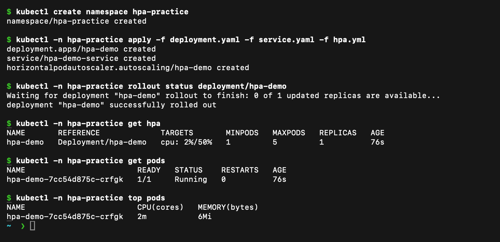
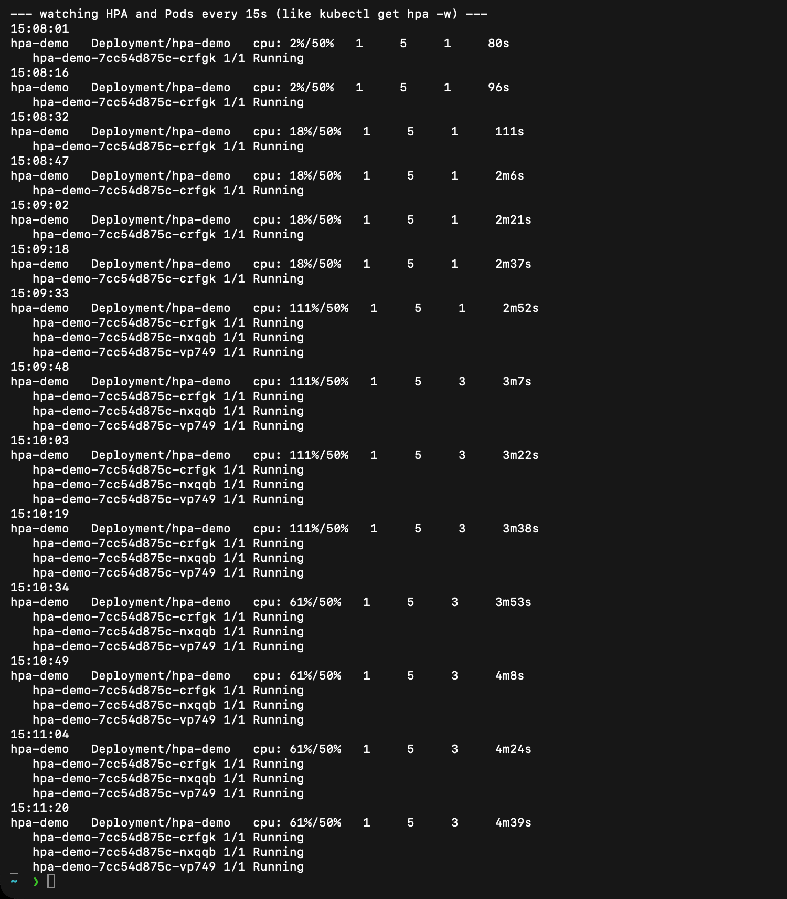
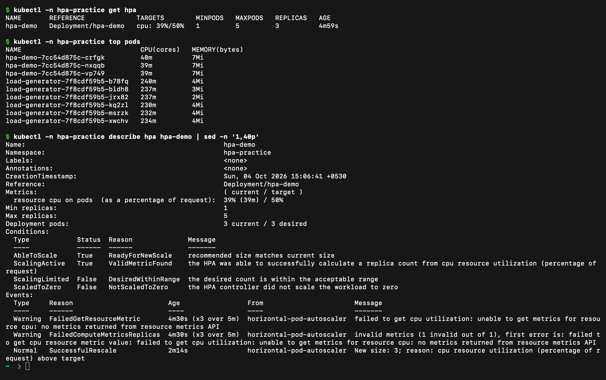

# Kubernetes Storage, HPA and Probes

**Name:** Raghavendra
**Enrollment number:** 24BCS10250
**Session:** 13

## Volumes

The [volume notes and examples](01-kubernetes-volumes/README.md) cover emptyDir, hostPath, PV, PVC, StorageClass and dynamic provisioning. The mini project checks persistent data after Pod replacement.

## HPA exercise

`02-hpa/hpa.yml` scales the Nginx Deployment using CPU metrics. The Deployment requests 100m CPU, the target is 50%, and the allowed range is one to five Pods.

Run from `02-hpa/`:

```bash
minikube addons enable metrics-server
kubectl create namespace hpa-practice
kubectl -n hpa-practice apply -f deployment.yaml -f service.yaml -f hpa.yml
kubectl -n hpa-practice rollout status deployment/hpa-demo
kubectl -n hpa-practice get hpa,pods
kubectl -n hpa-practice top pods
kubectl -n hpa-practice apply -f load-generator.yaml
kubectl -n hpa-practice scale deployment/load-generator --replicas=6
kubectl -n hpa-practice get hpa,pods -w
kubectl -n hpa-practice describe hpa hpa-demo
kubectl -n hpa-practice delete deployment load-generator
```

The load generator makes repeated HTTP requests. I increased it from three to six generator Pods. HPA compares usage to CPU requests, not to the node's total CPU capacity.

### Deploy, configure and verify HPA



The Deployment, Service and HPA were created. With no load, `kubectl get hpa` shows `cpu: 2%/50%` (current usage compared with the 50% target), `MINPODS 1`, `MAXPODS 5` and one replica. `kubectl top pods` shows the single Pod using about 2m CPU and 6Mi memory.

### Load generator and scaling



After the load generator started, the watch output (taken every 15 seconds, like `kubectl get hpa -w`) shows the CPU utilization rising from `2%` to `18%` and then to `111%/50%`. The HPA then raised the replicas from 1 to 3 and the two new Pods became `Running`. With three Pods the average utilization fell to `61%/50%`, which is still above the target, so the HPA stays at the new size until the load goes away. The [recorded text output](02-hpa/outputs/load-scaling.txt) of an earlier run is also kept.

### CPU utilization, Pod usage and `describe hpa`



`kubectl top pods` shows about 40m CPU for each `hpa-demo` Pod and about 230m for each load-generator Pod. `kubectl describe hpa` shows the metric (`resource cpu on pods ... 39% (39m) / 50%`), `3 current / 3 desired`, and the event `SuccessfulRescale: New size: 3; reason: cpu resource utilization (percentage of request) above target`. The two early `FailedGetResourceMetric` warnings appear because Metrics Server had no data for the brand-new Pod yet.

## Probes

| Probe | Purpose | Failure result |
|---|---|---|
| Startup | Gives the application time to start | Restarts it after the configured failure threshold |
| Readiness | Checks whether a Pod can receive traffic | Removes it from ready Service endpoints |
| Liveness | Checks whether the running container is healthy | Restarts the container |

Startup success permits readiness and liveness checks to proceed. A running Pod can still be unready. The [mini-project Deployment](mini-project/deployment.yaml) uses all three probes against Nginx's HTTP endpoint.

## Mini project

The class Nginx project combines a PVC, resource requests, probes, a Service and HPA. Its [instructions and results](mini-project/README.md) include persistence and scaling verification.

## Cleanup

```bash
kubectl delete namespace hpa-practice volume-practice production-webapp
minikube ssh -- 'sudo rm -rf /tmp/course-volume-demo'
```

Deleting the mini-project namespace also removes its claim. Save any needed files before cleanup. The node path above contains only this exercise's hostPath data.
