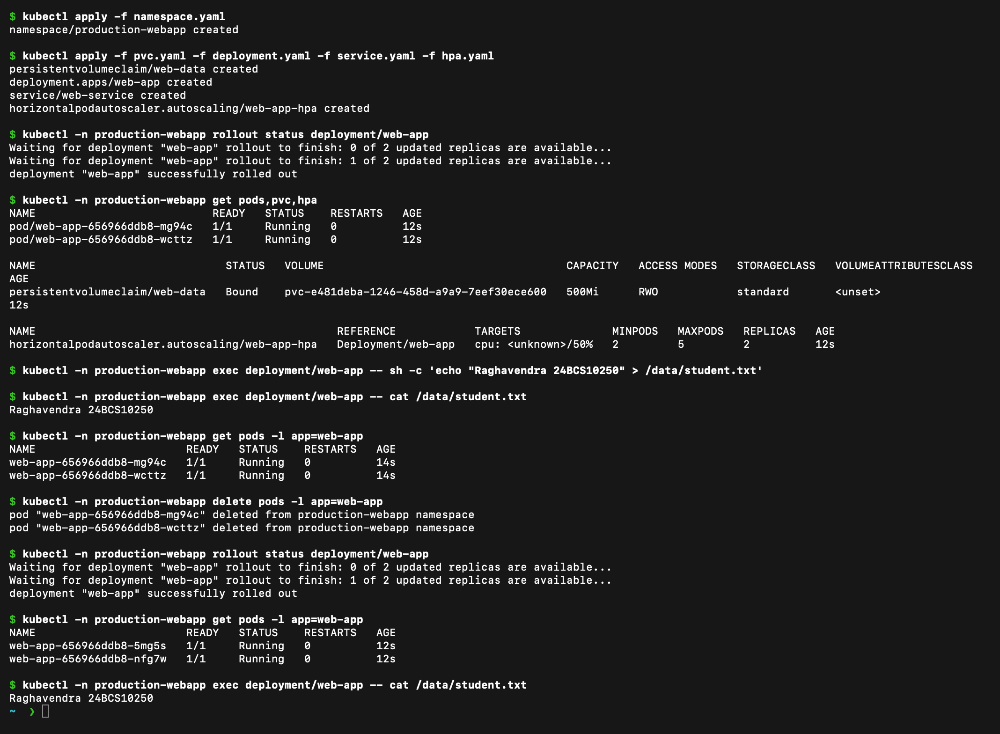
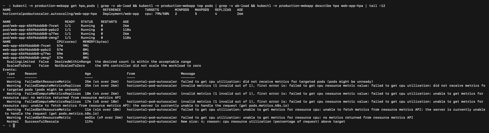
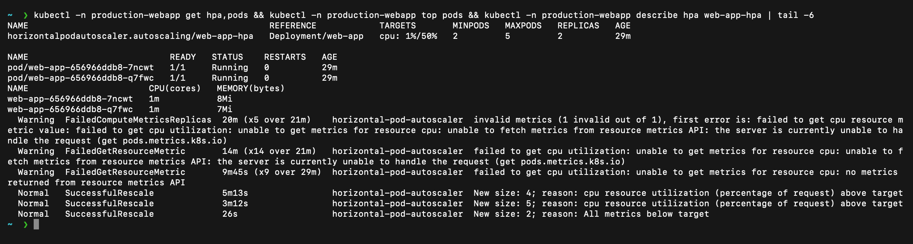

# Nginx Storage, HPA and Probes Mini Project

The class mini project runs Nginx with a 500Mi PVC, all three HTTP probes, and an HPA with two to five replicas at 50% CPU. I ran it locally on Minikube.

```text
Client -> web-service -> Nginx Pods
                         | probes and CPU requests
                         | /data -> PVC web-data -> PV
Metrics Server -> HPA -> Deployment replica count
```

Run from this folder:

```bash
kubectl apply -f namespace.yaml
kubectl apply -f pvc.yaml -f deployment.yaml -f service.yaml -f hpa.yaml
kubectl -n production-webapp rollout status deployment/web-app
kubectl -n production-webapp get pods,pvc,hpa
kubectl -n production-webapp exec deployment/web-app -- sh -c 'echo "Raghavendra 24BCS10250" > /data/student.txt'
kubectl -n production-webapp exec deployment/web-app -- cat /data/student.txt
kubectl -n production-webapp delete pods -l app=web-app
kubectl -n production-webapp rollout status deployment/web-app
kubectl -n production-webapp exec deployment/web-app -- cat /data/student.txt
```

All old application Pods were deleted. The replacement Pods still read `Raghavendra 24BCS10250` from the claim. [Persistence output](outputs/persistence.txt) records the old and new Pod names and both reads.



The [probe and Service output](outputs/probes-and-service.txt) shows the configured checks and a successful Nginx response through the Service.

```bash
kubectl -n production-webapp port-forward service/web-service 8086:80
```

Open `http://127.0.0.1:8086`.

```bash
kubectl -n production-webapp apply -f load-generator.yaml
kubectl -n production-webapp scale deployment/load-generator --replicas=30
kubectl -n production-webapp top pods
kubectl -n production-webapp get hpa,pods -w
kubectl -n production-webapp describe hpa web-app-hpa
kubectl -n production-webapp delete deployment load-generator
```

The local scale-down stabilization window is 60 seconds. This makes recovery easier to observe during the lab. Both Pods mount the same ReadWriteOnce claim on the single Minikube node. The deployment uses the class Recreate strategy, so an image update can cause downtime.

My first runs with the `load-generator` Deployment (six, then 30 generator Pods) only pushed the average to about `43%/50%`, so the HPA stayed at 2 replicas: the `wget` loops spend most of their CPU starting processes, not sending requests. For the final run I scaled `load-generator` to zero and used six `ab` (ApacheBench) Pods, each sending 100 concurrent requests to `web-service`:

```bash
kubectl -n production-webapp scale deployment/load-generator --replicas=0
for i in 1 2 3 4 5 6; do
  kubectl -n production-webapp run ab-load-$i --image=httpd:2.4-alpine --restart=Never \
    --command -- sh -c 'ab -n 100000000 -c 100 http://web-service/ > /dev/null'
done
```

Utilization went above the 50% target (`94%/50%` at first), and the HPA scaled `web-app` from 2 to 4 replicas, then to 5. The screenshot was taken with four Pods running at `79%/50%`; the HPA events show `New size: 4; reason: cpu resource utilization (percentage of request) above target`. The `FailedGetResourceMetric` warnings in the events are from the first minutes after the HPA was created, before metrics-server had data for the new Pods.



After I deleted the load Pods, utilization dropped to `1%/50%` and the HPA scaled back to 2 replicas. The last event reads `New size: 2; reason: All metrics below target`:


