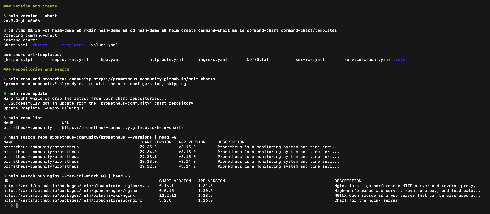
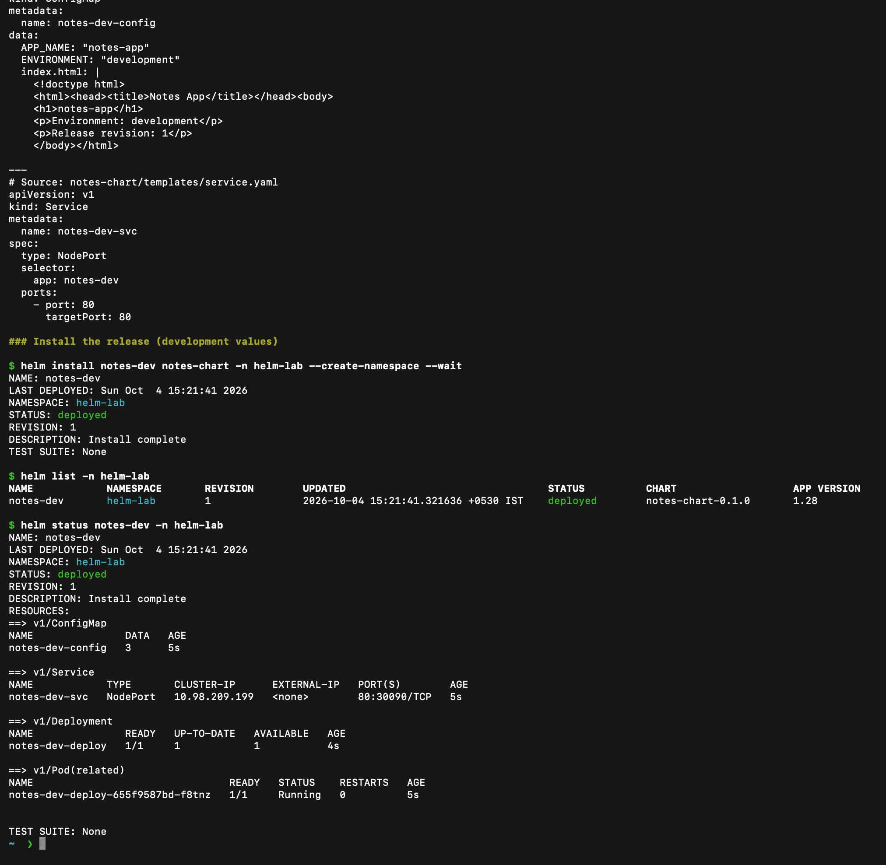
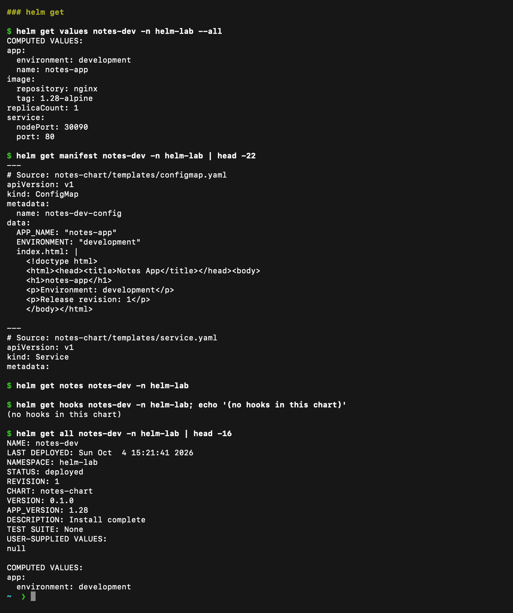
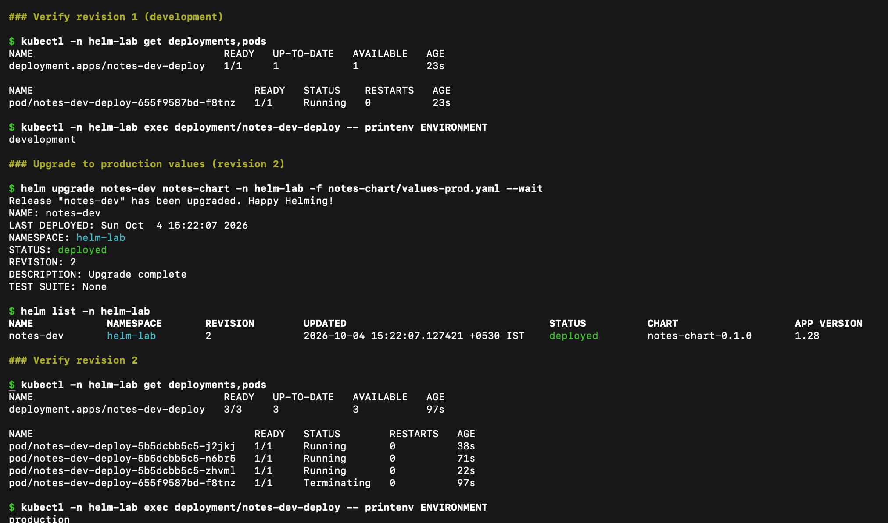
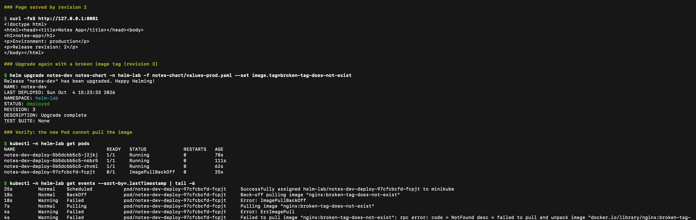
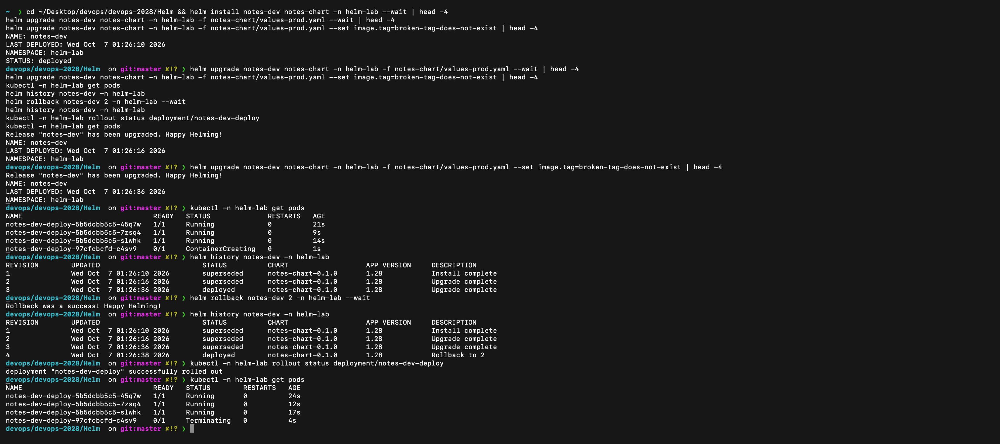
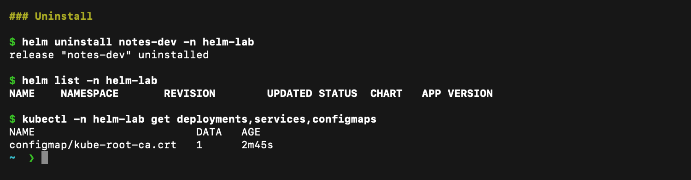

# Helm

**Name:** Raghavendra  
**Enrollment number:** 24BCS10250

**Session:** 15

Helm packages Kubernetes resources into a chart. A release is an installed copy of that chart. I used the class Notes mini project with Nginx, a ConfigMap and a NodePort Service.

## Chart files

`notes-chart/Chart.yaml` stores chart metadata. `values.yaml` uses one development replica; `values-prod.yaml` uses three production replicas. The templates create the Deployment, Service and ConfigMap. The ConfigMap also provides the page, so the environment change is visible in the browser.

I used Nginx `1.28-alpine` in both environments. The example keeps the environment and replica changes separate from the intentionally broken image upgrade.

## Commands

Run these from this folder. The [outputs](outputs/) directory contains the actual command output from the exercise.

| Command | Purpose | Output |
|---|---|---|
| `helm create command-chart` | Creates a starter chart | [Create](outputs/02-create.txt) |
| `helm repo add prometheus-community https://prometheus-community.github.io/helm-charts` | Adds a chart repository | [Add](outputs/03-repo-add.txt) |
| `helm repo update` | Updates the repository index | [Update](outputs/04-repo-update.txt) |
| `helm repo list` | Lists configured repositories | [Repositories](outputs/05-repo-list.txt) |
| `helm search repo prometheus-community/prometheus --versions` | Finds chart versions | [Search](outputs/06-search.txt) |
| `helm lint notes-chart` | Checks chart structure | [Lint](outputs/07-lint.txt) |
| `helm template notes-dev notes-chart` | Renders Kubernetes YAML | [Rendered chart](outputs/08-template.txt) |
| `helm install notes-dev notes-chart -n helm-lab --create-namespace --wait` | Installs the release | [Install](outputs/09-install.txt) |
| `helm list -n helm-lab` | Lists releases in the namespace | [List](outputs/10-list.txt) |
| `helm status notes-dev -n helm-lab` | Shows release status | [Status](outputs/11-status.txt) |
| `helm get values notes-dev -n helm-lab --all` | Shows the values used | [Values](outputs/12-get-values.txt) |
| `helm get manifest notes-dev -n helm-lab` | Shows installed manifests | [Manifest](outputs/13-get-manifest.txt) |
| `helm get notes notes-dev -n helm-lab` | Shows the release notes (empty here, my chart has no `NOTES.txt`) | [output](outputs/24-get-notes.txt) |
| `helm get hooks notes-dev -n helm-lab` | Shows hooks (my chart has none) | [output](outputs/25-get-hooks.txt) |
| `helm get all notes-dev -n helm-lab` | Shows status, values, manifest and notes together | [output](outputs/26-get-all.txt) |
| `helm search hub nginx` | Searches Artifact Hub for public charts | [output](outputs/27-search-hub.txt) |
| `helm upgrade`, `helm history`, `helm rollback`, `helm uninstall` | Used in the sections below | |

Screenshots of these commands from my terminal:







## Upgrade and rollback

```bash
helm upgrade notes-dev notes-chart -n helm-lab -f notes-chart/values-prod.yaml --wait
kubectl -n helm-lab get deployments,pods
kubectl -n helm-lab exec deployment/notes-dev-deploy -- printenv ENVIRONMENT
helm upgrade notes-dev notes-chart -n helm-lab -f notes-chart/values-prod.yaml --set image.tag=broken-tag-does-not-exist
kubectl -n helm-lab get pods
kubectl -n helm-lab get events --sort-by=.lastTimestamp
helm history notes-dev -n helm-lab
helm rollback notes-dev 2 -n helm-lab --wait
kubectl -n helm-lab rollout status deployment/notes-dev-deploy
helm history notes-dev -n helm-lab
```

Revision 1 installed the development values. Revision 2 used three production replicas. Revision 3 used an image tag that does not exist. Kubernetes reported `ErrImagePull` and `ImagePullBackOff`. Helm accepted that upgrade because the command did not wait for healthy Pods.

The rollback restored revision 2's values and created revision 4. A rollback adds a new release revision; it does not erase the failed revision. The existing production Pods kept serving requests during the bad upgrade.

Upgrade to production values: the release moved to revision 2, `ENVIRONMENT` changed from `development` to `production`, and the Deployment went from one Pod to three.



The broken upgrade (revision 3): Helm reports `deployed`, but the new Pod is in `ImagePullBackOff`. The three revision-2 Pods are still `Running`.



## Open the page

```bash
kubectl -n helm-lab port-forward service/notes-dev-svc 8081:80
```

Open `http://127.0.0.1:8081` in the browser. In another terminal:

```bash
curl -fsS http://127.0.0.1:8081
```

## Cleanup

```bash
helm uninstall notes-dev -n helm-lab
helm list -n helm-lab
kubectl -n helm-lab get deployments,services,configmaps
kubectl delete namespace helm-lab
```

Class reference: [devops-heros](https://github.com/Nency-Ravaliya/devops-heros), session-15-helm mini project.

## Rollback result

[Release history](outputs/20-history.txt) shows the failed third upgrade followed by the rollback. [Restored workload and page](outputs/21-restored.txt) confirm the production configuration returned.



The release was removed after the exercise. `helm list` is empty afterwards and the Deployment, Service and ConfigMap are gone.



 [Uninstall](outputs/22-uninstall.txt) and [release list after cleanup](outputs/23-cleanup.txt) record the cleanup.
