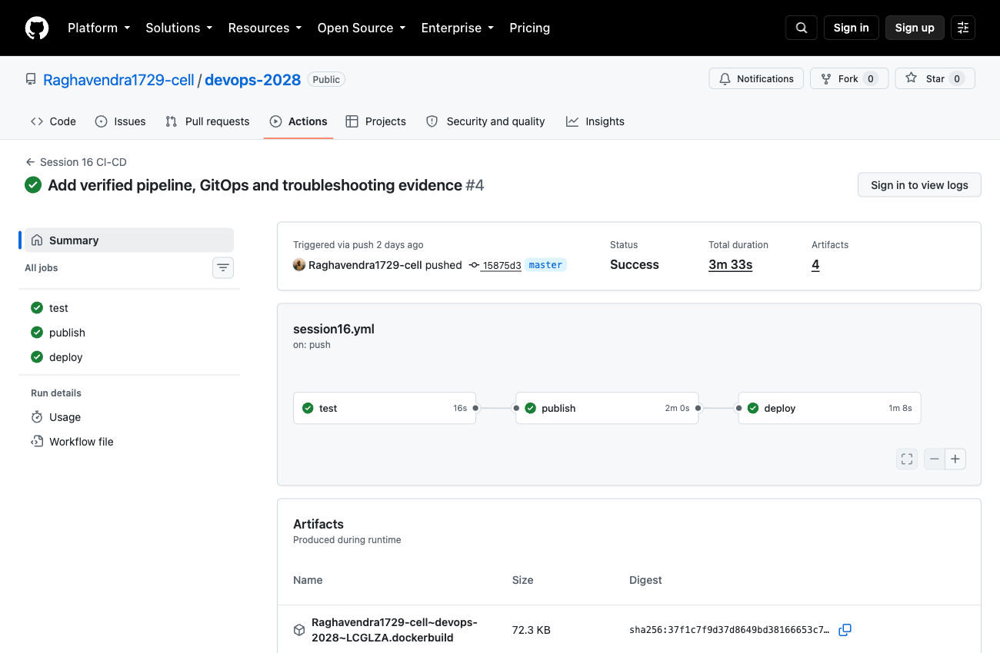

# CI/CD and GitHub Actions

**Name:** Raghavendra  
**Enrollment number:** 24BCS10250

**Session:** 16

This application displays its version, environment and hostname. It also provides a calculator API. I followed the class pipeline structure and added Docker publishing and a Kubernetes deployment check.

## Run locally

```bash
python3 -m venv .venv
source .venv/bin/activate
pip install -r requirements-dev.txt
pytest -v
export API_TOKEN=$(openssl rand -hex 24)
gunicorn --bind 127.0.0.1:8500 --workers 1 --threads 4 app:app
```

Open `http://127.0.0.1:8500`. In another terminal:

```bash
curl -fsS http://127.0.0.1:8500/health
curl -fsS -X POST http://127.0.0.1:8500/api/calculate -H 'Content-Type: application/json' -d '{"a":6,"b":3,"operation":"multiply"}'
```

The calculator returns `18`. It rejects missing fields, non-numeric values, unknown operations, division by zero and numbers too large to calculate safely.

## Docker

```bash
docker build -t ci-cd:1.0 .
docker run --rm -p 127.0.0.1:8500:5000 -e API_TOKEN ci-cd:1.0
```

## CI vs CD

- **CI (continuous integration):** every push is built and tested automatically, so a broken change is caught early.
- **CD (continuous delivery/deployment):** after CI passes, the app is packaged and delivered. Here the image is pushed to GHCR and deployed to a Kubernetes cluster without any manual step.

## GitHub Actions terms

| Term | In my pipeline |
|---|---|
| Workflow | `session16.yml`, the YAML file that defines the whole pipeline |
| Job | `test`, `publish`, `deploy` (they run one after another using `needs`) |
| Step | One command or action inside a job, e.g. `pytest` or `docker build` |
| Runner | The machine that runs the job; `ubuntu-24.04` is a GitHub-hosted runner |
| Secret | `GITHUB_TOKEN` for logging in to GHCR; nothing is hardcoded in the file |
| Artifact | Files saved from a run (test report, build, deployment response) that I can download |

Pipeline flow: **build and test -> publish image -> deploy and check**.

## CI and CD

CI checks each change by building the Python source and running tests. CD builds and publishes the Docker image, installs the chart in Kubernetes and verifies the application. The deployment target in this demo is a temporary Kind cluster inside the GitHub runner. It is removed at the end of the job.

A workflow contains jobs; each job contains steps. `needs` makes the publishing job wait for tests and the deployment job wait for publishing. `ubuntu-24.04` selects a GitHub-hosted runner.

The registry login uses GitHub's automatic `GITHUB_TOKEN` secret. The application token is generated during deployment and stored as a Kubernetes Secret. It is never written into the workflow file.

Test reports, the application build and the deployment response are uploaded as artifacts. They can be downloaded from the workflow run. The initial sensitive-file check follows the class example; Session 17 adds dedicated security scanners.

## GitHub Actions

The executable workflow is [`.github/workflows/session16.yml`](../.github/workflows/session16.yml) at the repository root. It runs on changes to this section and can also be started from the Actions page.

```bash
gh workflow run session16.yml --ref master
gh run list --workflow session16.yml
gh run view --log
```

The image is tagged with the full commit SHA, so the deployment uses the version built by that run. PR checks run tests without publishing an image.

The Kubernetes deployment uses the [final project chart](../Session-21-Final-DevOps-Project-Troubleshooting/final-devops-project/helm/notes/). For a manual run, create the application Secret, load the image into Minikube and use Helm with autoscaling disabled. The commands are in the [final project README](../Session-21-Final-DevOps-Project-Troubleshooting/final-devops-project/README.md).

Class reference: [devops-heros](https://github.com/Nency-Ravaliya/devops-heros), session-16-github-actions.

## Pipeline result

The [successful run](https://github.com/Raghavendra1729-cell/devops-2028/actions/runs/37001239685) completed tests, image publishing and Kubernetes deployment. Its deployment job verified readiness, health and the calculator response before deleting Kind.


