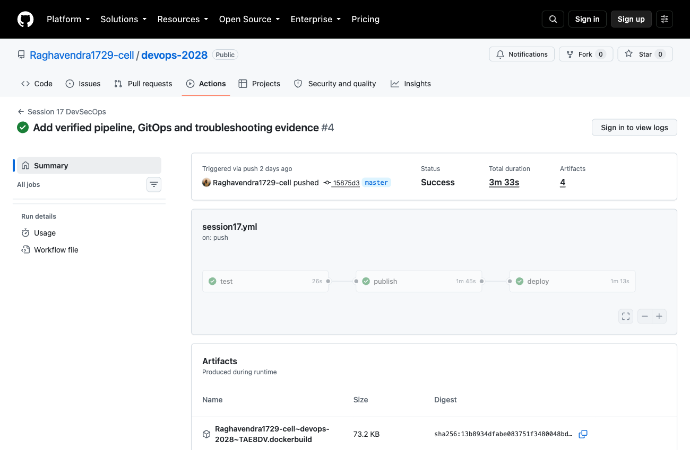
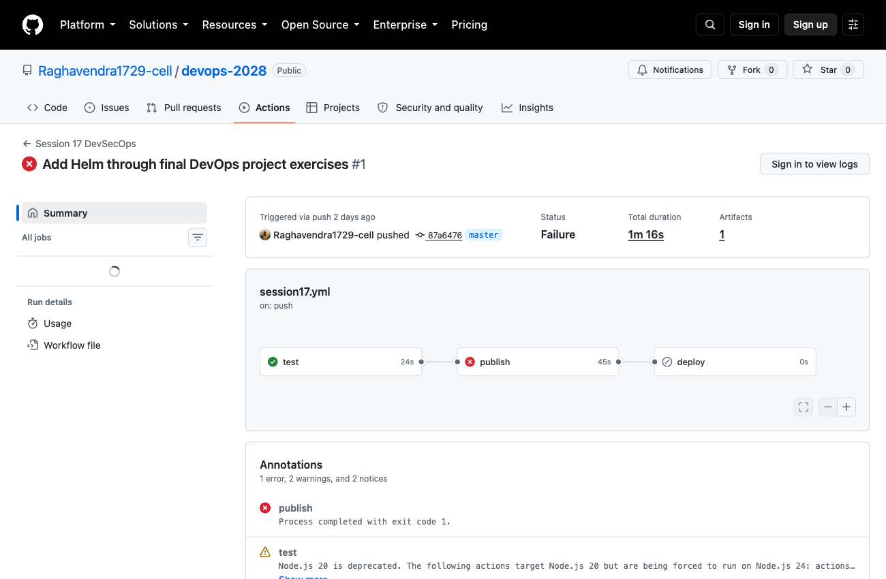

# CI/CD and DevSecOps

**Name:** Raghavendra  
**Enrollment number:** 24BCS10250

**Session:** 17

This is the same small Flask app as Session 16 (version page plus a calculator API), but this time the pipeline also scans the code, dependencies, secrets and the Docker image before anything is pushed or deployed.

## Run locally

```bash
python3 -m venv .venv
source .venv/bin/activate
pip install -r requirements-dev.txt
pytest -v
export API_TOKEN=$(openssl rand -hex 24)
gunicorn --bind 127.0.0.1:8500 --workers 1 --threads 4 app:app
```

Open `http://127.0.0.1:8500`. In another terminal:

```bash
curl -fsS http://127.0.0.1:8500/health
curl -fsS -X POST http://127.0.0.1:8500/api/calculate -H 'Content-Type: application/json' -d '{"a":6,"b":3,"operation":"multiply"}'
```

The calculator returns `18`. It rejects missing fields, non-numeric values, unknown operations, division by zero and numbers too large to calculate safely.

## Docker

```bash
docker build -t devsecops:1.0 .
docker run --rm -p 127.0.0.1:8500:5000 -e API_TOKEN devsecops:1.0
```

## Pipeline order

```
Code -> Build -> Unit test -> SAST (Bandit) -> SCA (pip-audit) -> Secret scan (Gitleaks)
     -> Docker build -> Image scan (Trivy) -> Security gate -> Push image -> Deploy to Kubernetes
```

| Stage | Tool | What it looks for |
|---|---|---|
| SAST | Bandit | Insecure patterns in my own Python code |
| SCA | pip-audit | Known vulnerabilities in the libraries I depend on |
| Secret scan | Gitleaks | Passwords or tokens committed by mistake |
| Image scan | Trivy | Vulnerabilities in the OS packages and libraries inside the image |
| Security gate | Trivy exit code | The Trivy step fails the job on a fixable HIGH or CRITICAL finding, so the push and deploy steps never run |

The security gate is the Trivy step itself (`exit-code: 1`) rather than a separate step in the workflow file.

## Security checks

The pipeline runs Bandit for SAST, pip-audit for dependency vulnerabilities, Gitleaks for secrets and Trivy for the Docker image. The test and source scan jobs must pass before the image job runs. The image gate blocks fixable HIGH and CRITICAL vulnerabilities before publishing. Findings without an available fix remain visible in a full scan report and are reviewed separately.

Run source checks locally:

```bash
bandit -c security/bandit.yaml -q app.py
pip-audit -r requirements.txt
gitleaks dir . --redact
```

There is no `continue-on-error` on security checks. The workflow's `gate_demo` input produces a controlled failure so that skipped image and deployment jobs can be observed without committing broken application code.

## GitHub Actions

The executable workflow is [`.github/workflows/session17.yml`](../.github/workflows/session17.yml) at the repository root. It runs on changes to this section and can also be started from the Actions page.

```bash
gh workflow run session17.yml --ref master
gh run list --workflow session17.yml
gh run view --log
```

The image is tagged with the full commit SHA, so the deployment uses the version built by that run. PR checks run tests without publishing an image.

The Kubernetes deployment uses the [final project chart](../Session-21-Final-DevOps-Project-Troubleshooting/final-devops-project/helm/notes/). For a manual run, create the application Secret, load the image into Minikube and use Helm with autoscaling disabled. The commands are in the [final project README](../Session-21-Final-DevOps-Project-Troubleshooting/final-devops-project/README.md).

Class reference: [devops-heros](https://github.com/Nency-Ravaliya/devops-heros), session-17-devsecops.

## Kubernetes manifests

These manifests are for running the app by hand on Minikube. The pipeline itself deploys with the Helm chart from Session 21. After building the Docker image above:

```bash
minikube image load devsecops:1.0
../Session-21-Final-DevOps-Project-Troubleshooting/final-devops-project/kubernetes/create-secret.sh devsecops-lab
kubectl apply -n devsecops-lab -f kubernetes/application.yaml
kubectl -n devsecops-lab rollout status deployment/notes
kubectl -n devsecops-lab port-forward service/notes 8500:5000
```

Open `http://127.0.0.1:8500`. Delete `devsecops-lab` after the exercise.

## Pipeline result

The [successful run](https://github.com/Raghavendra1729-cell/devops-2028/actions/runs/37001239734) completed tests, image publishing and Kubernetes deployment. Its deployment job verified readiness, health and the calculator response before deleting Kind.



## Security gate result

The first image scan found fixable vulnerabilities and stopped the publishing job. Deployment remained skipped. I updated the Debian packages and removed pip and its bundled installer from the runtime image after installing the application dependencies.

The [blocked run](https://github.com/Raghavendra1729-cell/devops-2028/actions/runs/37000088493) below shows the `publish` job failing (exit code 1) and `deploy` skipped. The failing step in that job was the Trivy scan:



The [updated image scan](outputs/image-scan.txt) passed the configured gate. The later successful run completed publishing and deployment. A passing gate means no fixable HIGH or CRITICAL findings were detected at scan time; it is not a claim that the image has no vulnerabilities of any severity.
