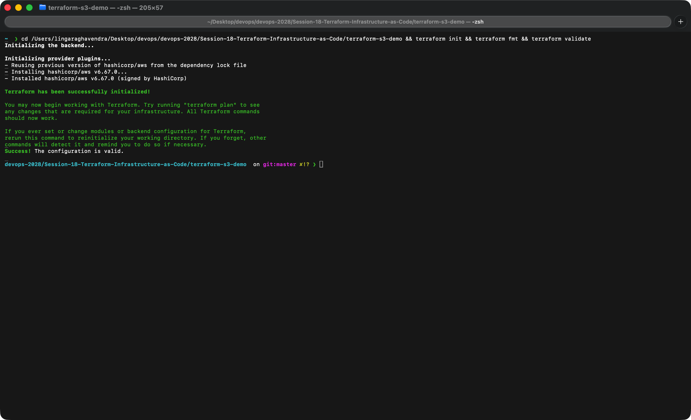
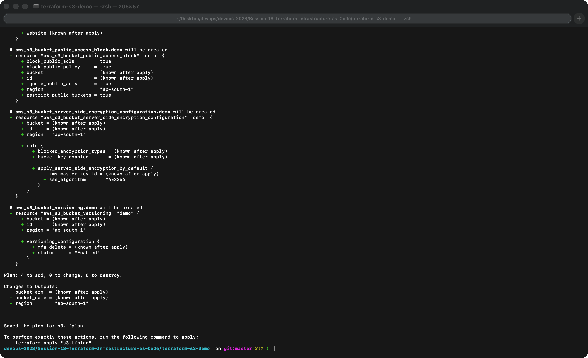
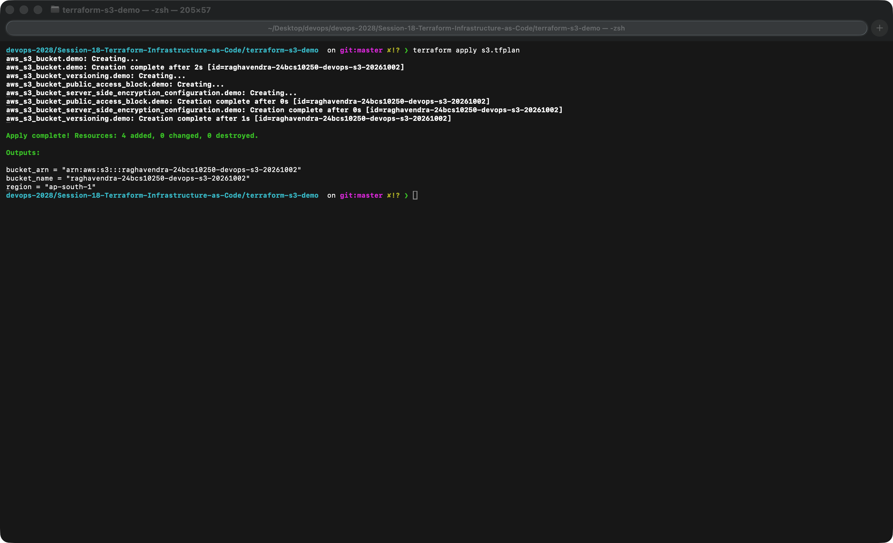
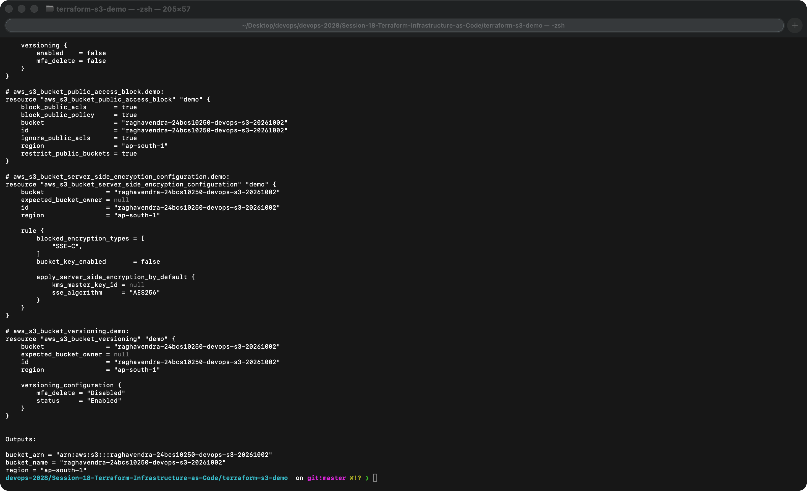
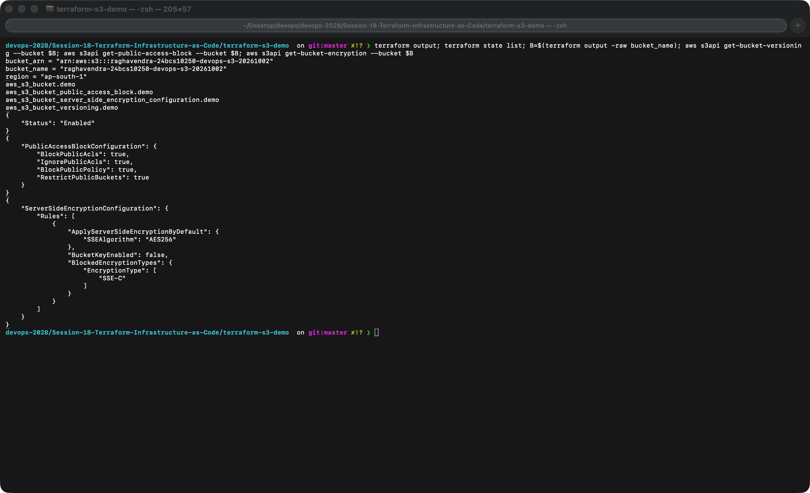
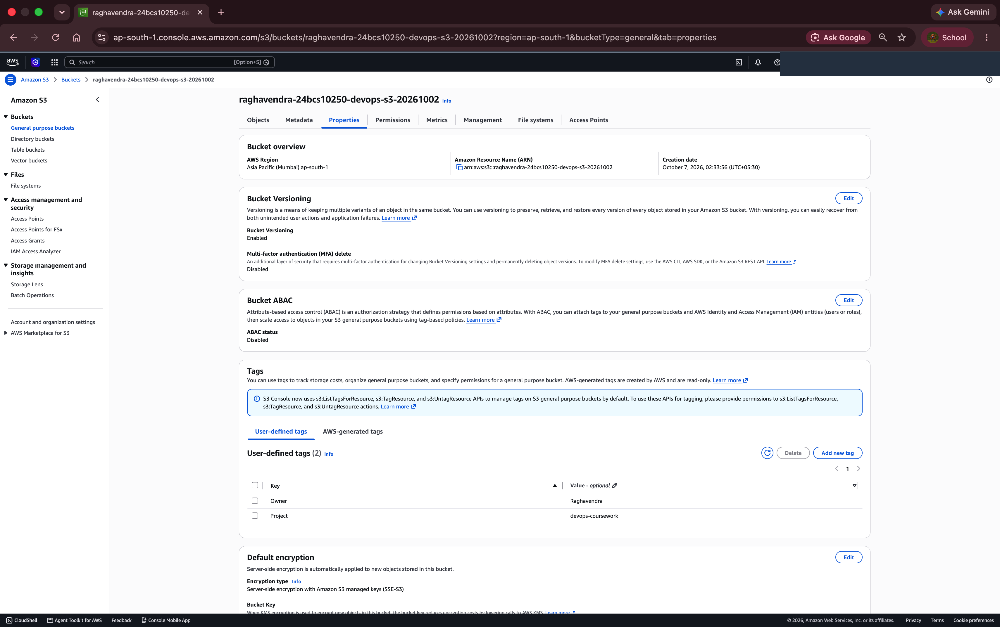
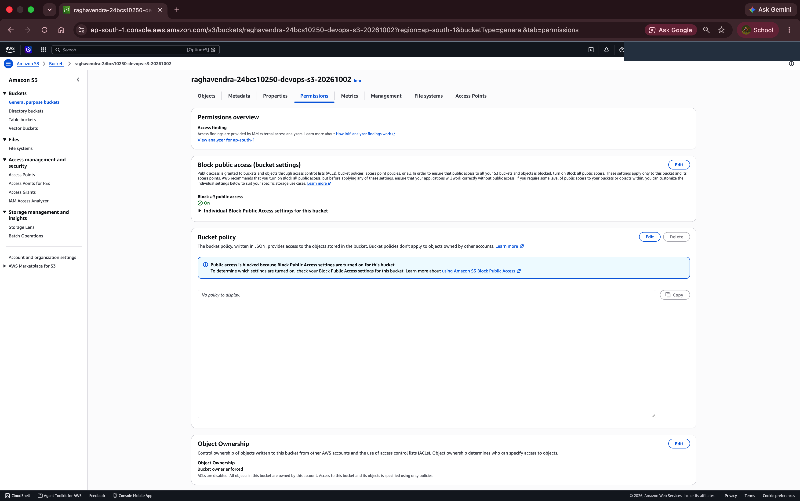
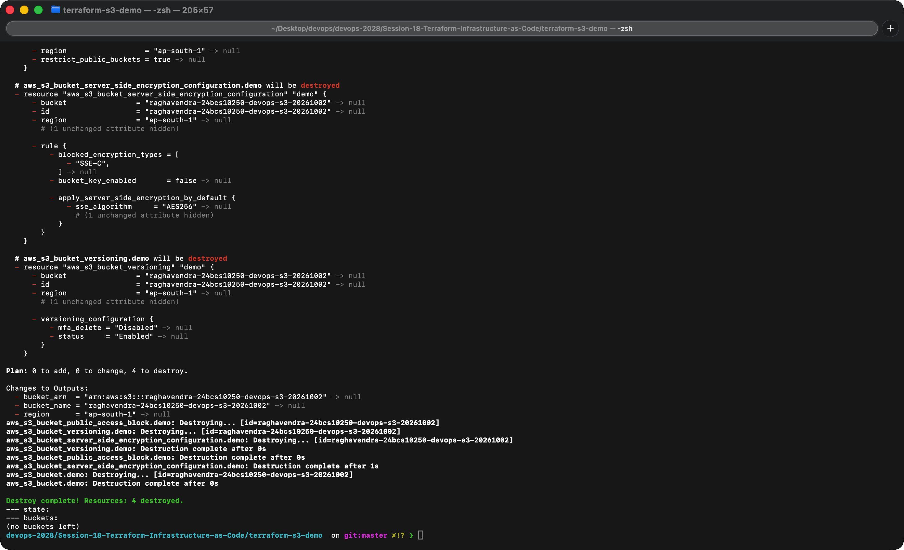

# Terraform S3 Demo

**Name:** Raghavendra  
**Enrollment number:** 24BCS10250

**Session:** 18


This configuration creates a private S3 bucket with versioning and server-side encryption. The bucket name and region are variables, and the bucket name, ARN and region are outputs.

## Files

| File | Purpose |
|---|---|
| `provider.tf` | Terraform and AWS provider versions; AWS region |
| `variables.tf` | Input definitions |
| `terraform.tfvars` | Non-sensitive example settings |
| `main.tf` | Bucket, versioning, encryption and public access protection |
| `outputs.tf` | Values returned after apply |
| `.terraform.lock.hcl` | Selected provider version and checksums |

## Commands

Run from this folder. Use an authenticated AWS profile with permission to manage the bucket. Bucket names are globally unique; change `bucket_name` if the configured name is already taken.

```bash
export AWS_PROFILE=devops
aws sts get-caller-identity
terraform init
terraform fmt
terraform validate
terraform plan -out=s3.tfplan
terraform apply s3.tfplan
terraform show
terraform output
aws s3api get-bucket-versioning --bucket "$(terraform output -raw bucket_name)"
aws s3api get-public-access-block --bucket "$(terraform output -raw bucket_name)"
```

`init` downloads the provider. `fmt` formats the source. `validate` checks the configuration. `plan` previews changes and `apply` performs them. `show` displays the current state; `output` prints the declared output values.

The local state records the resources Terraform manages. State files and saved plans are excluded from Git because they can contain sensitive data.

## What I ran

I ran the whole workflow against my own AWS account in `ap-south-1` with an IAM user (not the root user). In the console screenshots my name and account ID are blacked out. The `.tf` files were not changed.

`init`, `fmt` and `validate`:



`plan` shows four resources to add (the bucket, versioning, encryption and the public access block). I saved the plan to a file so that `apply` runs exactly what I reviewed:



`apply` created all four resources:



`terraform show` prints the full state of every resource Terraform created (the end of the output is shown, including the encryption, versioning and outputs):



`terraform output`, `terraform state list`, and checks against the S3 API: versioning is `Enabled`, all four public access settings are `true`, and default encryption is AES256:



The same settings in the AWS console. Properties tab: versioning `Enabled` and default encryption SSE-S3. Permissions tab: Block all public access is `On`.





`terraform destroy` removed all four resources. Afterwards the state is empty and `aws s3 ls` shows no buckets, so nothing is left running in the account:



## Cleanup

```bash
terraform plan -destroy
terraform destroy
terraform show
```

Keep the bucket empty for this exercise. If objects are uploaded, remove their versions and delete markers before destroying a versioned bucket. The configuration does not force-delete data.

## Local configuration check

```bash
terraform init -backend=false
terraform fmt -check
terraform validate
```

These checks examine the configuration without creating AWS resources.

[AWS provider S3 bucket documentation](https://registry.terraform.io/providers/hashicorp/aws/latest/docs/resources/s3_bucket).

[Local validation output](outputs/validate.txt) records Terraform initialization and configuration validation.
