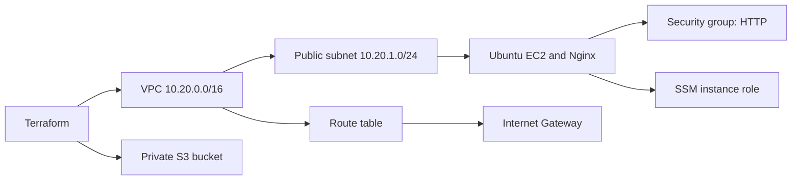
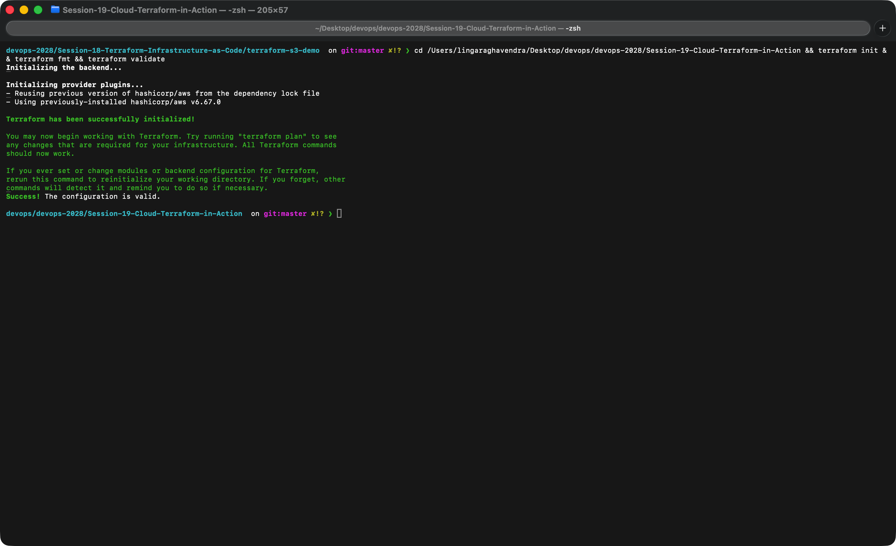
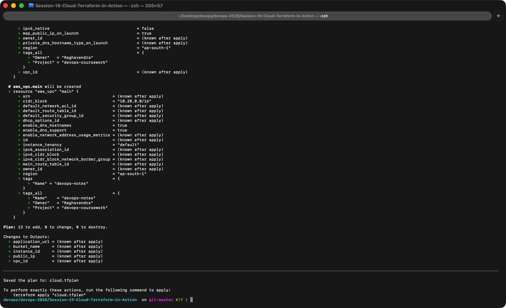
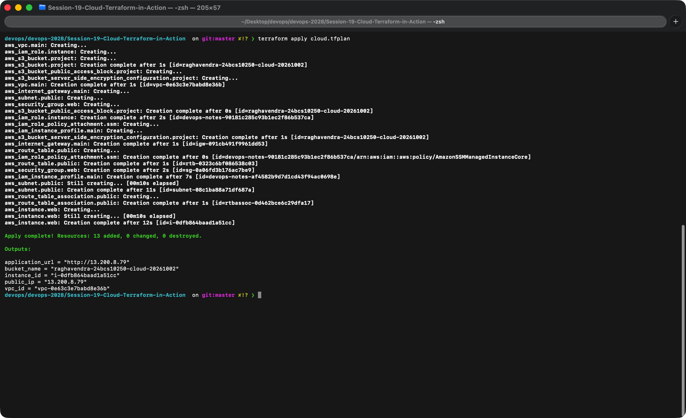
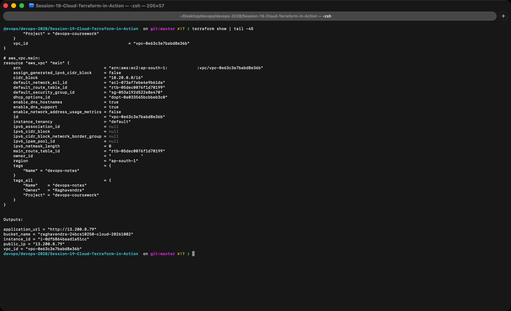
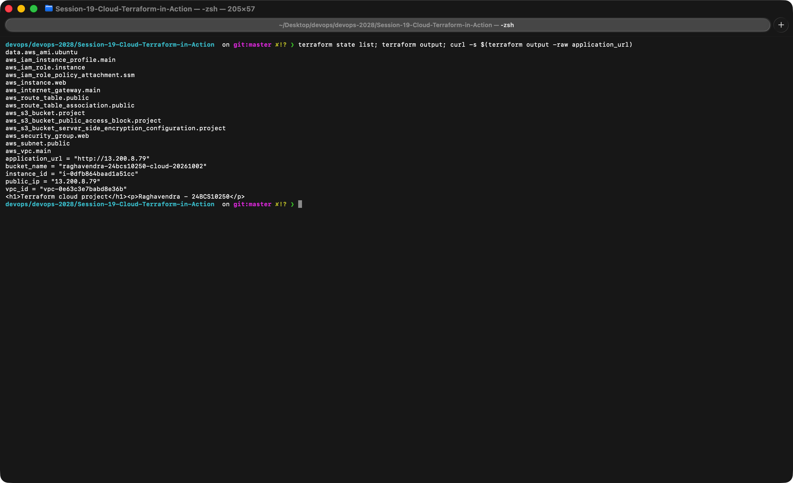
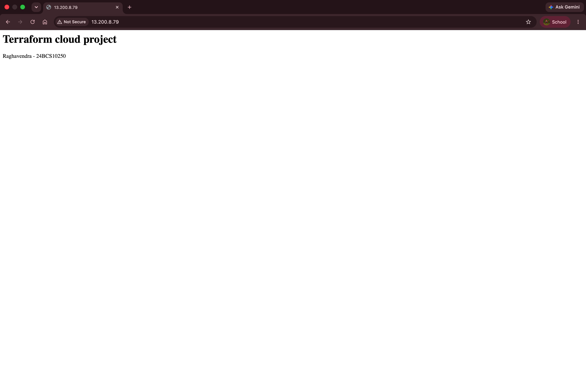
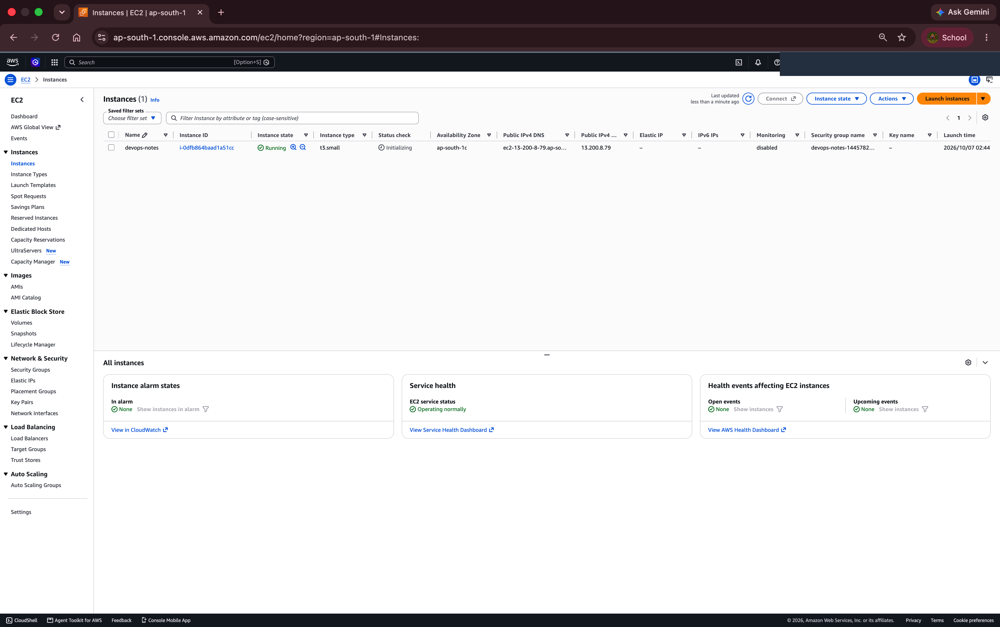
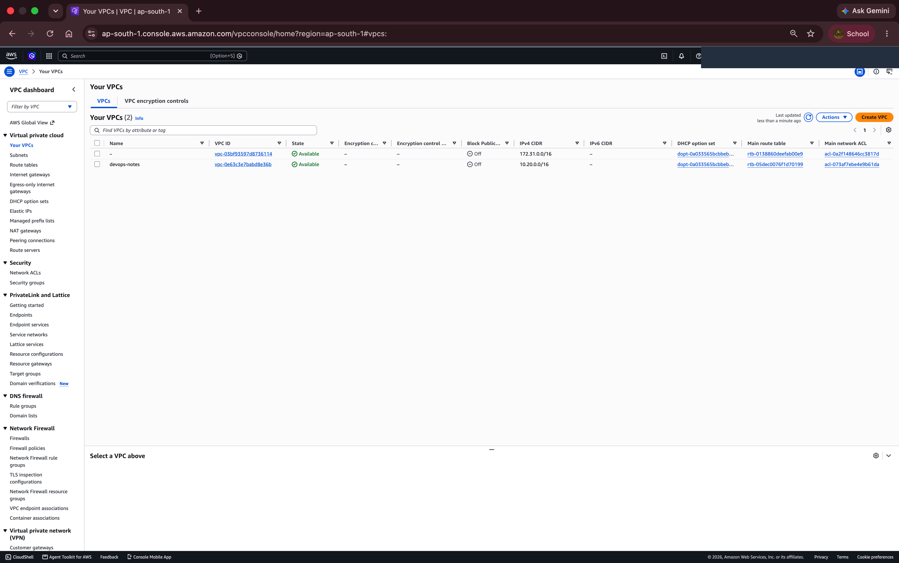
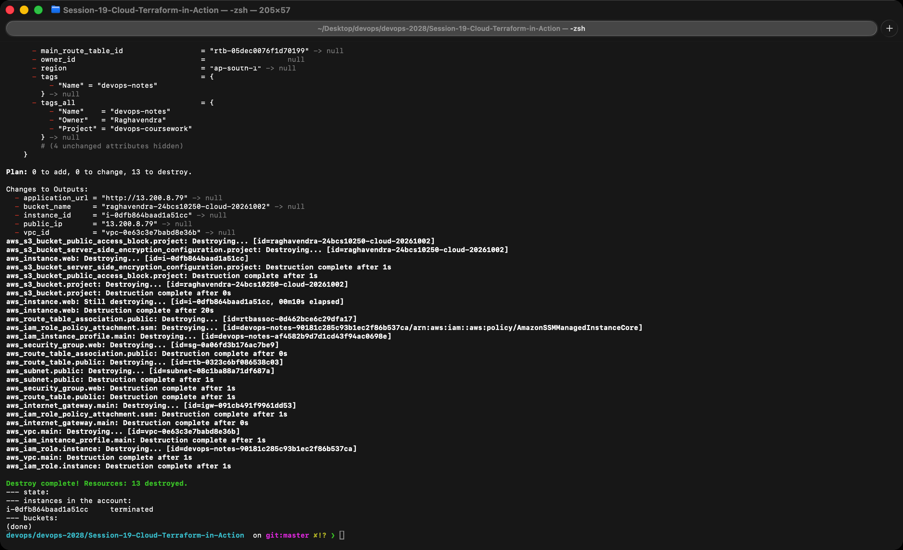

# Cloud Infrastructure with Terraform

**Name:** Raghavendra  
**Enrollment number:** 24BCS10250

**Session:** 19

The project creates a VPC, public subnet, route table, Internet Gateway, security group, Ubuntu EC2 instance and private S3 bucket. EC2 installs Nginx using `user-data.sh`.



## Configuration

`provider.tf` selects AWS and the region. `variables.tf` defines the project name, bucket name and instance size. `main.tf` creates the resources. `outputs.tf` returns the instance ID, public IP, application URL, bucket name and VPC ID.

Resource references such as `aws_vpc.main.id` create dependencies. The EC2 instance explicitly waits for routing and SSM role permissions. The instance's root volume is encrypted and IMDSv2 is required.

The subnet has a default route to the Internet Gateway. The security group accepts HTTP on port 80. SSH and the Kubernetes API are not exposed; instance administration uses AWS Systems Manager.

## Deploy

Run from this folder:

```bash
export AWS_PROFILE=devops
aws sts get-caller-identity
terraform init
terraform fmt -check
terraform validate
terraform plan -out=cloud.tfplan
terraform apply cloud.tfplan
terraform show
terraform output
curl -fsS "$(terraform output -raw application_url)"
```

Allow time for cloud-init to install Nginx. Its log is `/var/log/cloud-init-output.log`.

For an SSM shell, install AWS's Session Manager plugin, then run:

```bash
aws ssm start-session --target "$(terraform output -raw instance_id)"
```

The AWS identity running this command needs SSM session permissions. The attached instance role supplies the agent's permissions.

## State and cleanup

Terraform state (`terraform.tfstate`) is a file where Terraform records every resource it created, with their IDs and attributes. On each `plan` it compares the configuration, the state and the real infrastructure to decide what to add, change or destroy. `terraform state list` shows the tracked resources and `terraform show` prints their details. The state can contain sensitive values, so keep it out of Git and preserve it until the resources are removed.

```bash
terraform plan -destroy
terraform destroy
terraform show
```

Destroy the instance, its root EBS volume, networking resources and empty S3 bucket after the exercise. Check the AWS console for remaining resources. Stopping EC2 alone leaves storage and other resources allocated.

## Local checks

```bash
terraform init -backend=false
terraform fmt -check
terraform validate
```

[AWS VPC documentation](https://docs.aws.amazon.com/vpc/latest/userguide/what-is-amazon-vpc.html), [SSM Session Manager](https://docs.aws.amazon.com/systems-manager/latest/userguide/session-manager.html).

[Local validation output](outputs/validate.txt) records Terraform initialization and configuration validation.

## Evidence from a real AWS run

I ran the whole project in my own AWS account in `ap-south-1` with an IAM user (not the root user). My name and account ID are blacked out in the screenshots. The instance type is `t3.small` (set in `terraform.tfvars`). The IAM user needed permission to create the SSM role, so I gave it IAM access for this exercise.

`init`, `fmt` and `validate`:



`plan` ends with `Plan: 13 to add`. The 13 resources are the VPC, subnet, internet gateway, route table and its association, security group, IAM role, policy attachment, instance profile, EC2 instance, and the S3 bucket with its encryption and public access block. I saved the plan so `apply` runs exactly what I reviewed:



`apply` created all 13 resources and printed the outputs (the instance ID, public IP, application URL, bucket name and VPC ID). Terraform builds them in dependency order, for example the subnet and security group wait for the VPC, and the instance waits for the route table association and instance profile:



`terraform show` prints the full state (this is the end of it, including the VPC and the outputs):



`terraform state list`, `terraform output` and a `curl` of the application URL returned the page written by `user-data.sh`:



The same page in the browser at the instance's public IP:



The EC2 console shows the running `t3.small` instance with the same public IP, and the VPC console shows the new `devops-notes` VPC (`10.20.0.0/16`) next to the default VPC:





`terraform destroy` removed all 13 resources. Afterwards the state is empty, the instance shows `terminated`, and `aws s3 ls` lists no buckets, so nothing is left running (or costing money) in the account:


