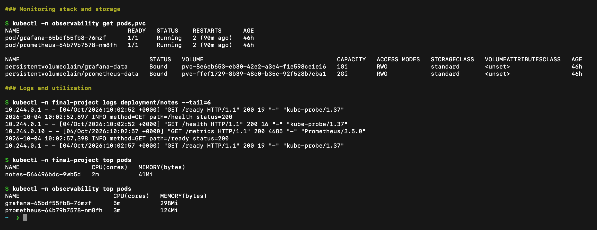
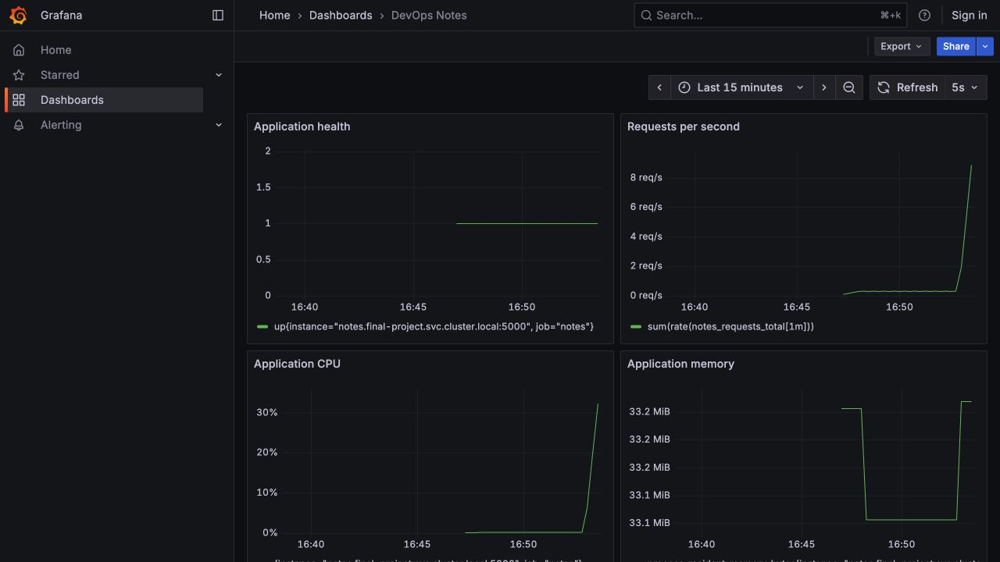
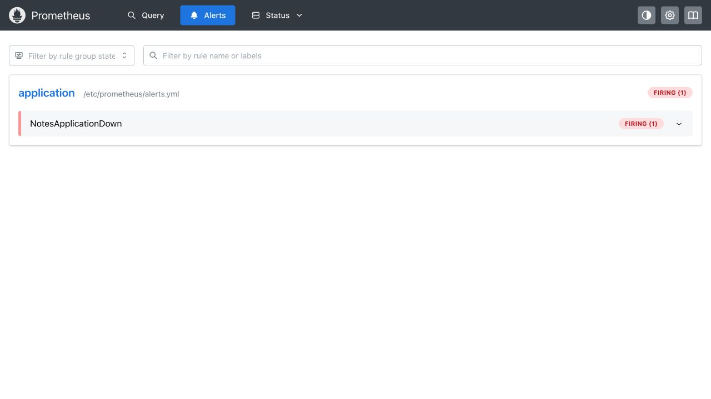
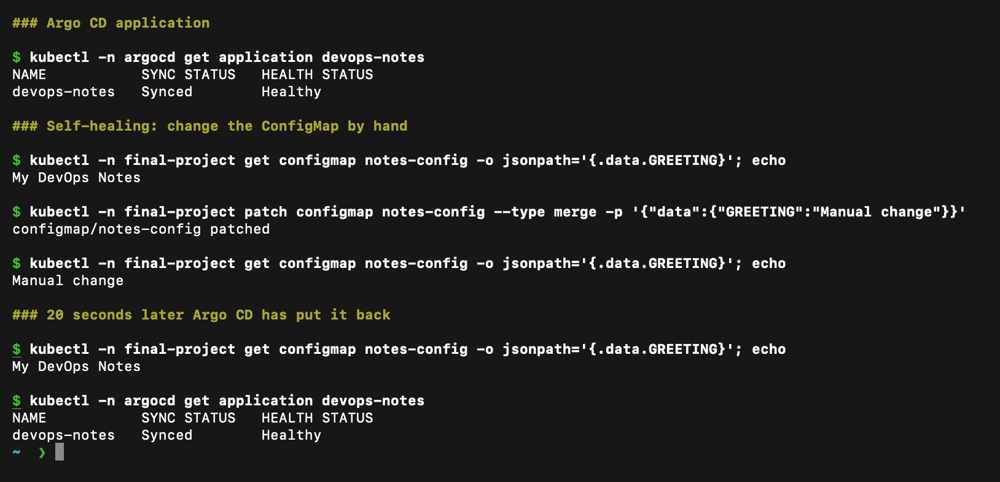
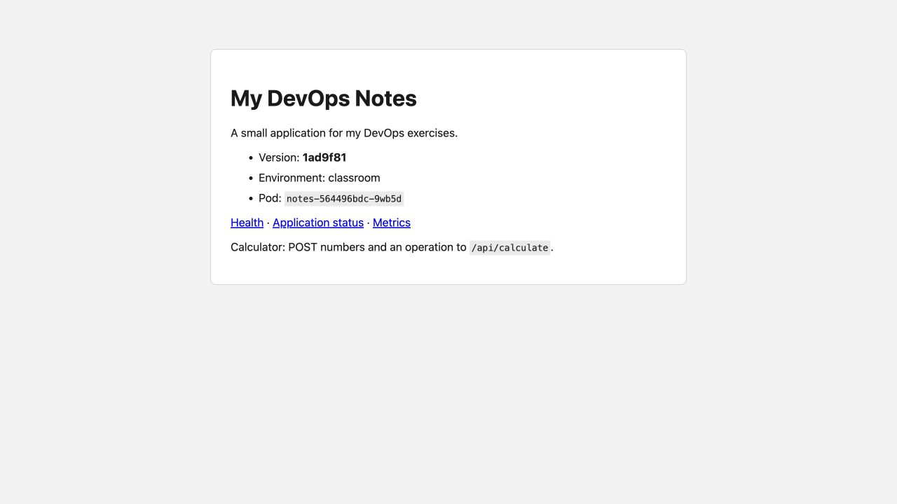

# Monitoring, Observability and GitOps

**Name:** Raghavendra  
**Enrollment number:** 24BCS10250  
**Session:** 20

## Monitoring

The [monitoring stack](../Session-21-Final-DevOps-Project-Troubleshooting/final-devops-project/monitoring/stack.yaml) runs Prometheus and Grafana. Prometheus scrapes the application every five seconds and evaluates an application-down alert. Grafana uses a provisioned dashboard for availability, request rate, CPU and memory. Both services store data on PVCs.

Start the Notes app using the final project's Helm instructions, then run:

```bash
./install-monitoring.sh
kubectl -n observability get pods,pvc
kubectl -n observability port-forward service/prometheus 9090:9090
```

In another terminal:

```bash
kubectl -n observability port-forward service/grafana 3000:3000
```

Open `http://127.0.0.1:3000/d/devops-notes`. Generate traffic to the Notes page or its `/work` endpoint. Inspect logs and utilization:

```bash
kubectl -n final-project logs deployment/notes --tail=20
kubectl -n final-project top pods
```

The dashboard measures the scraped application process. `kubectl top pods` gives Kubernetes Pod usage. These measurements have different scopes.

## Metrics, logs and traces

| Pillar | What it shows | Example and tools |
|---|---|---|
| Metrics | Numeric measurements over time | CPU, memory, error counts; Prometheus and Grafana |
| Logs | Events written by the application or service | A request returning 400; stdout, kubectl logs, Loki |
| Traces | One request's path through components | Time spent in API and database calls; OpenTelemetry, Jaeger |

### Why observability is needed

Monitoring tells me *that* something is wrong, for example the application-down alert firing. Observability is being able to work out *why* from the data the system already produces, without having to change the code and redeploy just to find out. In a real system with many services nobody can guess where a slow request went, so metrics, logs and traces are needed together. Metrics tell me where to look, logs give the detail, and traces connect one request across services.

Monitoring shows that something is wrong. Observability helps investigate why it is wrong. For example, a failed health metric points to an unavailable service; Pod events and application logs help explain the failure. Distributed traces become useful when a request passes through several services.

### Observability in Kubernetes

In Kubernetes I look at several layers: Pod status and events (`kubectl get`, `describe`, `get events`), probe results, container logs (`kubectl logs`), resource usage from Metrics Server (`kubectl top`), and application metrics scraped by Prometheus. Common tools are Prometheus and Grafana for metrics, Loki or the EFK stack for logs, and Jaeger or Tempo with OpenTelemetry for traces. This demo uses Prometheus, Grafana and `kubectl logs`.

For Kubernetes, check Pods, events, probes, logs and Metrics Server alongside application metrics. This small single-service demo uses metrics and logs. The trace explanation describes how tracing would help a multi-service application.

## Alert demonstration

The `NotesApplicationDown` rule tests `up{job="notes"} == 0` for 15 seconds. Change the Service selector so that the scrape target has no endpoint, observe the alert, then restore the selector.

```bash
kubectl -n final-project patch service notes -p '{"spec":{"selector":{"app":"notes-wrong"}}}'
kubectl -n final-project get endpointslice -l kubernetes.io/service-name=notes
```

After checking the alert at `http://127.0.0.1:9090/alerts`, restore it:

```bash
kubectl -n final-project patch service notes -p '{"spec":{"selector":{"app":"notes"}}}'
curl -fsS 'http://127.0.0.1:9090/api/v1/query?query=up%7Bjob%3D%22notes%22%7D'
```

Do this before enabling Argo CD self-healing, or perform the deliberate change through Git. Otherwise reconciliation may fix the selector before the alert fires.

## GitOps

**What is GitOps?** GitOps means the desired state of the system is written down in Git and an automated tool makes the cluster match it. The ideas I learned:

- **Git is the source of truth.** The chart and `values.yaml` in the repo describe what should be running. If it is not in Git, it is not the official state.
- **Declarative configuration.** I describe the end result (YAML/Helm values), not the steps to get there.
- **Continuous reconciliation.** Argo CD keeps comparing Git with the cluster. If they differ (someone edits the cluster by hand), it puts the cluster back.
- **Workflow.** Change a file, commit and push (or merge a pull request). The tool notices and applies it. Rolling back is a `git revert`.

With Kubernetes this means no one runs `kubectl apply` by hand on the real cluster. In my project CI builds the image and writes the new image tag into `gitops/values.yaml`, then Argo CD deploys it.

Git stores the intended configuration. Argo CD reads the [Application](../Session-21-Final-DevOps-Project-Troubleshooting/final-devops-project/gitops/application.yaml), renders the Helm chart and continuously compares Git with Kubernetes. Automated sync applies Git changes; self-healing restores manual drift.

Follow the final project's Argo CD installation commands, then:

```bash
kubectl apply -f ../Session-21-Final-DevOps-Project-Troubleshooting/final-devops-project/gitops/application-local.yaml
kubectl -n argocd get application devops-notes
```

Change the greeting in `Session-21-Final-DevOps-Project-Troubleshooting/final-devops-project/gitops/values.yaml`, commit and push. Argo CD synchronizes the ConfigMap and Deployment. Verify the greeting using the browser and inspect the Application's Git revision.

To check self-healing:

```bash
kubectl -n final-project patch configmap notes-config --type merge -p '{"data":{"GREETING":"Manual change"}}'
kubectl -n final-project get configmap notes-config -o jsonpath='{.data.GREETING}'
```

After reconciliation the value returns to the greeting in Git. A manual `kubectl` change is not a permanent GitOps update.

[Prometheus alert rules](https://prometheus.io/docs/prometheus/latest/configuration/alerting_rules/), [Argo CD automated sync](https://argo-cd.readthedocs.io/en/stable/user-guide/auto_sync/).

## Results

The [storage and metrics output](outputs/storage-and-metrics.txt) shows the two PVCs bound and the application target available.

The stack, its PVCs, the application logs and `kubectl top pods`, captured from my cluster:



Traffic generated through `/work` increased the request rate and CPU graph.



The wrong Service selector removed its ready endpoints. Prometheus reported the application-down alert as firing. Restoring the selector returned the endpoints and cleared the alert.




The exact results are in [broken Service output](outputs/broken-service.txt), [firing alert](outputs/alert-firing.json), [restored Service](outputs/service-restored.txt) and [recovered alert](outputs/alert-recovered.json).

Argo CD synchronized the configuration from Git and reported Healthy. Changing the greeting in Git updated the running page to My DevOps Notes. The [self-healing output](outputs/gitops-self-healing.txt) records the manual change and restoration. Its last status line was read while Argo CD was still comparing and shows `OutOfSync`; the [final state](outputs/gitops-healthy.txt) confirms `Synced` and `Healthy`.

Self-healing: I changed the ConfigMap greeting by hand to `Manual change`; about 20 seconds later Argo CD had restored `My DevOps Notes` from Git and the application was still `Synced` and `Healthy`.





