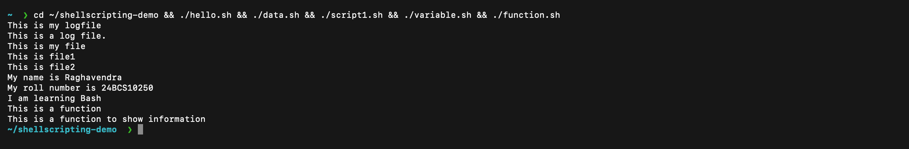
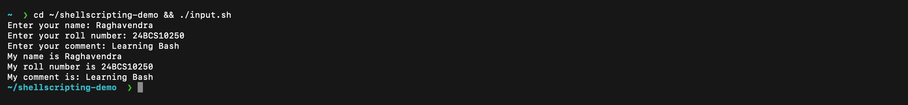
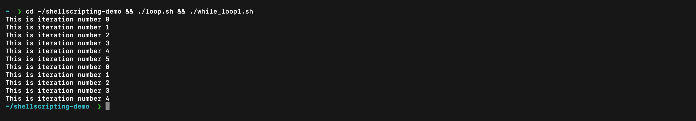
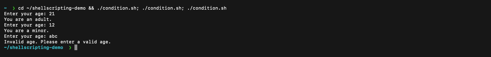
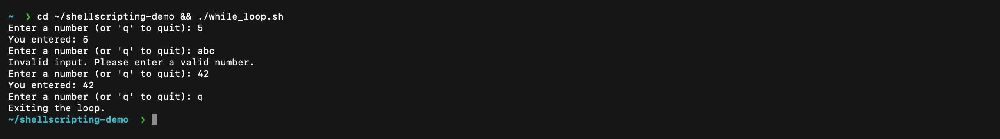
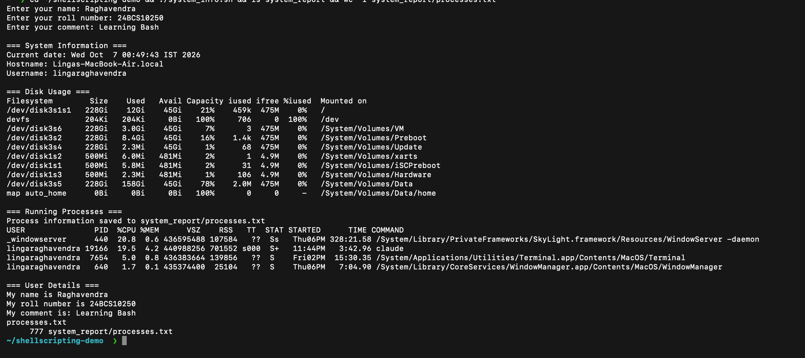

# Shell Scripting

**Name:** Raghavendra

**Enrollment number:** 24BCS10250

I wrote these scripts while practising files, input, variables, functions, conditions, and loops in Bash.

## 1. Create a folder and file - `hello.sh`

`mkdir -p` creates a folder. `>` writes text into a file and `cat` prints the file content.

```bash
#!/usr/bin/env bash

mkdir -p hello
printf '%s\n' "This is my logfile" > hello/app.log
cat hello/app.log
```

**Output:** see the screenshot in [Running the scripts](#running-the-scripts).

## 2. Overwrite a file - `data.sh`

`>` replaces whatever is in the file, so the second `printf` overwrites the first line.

```bash
#!/usr/bin/env bash

mkdir -p data
printf '%s\n' "This is a log file." > data/app.log
cat data/app.log
printf '%s\n' "This is my file" > data/app.log
cat data/app.log
```

**Output:** see the screenshot in [Running the scripts](#running-the-scripts).

## 3. Append to a file - `script1.sh`

`>>` adds a line at the end instead of replacing the file.

```bash
#!/usr/bin/env bash

mkdir -p test
echo "This is file1" > test/app.log
echo "This is file2" >> test/app.log
cat test/app.log
```

**Output:** see the screenshot in [Running the scripts](#running-the-scripts).

## 4. User input with `read -p` - `input.sh`

`read -r -p` shows a prompt and stores what I type in a variable.

```bash
#!/usr/bin/env bash

read -r -p "Enter your name: " name
read -r -p "Enter your roll number: " roll_number
read -r -p "Enter your comment: " comment

echo "My name is $name"
echo "My roll number is $roll_number"
echo "My comment is: $comment"
```

**Output:** see the screenshot in [Running the scripts](#running-the-scripts).

## 5. Variables - `variable.sh`

Values are stored in variables and used with `$`.

```bash
#!/usr/bin/env bash

name="Raghavendra"
roll_number="24BCS10250"
comment="learning Bash"

echo "My name is $name"
echo "My roll number is $roll_number"
echo "I am $comment"
```

**Output:** see the screenshot in [Running the scripts](#running-the-scripts).

## 6. Function - `function.sh`

A function is defined once and then called by its name.

```bash
#!/usr/bin/env bash

show_info() {
    echo "This is a function"
    echo "This is a function to show information"
}

show_info
```

**Output:** see the screenshot in [Running the scripts](#running-the-scripts).

## 7. For loop - `loop.sh`

A C-style `for` loop that counts from 0 to 5.

```bash
#!/usr/bin/env bash

for ((i=0;i<=5;i++)); do
    echo "This is iteration number $i"
done
```

**Output:** see the screenshot in [Running the scripts](#running-the-scripts).

## 8. System information script - `system_info.sh`

This is the homework script. It reads input with `read -p`, stores data in variables, prints the date, hostname, username, disk usage (`df -h`) and running processes (`ps aux`), creates a directory with `mkdir` and a file with `touch`, and saves the process list into that file with `>`.

```bash
#!/usr/bin/env bash

read -r -p "Enter your name: " name
read -r -p "Enter your roll number: " roll_number
read -r -p "Enter your comment: " comment

current_date=$(date)
host_name=$(hostname)
user_name=$(whoami)
report_directory="system_report"
process_file="$report_directory/processes.txt"

mkdir -p "$report_directory"
touch "$process_file"

echo ""
echo "=== System Information ==="
echo "Current date: $current_date"
echo "Hostname: $host_name"
echo "Username: $user_name"

echo ""
echo "=== Disk Usage ==="
df -h

echo ""
echo "=== Running Processes ==="
ps aux > "$process_file"
echo "Process information saved to $process_file"
head -n 5 "$process_file"

echo ""
echo "=== User Details ==="
echo "My name is $name"
echo "My roll number is $roll_number"
echo "My comment is: $comment"
```

**Output:** see the screenshot in [Running the scripts](#running-the-scripts).

## 9. If-elif-else condition - `condition.sh`

This script first rejects invalid input, then checks whether the entered age is at least 18. The final `else` handles valid ages below 18.

```bash
#!/usr/bin/env bash

read -r -p "Enter your age: " age

if ! [[ "$age" =~ ^[0-9]+$ ]]; then
    echo "Invalid age. Please enter a valid age."
elif [ "$age" -ge 18 ]; then
    echo "You are an adult."
else
    echo "You are a minor."
fi
```

**Inputs I used:** `21`, `12` and `abc` (three runs).

**Output:** see the screenshot in [Running the scripts](#running-the-scripts).

The three runs show an adult (`21`), a minor (`12`) and rejected text input (`abc`).

## 10. While loop with input - `while_loop.sh`

A `while true` loop repeats until `break` stops it. This script accepts numbers until the user enters `q`.

```bash
#!/usr/bin/env bash

while true; do
    read -r -p "Enter a number (or 'q' to quit): " input

    if [[ "$input" == "q" ]]; then
        echo "Exiting the loop."
        break
    elif ! [[ "$input" =~ ^[0-9]+$ ]]; then
        echo "Invalid input. Please enter a valid number."
        continue
    fi

    echo "You entered: $input"
done
```

**Inputs I used:** `5`, `abc`, `42`, then `q`.

**Output:** see the screenshot in [Running the scripts](#running-the-scripts).

## 11. While loop counter - `while_loop1.sh`

A `while` loop runs while its condition is true. `count` increases after each iteration until it reaches 5.

```bash
#!/usr/bin/env bash

count=0

while [ "$count" -lt 5 ]; do
    echo "This is iteration number $count"
    ((count++))
done
```

**Output:** see the screenshot in [Running the scripts](#running-the-scripts).

## Run all scripts

```bash
chmod +x *.sh
./hello.sh
./data.sh
./script1.sh
./input.sh
./variable.sh
./function.sh
./loop.sh
./system_info.sh
./condition.sh
./while_loop.sh
./while_loop1.sh
```

## Running the scripts

I ran every script on my Mac (macOS, `bash` through `#!/usr/bin/env bash`) from a clean folder, `~/shellscripting-demo`, and typed the inputs myself where a script asks for them. The scripts create `hello/`, `data/`, `test/` and `system_report/` in the folder they run in, so I ran them in that scratch folder and not inside this repository.

`hello.sh`, `data.sh`, `script1.sh`, `variable.sh` and `function.sh` (the second script overwrites the first line of its file with `>`, and the third appends with `>>`):



`input.sh` with `read -p`:



`loop.sh` (for loop) and `while_loop1.sh` (while loop with a counter):



`condition.sh` run three times with `21`, `12` and `abc`:



`while_loop.sh` with `5`, `abc`, `42` and `q`:



`system_info.sh`, the homework script, with the three inputs typed at its prompts. It prints the date, hostname, username, disk usage (`df -h`) and the first lines of the process list, then lists `system_report/` and counts the lines in `processes.txt`, which `ps aux >` created. The hostname and username in the screenshot are my Mac's:


