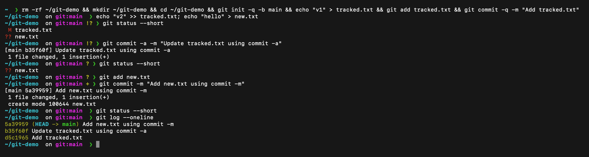
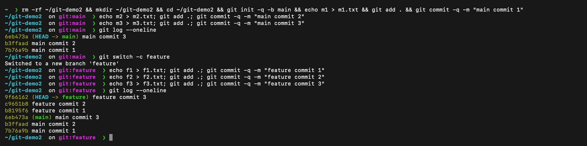
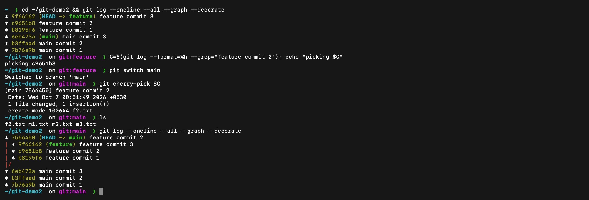

# Git and GitHub

**Name:** Raghavendra

**Enrollment number:** 24BCS10250

I used two small practice repositories on my Mac to compare the commit commands and to practise cherry-pick. The commit hashes below are from those runs.

## 1. `git commit -a -m` vs `git commit -m`

| Command | What it does |
| --- | --- |
| `git commit -m "message"` | Commits only what is already staged with `git add`. |
| `git commit -a -m "message"` | Stages every modified or deleted **tracked** file, then commits. |

The `-a` option does not include a new untracked file. A new file must be added with `git add` first.

```bash
mkdir ~/git-demo && cd ~/git-demo && git init -b main
echo "v1" > tracked.txt && git add tracked.txt && git commit -m "Add tracked.txt"

echo "v2" >> tracked.txt        # modify a tracked file
echo "hello" > new.txt          # create a new, untracked file
git status --short
git commit -a -m "Update tracked.txt using commit -a"
git status --short
git add new.txt
git commit -m "Add new.txt using commit -m"
git log --oneline
```

`git status --short` showed ` M tracked.txt` and `?? new.txt`. After `git commit -a -m` the modified file was committed (`1 file changed`) but `new.txt` was still `??`, so `-a` ignored the untracked file. After `git add new.txt`, a plain `git commit -m` committed it (`create mode 100644 new.txt`). The log shows all three commits.



## 2. Cherry-pick

I made three commits on `main`, created a `feature` branch and made three commits there. `git log --oneline` shows both stages.

```bash
mkdir ~/git-demo2 && cd ~/git-demo2 && git init -b main
# three commits on main: main commit 1, 2 and 3
git log --oneline
git switch -c feature
# three commits on feature: feature commit 1, 2 and 3
git log --oneline
```



I picked the middle feature commit, `feature commit 2`, found its hash with `git log`, switched back to `main` and cherry-picked it:

```bash
C=$(git log --format=%h --grep="feature commit 2")
git switch main
git cherry-pick $C
ls
git log --oneline --all --graph --decorate
```

The commit `c9651b8` on `feature` was applied to `main` as a new commit, `7566450`, with a different hash because it sits on a different history. `ls` shows `f2.txt` but not `f1.txt` or `f3.txt`, so only that commit's change came across. The graph shows `feature` still holding its three commits and `main` holding its three plus the cherry-picked one.



If the selected change conflicts with the current branch, cherry-pick pauses instead of guessing. I would fix the marked files, stage them and continue:

```bash
git status
git add <resolved-file>
git cherry-pick --continue
```

To cancel the whole operation and return to the state before it started:

```bash
git cherry-pick --abort
```
