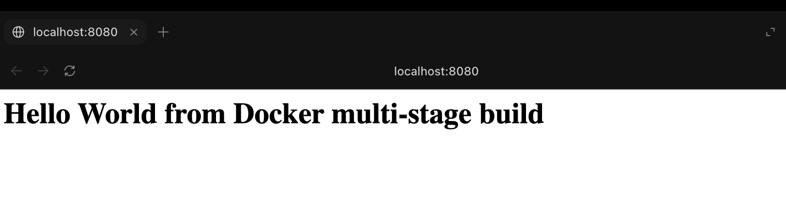
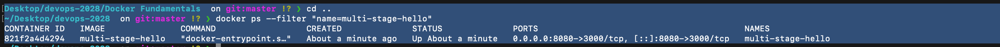
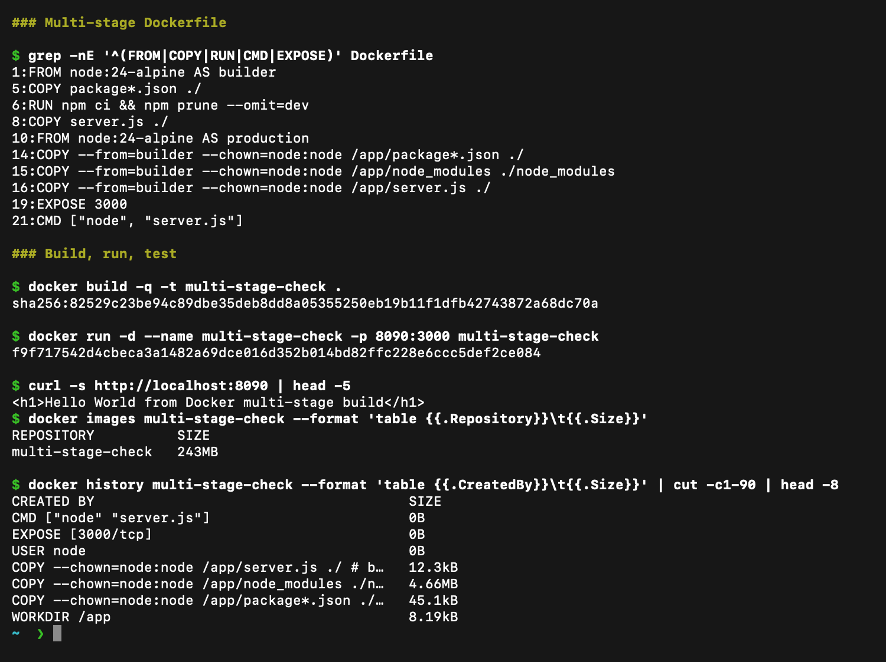
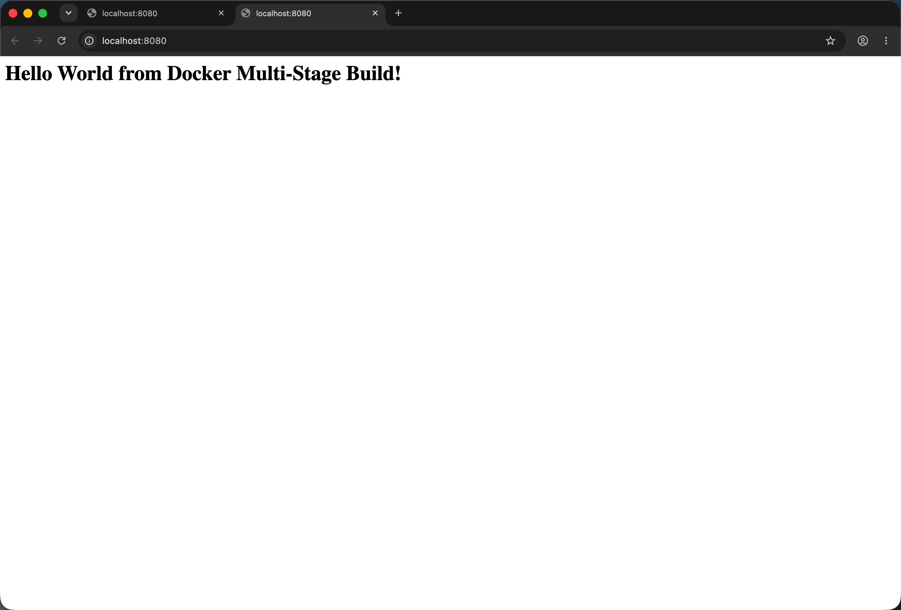
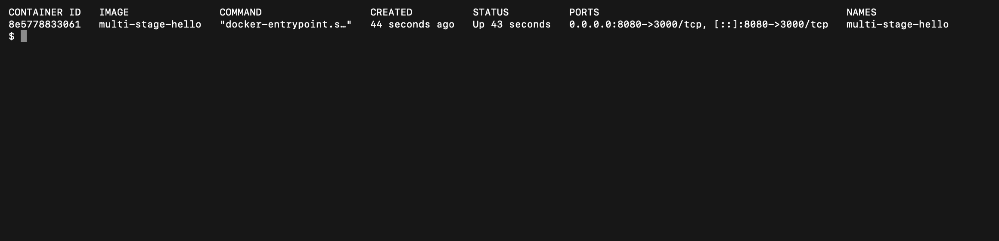

# Docker Images

**Name:** Raghavendra

**Enrollment number:** 24BCS10250

## Multi-stage Node.js image

I used a multi-stage Dockerfile for a small Node.js application. The application listens on port 3000 in the container, and I mapped it to port 8080 on my computer.

The files are inside `multi-stage-app`:

```text
multi-stage-app/
├── .dockerignore
├── Dockerfile
├── package-lock.json
├── package.json
└── server.js
```

## Build and run

```bash
cd "Session-7-Docker-Images/multi-stage-app"
docker build -t multi-stage-hello .
docker run -d --name multi-stage-hello -p 8080:3000 multi-stage-hello
```

I checked the application with:

```bash
curl http://localhost:8080
```

It returned this HTML response:

```html
<h1>Hello World from Docker multi-stage build</h1>
```

The same message appeared when I opened `http://localhost:8080` in the browser.



I also checked the container and its port mapping:

```bash
docker ps --filter "name=multi-stage-hello"
```

The output showed port 8080 on my computer mapped to port 3000 in the container.



The first stage in the Dockerfile prepares the application files. The final stage copies only the files needed to run the server using `COPY --from=builder`.

## Build, run and layers

The Dockerfile has two stages. The `builder` stage installs the production dependencies and the `production` stage copies only `node_modules`, `package*.json` and `server.js` into a clean Node image, so the build tools do not end up in the final image. A fresh build and run on port 8090 returned the Hello World page, and `docker history` shows the copied layers.



## Running the class repository's multi-stage example

The class repository is [devops-heros](https://github.com/Nency-Ravaliya/devops-heros). I cloned it and built the multi-stage Dockerfile from `session6-7-docker/multi-stage-dockerfile` without changing it:

```bash
git clone https://github.com/Nency-Ravaliya/devops-heros
cd devops-heros/session6-7-docker/multi-stage-dockerfile
docker build -t multi-stage-hello .
docker run -d --name multi-stage-hello -p 8080:3000 multi-stage-hello
curl http://localhost:8080
docker ps --filter name=multi-stage-hello
```

`curl` returned `<h1>Hello World from Docker Multi-Stage Build!</h1>`. The page in the browser at `localhost:8080`:



`docker ps` shows the container up with host port 8080 mapped to container port 3000:



My own copy in `multi-stage-app/` differs slightly from the class version: it uses `npm ci`, runs as the non-root `node` user and prints the message without the trailing `!`.

The [build output](outputs/multi-stage.txt) is from my own copy. The three language deployment requirement is covered by the independently built [Node.js](../Session-6-Docker-Fundamentals/outputs/node.txt), [Python](../Session-6-Docker-Fundamentals/outputs/python.txt) and [Java](../Session-6-Docker-Fundamentals/outputs/java.txt) applications.
