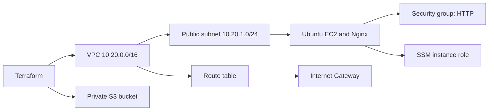

# Cloud Infrastructure with Terraform

**Name:** Raghavendra  
**Enrollment number:** 24BCS10250

**Session:** 19

The project creates a VPC, public subnet, route table, Internet Gateway, security group, Ubuntu EC2 instance and private S3 bucket. EC2 installs Nginx using `user-data.sh`.



## Configuration

`provider.tf` selects AWS and the region. `variables.tf` defines the project name, bucket name and instance size. `main.tf` creates the resources. `outputs.tf` returns the instance ID, public IP, application URL, bucket name and VPC ID.

Resource references such as `aws_vpc.main.id` create dependencies. The EC2 instance explicitly waits for routing and SSM role permissions. The instance's root volume is encrypted and IMDSv2 is required.

The subnet has a default route to the Internet Gateway. The security group accepts HTTP on port 80. SSH and the Kubernetes API are not exposed; instance administration uses AWS Systems Manager.

## Deploy

Run from this folder:

```bash
export AWS_PROFILE=devops
aws sts get-caller-identity
terraform init
terraform fmt -check
terraform validate
terraform plan -out=cloud.tfplan
terraform apply cloud.tfplan
terraform show
terraform output
curl -fsS "$(terraform output -raw application_url)"
```

Allow time for cloud-init to install Nginx. Its log is `/var/log/cloud-init-output.log`.

For an SSM shell, install AWS's Session Manager plugin, then run:

```bash
aws ssm start-session --target "$(terraform output -raw instance_id)"
```

The AWS identity running this command needs SSM session permissions. The attached instance role supplies the agent's permissions.

## State and cleanup

Terraform state maps configuration to AWS resources. Keep it out of Git and preserve it until the resources are removed.

```bash
terraform plan -destroy
terraform destroy
terraform show
```

Destroy the instance, its root EBS volume, networking resources and empty S3 bucket after the exercise. Check the AWS console for remaining resources. Stopping EC2 alone leaves storage and other resources allocated.

## Local checks

```bash
terraform init -backend=false
terraform fmt -check
terraform validate
```

[AWS VPC documentation](https://docs.aws.amazon.com/vpc/latest/userguide/what-is-amazon-vpc.html), [SSM Session Manager](https://docs.aws.amazon.com/systems-manager/latest/userguide/session-manager.html).
