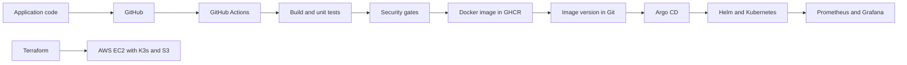

# Final DevOps Project

**Name:** Raghavendra  
**Enrollment number:** 24BCS10250

**Session:** 21

DevOps Notes is a small Flask application with a calculator API. The project connects tests, security checks, Docker images, Kubernetes, Helm, monitoring and GitOps. Terraform provides a cloud deployment option.



## Technologies

Python, Flask, pytest, Gunicorn, Bandit, pip-audit, Gitleaks, Trivy, Docker, GHCR, GitHub Actions, Kubernetes, Helm, Prometheus, Grafana, Argo CD and Terraform.

## Application setup

```bash
cd application
python3 -m venv .venv
source .venv/bin/activate
pip install -r requirements-dev.txt
pytest -v
export API_TOKEN=$(openssl rand -hex 24)
gunicorn --bind 127.0.0.1:5000 --workers 1 --threads 4 app:app
```

The page is at `http://127.0.0.1:5000`. `/health` checks that the application runs. `/ready` checks that its Secret configuration is present. `/api/private` requires the token in an `X-API-Token` header. `/metrics` exposes request counts, latency and process metrics. `/work` performs a fixed amount of CPU work for the HPA exercise.

```bash
curl -fsS -X POST http://127.0.0.1:5000/api/calculate -H 'Content-Type: application/json' -d '{"a":6,"b":3,"operation":"multiply"}'
```

## Docker setup

Run the following from `final-devops-project/`:

```bash
docker build -t devops-notes:1.0 -f docker/Dockerfile application
docker run --rm -p 127.0.0.1:5000:5000 -e API_TOKEN devops-notes:1.0
```

The container runs as a regular user. The pipeline publishes both AMD64 and ARM64 images, tagged with the commit SHA.

## Kubernetes and Helm deployment

```bash
minikube start --driver=docker
minikube addons enable ingress
minikube addons enable metrics-server
minikube image load devops-notes:1.0
./kubernetes/create-secret.sh final-project
helm upgrade --install notes helm/notes -n final-project --wait --timeout 180s
kubectl -n final-project get deployments,pods,services,configmaps,secrets,ingress,hpa
kubectl -n final-project port-forward service/notes 8500:5000
```

To deploy plain Kubernetes manifests instead of Helm, create the Secret and apply `kubernetes/application.yaml` in a separate namespace. Use one deployment method per namespace.

```bash
./kubernetes/create-secret.sh manifest-demo
kubectl apply -n manifest-demo -f kubernetes/application.yaml
kubectl -n manifest-demo rollout status deployment/notes
```

The chart includes Deployment, Service, ConfigMap, optional Secret creation, Ingress, HPA and health probes. The default uses the Secret created by the script. Tokens are generated locally and kept outside Git. HPA owns the replica count when enabled.

To test Ingress, forward the controller in another terminal:

```bash
kubectl -n ingress-nginx port-forward service/ingress-nginx-controller 8080:80
curl -fsS -H 'Host: notes.local' http://127.0.0.1:8080/api/status
```

## HPA

```bash
kubectl -n final-project top pods
kubectl -n final-project get hpa
kubectl -n final-project apply -f kubernetes/load-generator.yaml
kubectl -n final-project get hpa,pods -w
kubectl -n final-project describe hpa notes
kubectl -n final-project delete -f kubernetes/load-generator.yaml
```

The application requests 100m CPU. HPA targets 60% of that request and can scale from one to three Pods. Metrics Server supplies utilization. Wait for metrics after starting the cluster. Scale-down uses a 60-second stabilization window.

## CI/CD and DevSecOps

The executable workflow is [the root final workflow](../.github/workflows/final-project.yml). A copy is in `.github/workflows/` to keep the requested project structure. Both describe paths relative to this coursework repository.

Build and tests run before SAST, SCA and secret scanning. The Docker image scan gates publishing on fixable HIGH and CRITICAL findings. Test reports and deployment responses are uploaded as artifacts. The pipeline deploys to a temporary Kind cluster, tests readiness and the calculator, and removes that cluster.

After deployment verification, the workflow commits the published image SHA to `gitops/values.yaml`. Argo CD reads that file and reconciles the persistent local cluster. The test input `gate_demo` stops the test job deliberately; publish and deploy must remain skipped.

```bash
gh workflow run final-project.yml --ref master
gh run list --workflow final-project.yml
```

## Monitoring and storage

```bash
./monitoring/install.sh
kubectl -n observability get pods,pvc
kubectl -n observability port-forward service/prometheus 9090:9090
```

In another terminal:

```bash
kubectl -n observability port-forward service/grafana 3000:3000
```

Open Prometheus at `http://127.0.0.1:9090` and the Grafana dashboard at `http://127.0.0.1:3000/d/devops-notes`. The dashboard shows application availability, request rate, CPU and memory. Grafana permits anonymous viewing for the local demo; its admin password is generated in a Kubernetes Secret.

Prometheus and Grafana use dynamically provisioned PVCs. The application is stateless, so it does not need a database or a persistent application volume. The container uses `emptyDir` for temporary files.

```bash
kubectl -n final-project logs deployment/notes --tail=20
kubectl -n final-project top pods
```

The `NotesApplicationDown` alert fires after the scrape target is unreachable for 15 seconds. A controlled Service selector error can demonstrate firing and recovery.

## GitOps

Install Argo CD v3.5.3 and create the application Secret before synchronizing:

```bash
kubectl create namespace argocd
kubectl apply -n argocd --server-side -f https://raw.githubusercontent.com/argoproj/argo-cd/v3.5.3/manifests/install.yaml
kubectl -n argocd rollout status deployment/argocd-server --timeout=300s
./kubernetes/create-secret.sh final-project
kubectl apply -f gitops/application-local.yaml
kubectl -n argocd get application devops-notes
kubectl -n argocd port-forward service/argocd-server 8082:80
```

For the local HTTP port-forward, configure the server before opening it:

```bash
kubectl -n argocd patch configmap argocd-cmd-params-cm --type merge -p '{"data":{"server.insecure":"true"}}'
kubectl -n argocd rollout restart deployment/argocd-server
```

Open `http://127.0.0.1:8082`. Use the Argo CD initial admin Secret for the local login. The Application follows `master`, reads the chart and `gitops/values.yaml`, and enables pruning and self-healing. `application-local.yaml` selects the image already loaded into Minikube; Git still controls the greeting and other application configuration. `application.yaml` selects the image published by CI for a registry-backed deployment. Git contains the intended configuration. Manual changes are corrected by reconciliation.

For private GHCR packages, create a pull Secret in `final-project` using a token with package-read permission and attach it to the default ServiceAccount before syncing. Public packages can be pulled without registry credentials.

## Terraform infrastructure

`terraform/` creates a VPC, public subnet, routing, EC2, SSM instance role and private S3 bucket. The instance starts K3s. It exposes HTTP; administration uses SSM.

```bash
cd terraform
export AWS_PROFILE=devops
aws sts get-caller-identity
terraform init
terraform fmt -check
terraform validate
terraform plan -out=final.tfplan
terraform apply final.tfplan
terraform output
```

Use the steps in [the Terraform guide](terraform/README.md) to deploy this same project to K3s. Terraform state, kubeconfig and credentials stay outside Git.

## Cleanup

```bash
kubectl -n argocd delete application devops-notes
kubectl delete namespace final-project manifest-demo observability argocd --ignore-not-found
minikube stop
```

Delete the Argo CD Application before the namespace so reconciliation does not recreate resources. Remove PVC data only after saving any needed evidence. For the cloud deployment, run `terraform destroy` from `terraform/` after removing stored objects and confirming the planned deletions.
